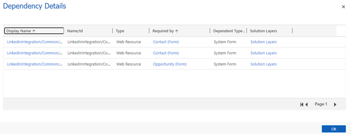

# Uninstall LinkedIn Sales Navigator

you can uninstall the LinkedIn Sales Navigator, if you don’t want to use it in your organization. To uninstall, you must delete the following solutions:

-	LinkedInSalesNavigatorControlsForUnifiedClient
-	LinkedIn
-	msdyn_LinkedInSalesNavigatorAnchor

>[!IMPORTANT]
>Uninstall the solutions in the following specified order only: **LinkedInSalesNavigatorControlsForUnifiedClient**, **LinkedIn**, and **msdyn_LinkedInSalesNavigatorAnchor**. 

Follow these steps:

1.	In your app, select the **Settings** icon, and then select **Advanced Settings**.

    > [!div class="mx-imgBorder"]  
    > 

2.	Go to **Settings** > **Customizations** > **Solutions**.

3.	Select the **LinkedInSalesNavigatorControlsForUnifiedClient** solution.

4.	Select **Show Dependencies** to verify if there are any dependencies for the solution. If dependencies exist, remove the dependencies, and proceed to delete. The following image is an example of dependency details:

    > [!div class="mx-imgBorder"]  
    > 
 
    These dependencies occur due to LinkedIn controls in Account, Contact, Lead, or Opportunity forms. To remove the dependencies, follow these steps:

    a.	Open the form in form editor.
    
    b.	Select the **LinkedIn Sales Navigator** section and then select **Remove**.
        
      > [!div class="mx-imgBorder"]  
      > 
 
    c.	Save and publish the form.

    d.	Repeat the steps a to c for other dependencies.

5.	After you've removed the all the dependencies, select **Delete**.
    
    A confirmation message is displayed. 

6.	Select **OK**.

7.	Repeat the steps 3 to 6 for **LinkedIn** and **msdyn_LinkedInSalesNavigatorAnchor** solutions.

    The LinkedIn Sales Navigator is removed from your organization.

### See also

[Install and enable LinkedIn Sales Navigator](install-sales-navigator.md)

[Disable LinkedIn Sales Navigator](disable-sales-navigator.md)
