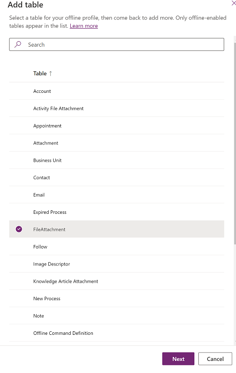
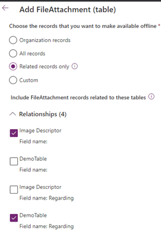

# Configure mobile offline profiles for images and files 

To work with file and images tables in offline mode, you need to add additional tables and relationships.

Follow the steps in this topic, for a mobile offline profile that has a table with a column where **Date type** is set to a file or image.

## View column properties for file or image 

1. Sign in to [Power Apps](https://make.powerapps.com).

2. On the left nav select **Data** to expand it and then select **Tables**.  

   > [!div class="mx-imgBorder"]
   >
  
  
3. Select the **Display name** of a column where **Date type** is set to a file or image.

4. The column properties show the **Date type**. Expand **Advanced options** to view the maximum size for a file or image.

   > [!div class="mx-imgBorder"]
   >

## Add image columns to mobile offline 

Add all tables to your mobile offline profile where the column type is a image. For any tables that have an image column, add the **Image Descriptor** table to make images available in offline mode.

1. Go to Power Platform Admin center, [https://admin.powerplatform.microsoft.com](https://admin.powerplatform.microsoft.com) and sign-in as an admin.

2. On the right, select **Environments**.

   > [!div class="mx-imgBorder"]
   >
 
3. Choose an environment and then select **Settings**.

   > [!div class="mx-imgBorder"]
   >
 
4. Expand **Users + permissions**,  and then select **Mobile configuration**.

   > [!div class="mx-imgBorder"]
   >

5. Select a mobile offline profile to edit it.

6. In the **Data available offline** select **Add table**.

7. Select **Image Descriptor** and then select **Next**.

   > [!div class="mx-imgBorder"]
    >

8. Under **Choose the records that you want to make available offline**, select **Related records only**.
9. Expand **Relationships** and select **Field name**

   > [!div class="mx-imgBorder"]
    >
   
10. For each table with a image column to be downloaded, select **Field name: Regarding**.
    
11. Select **Save**.

## Add file columns to mobile offline 

Add all tables to your mobile offline profile where the column type is a file. For any tables that have a file column, add the **FileAttachment** table to make file available in offline mode.

1. Go to Power Platform Admin center, [https://admin.powerplatform.microsoft.com](https://admin.powerplatform.microsoft.com) and sign-in as an admin.

2. On the right, select **Environments**.

   > [!div class="mx-imgBorder"]
   >
 
3. Choose an environment and then select **Settings**.

   > [!div class="mx-imgBorder"]
   >
 
4. Expand **Users + permissions**,  and then select **Mobile configuration**.

   > [!div class="mx-imgBorder"]
   >

5. Select a mobile offline profile to edit it.

6. In the **Data available offline** select **Add table**.

7. Select **FileAttachment**  and then select **Next**.

   > [!div class="mx-imgBorder"]
    >

8. Under **Choose the records that you want to make available offline**, select **Related records only**.
9. Expand **Relationships** and select **Image Descriptor, Field name**.

   >![Note] Don't select **Image Descriptor, Field name: Regarding**.

10. For each table with a file column to be downloaded, select **Field name: Regarding**. 

    > [!div class="mx-imgBorder"]
    >
   

 11. Select **Save**. 
  
