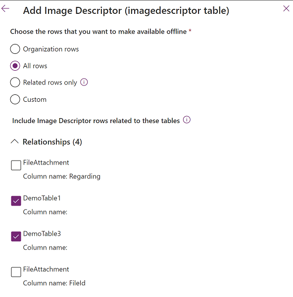

# Configure mobile offline profiles for files and images

To work with files and images in  offline mode, you must add additional tables and relationships. This should be considered when the profile contains tables where **Date type** is a file or image.

To find the maximum size for files and images, go to column settings in **Advanced options** in Power Apps for columns where **Data type** is an **Image**.

> [!div class="mx-imgBorder"]
>

   
## Expand a mobile offline profile to include files and images

1.	Make sure to first add all applicable tables with file and/or image type columns.
2.	If at least one table has an image column, add the **Image Descriptor (table)** to make images available offline.

   > [!div class="mx-imgBorder"]
    >

3.	Select Related records only.
4.	Under Relationships:
a.	For each table with image columns, select Field name: under Relationships.
5.	Add the **FileAttachment table**. This is required to make images and files available offline:

    > [!div class="mx-imgBorder"]
    >
    
6.	Select Related records only.
7.	Follow these steps, Under Relationships
  .	Select Image Descriptor, Field name:.
Do not select Image Descriptor, Field name: Regarding.
  b.	For each table with image and/or file columns to be downloaded, select Field name: Regarding. 
