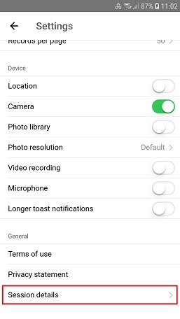

# Get logs and session ID to help troubleshoot your issue

If you encounter a problem with the mobile app, you can help Microsoft troubleshoot the problem much more effectively if you provide them with a session ID and logs for that problem.

## Get the session ID from the Setting menu

1. From the navigation bar, select  and then the gear icon (**Settings**).

   > [!div class="mx-imgBorder"]
   > 

2. Select **Session details** (at the bottom of the menu) and then you will see the **Session ID**.

   > [!div class="mx-imgBorder"]
   > 
   > 

## Get the session ID from the sign in screen

On the sign in screen, select the clipboard icon and then select **Copy session ID**.

   > [!div class="mx-imgBorder"]
   > 

## Share logs

1. On the sign in screen, select the clipboard icon and then select **Share logs**.
2. Share logs which trigger a share action (next step)

   
