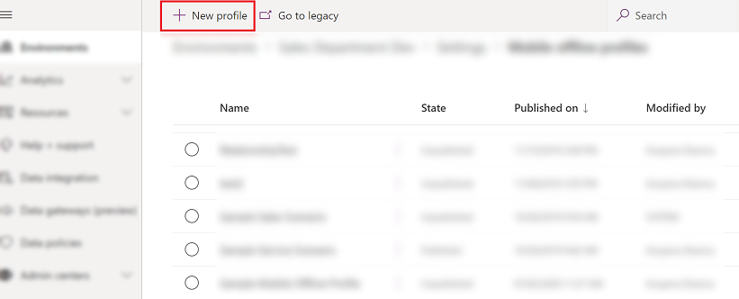
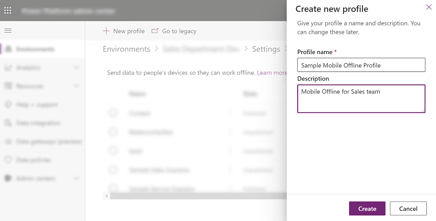
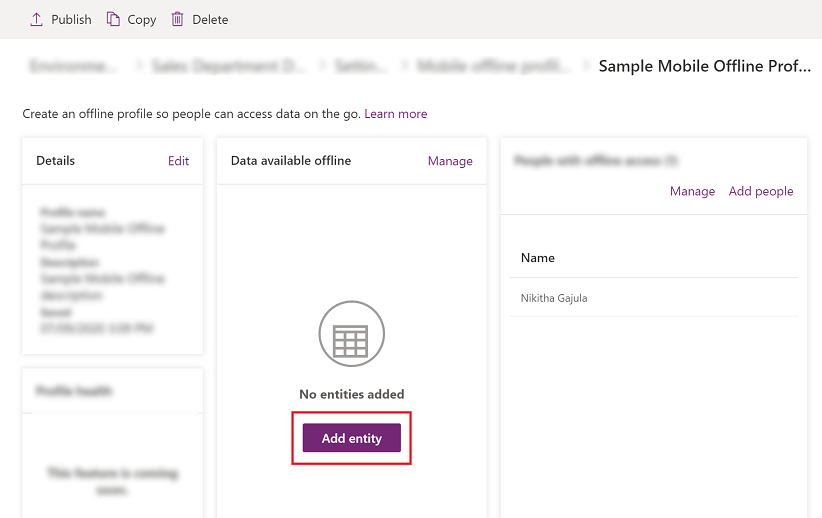
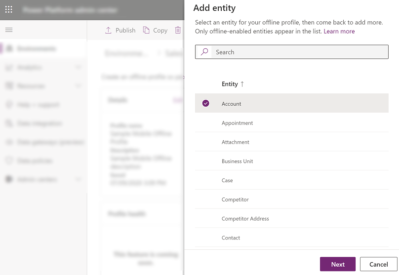
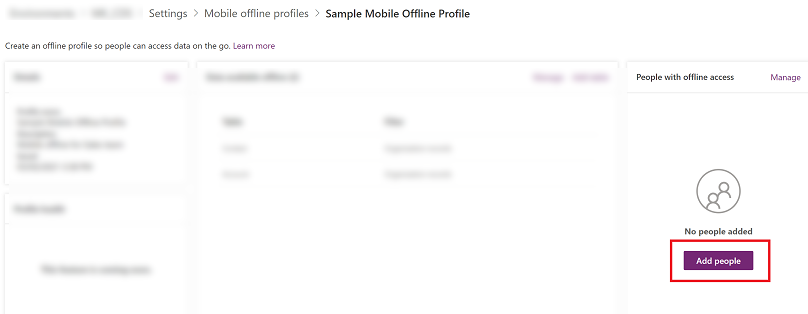
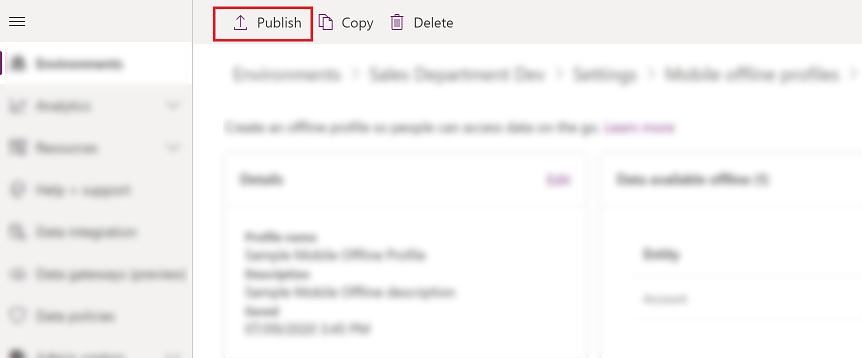

# Preview: Set up mobile offline synchronization to allow users to work in offline mode on their mobile device 

[!INCLUDE [cc-beta-prerelease-disclaimer](../includes/cc-beta-prerelease-disclaimer.md)]

Mobile offline allows your users to use the Dynamics 365 for phones app in offline mode to interact with their data, even when they are not connected to the internet. The Dynamics 365 for phones app provides a rich offline experience and helps you to stay productive. You can use basic commands such as create, read, update, and delete when you are offline. Once you are back online, your changes are automatically synchronized with your Dynamics 365 for phones app. 

> [!Note]
> - Mobile offline is only available for iOS and Android devices.
> - To use the mobile offline feature, download the latest version of the Dynamics 365 for phones and tablet app from the app store. For iOS, version 13.19043.32 or later is supported; for Android, version 4.3.19043.33 or later supported.

For information on entities and corresponding commands that are available in offline mode, see [Mobile offline capabilities and limitations](mobile-offline-capabilities.md).

To allows users to use this feature, a Dynamics 365 administrator will need to set up mobile offline for their organization. 
  
This offline experience uses [!INCLUDE[pn_Windows_Azure](../includes/pn-windows-azure.md)] services to periodically synchronize entities with the Dynamics 365 for phones and tablets apps so synchronized records are available when users’ mobile devices are disconnected. To enable mobile offline synchronization, follow the steps below.
 
 
## Step 1: Enable entities for mobile offline synchronization 
 
One of the first things you need to do is enable entities that will be available to mobile users when they're using the mobile app in offline mode. You can disable or enable any of the supported entities for offline mode.

  
1. In the **Dynamics 365- custom** app, go to **Settings** > **Advanced Settings**.

   > [!div class="mx-imgBorder"]
   >
  
2. Select **Settings** > **Customizations** and then select **Customize the System**.  

   > [!div class="mx-imgBorder"]
   >
   
 > [!IMPORTANT]
> - Ignore the **Try New Experience** notification at the top. The new experience does not include all the options to set-up mobile offline.   
  
3. Expand **Entities** in the left pane.  
  
4. Select the entity you want to enable for mobile offline (for example, **Account**).  
  
5. Under **Outlook & Mobile**, select **Enable for mobile offline**. 

   > [!div class="mx-imgBorder"]
   >
 
6. Select **Organization data download filter** to filter the data and set the freshness of the data you want to make available offline. You can set up to three criteria when you define a filter. Select the field to filter by, select an operator, then set a value. 
  
    The entities that are enabled for mobile offline by default have **Modified On** set for **Last X Days** = 10, so the data modified or created in the last 10 days will be available for downloading to mobile devices.  
  
7. Select **Save**.  
  
8. When you’re done enabling entities for mobile offline, select **Publish** so your changes take effect.  

> [!WARNING]
> Keep in mind that the amount of data you make available to users while they’re offline can affect the data usage rates for devices on cellular networks. The amount of data depends on:  
>   
> -   The number of entities you enable for mobile offline.  
> -   The number of days you specify since records were last modified.  
> -   The filters you set while creating mobile offline profiles.  
 
## Step 2: Create a mobile offline profile to determine what data will be available while offline
 
You need to create mobile offline profiles for users to configure filters that determine how much of an entity's data (and related entities' data) will be available to the user while offline.  

> [!NOTE] 
> -  A user must have a security role that has Read permissions on the mobile offline profile to be able to use their mobile device in offline mode.
  
1. Go to Power Platform Admin center, [https://admin.powerplatform.microsoft.com](https://admin.powerplatform.microsoft.com) and sign-in as an admin.

2. On the right, select **Environments**.

   > [!div class="mx-imgBorder"]
   >
 
3. Choose an environment and then select **Settings**.

   > [!div class="mx-imgBorder"]
   >
 
4. Expand **Users + permissions**,  and then select **Mobile configuration**.

   > [!div class="mx-imgBorder"]
   >
  
5. Select **New Profiles** to create a new mobile offline profile. If you already have a profile that you want to edit, select it from the list.

   > [!div class="mx-imgBorder"]
   >

  
6. Enter a name and description for your mobile offline profile. Select **Create** to create the mobile offline profile. Once the profile is created select it to open the profile so you can continue to editing it.  
    
   > [!div class="mx-imgBorder"]
   >
  
  
7. In the **Data available offline** area, select **Add entity** to add an entity to the profile. 

   > [!div class="mx-imgBorder"]
   >
   
  
8. Select an entity. Only entities that can be enabled for mobile offline appear in the **Entity** list and then select **Next**.

   > [!div class="mx-imgBorder"]
   >
 

9. Select a filter based on the ownership type for the entity. Entity ownership is decided when you create the entity. For more information, see [Types of entities and entity ownership](https://docs.microsoft.com/powerapps/maker/common-data-service/types-of-entities).

   |Entity ownership type|Available Data Download Filter options |  
  |---------------|-----------------|  
  |**User or Team**| <ul><li>**Download related data only** - Make related data for this entity available offline. If you don’t set any relationships, no records for this entity will be available.</li> <li>**All records** - Make all records for this entity available offline.</li> <li>**Other data filter** - Make only the specified records for this entity available offline and then choose from the following: </li> <ul><li> **Download my records** - Make only your records available offline.</li>  <li> **Download my team’s records** - Make your team’s records available offline.</li> <li>**Download my business unit’s records** - Make your business unit’s records available offline.</lu>|  
  |**Organization**|<ul><li>**Download related data only** - Make related data for this entity available offline. If you don’t set any relationships, no records for this entity will be available.</li> <li>**All records** - Make all records for this entity available offline. </li>|  
  |**Business**|<ul><li>**Download related data only** -  Make related data for this entity available offline. If you don’t set any relationships, no records for this entity will be available. </li> <li>**All records** - Make all records for this entity available offline.</li> <li>**Other records** - Make only the specified records for this entity available offline and choose from the following:</li> <ul><li> **Download my business unit’s records** - Make your business unit’s records available offline.</li>   |  
  |**None**|  <ul><li>**Download related data only**. Make related data for this entity available offline. If you don’t set any relationships, no records for this entity will be available.</li> |        
 
    
  **Custom (Coming soon)** Admins can define a custom filter based on the following rules. You can create filters up to three levels.  

  | |  | |
  |---------|---------|---------|
  |equal     |     not equal     |   gt – greater than      |
  |ge – greater than or equal to     |   le – less than or equal to      |   lt – less than      |
  |like     |   not-like      |     in   |
  |not-in     |    null     |    not-null     |
  |eq-userid     |   ne-userid      |    eq-userteams     |
  |eq-useroruserteams     |    eq-useroruserhierarchy     |    eq-useroruserhierarchyandteams     |
  |eq-businessid     |    ne-businessid     |   eq-userlanguage      |
  |begins-with     |     not-begin-with    |    ends-with     |
  |not-end-with    |       |         |

 
 
10. In the **Include [selected entity name] records related to these entities** area, select which related entity relationships to create. You need to have already added the entity you want to create the relationship with. For example, if you add want to create a relationship between the Account and Contact entities, you need to add both to this mobile offline profile. 

    For example, if you select **Contact | Field name: Primary contact** this means for every contact, the system will also download the account related to it. 
     
    > [!div class="mx-imgBorder"]
    >
  
11. Select the relationships you want to include. 
12. Select **Save** to add the entity to your profile so you can continue editing it.

### Step 2.1: Add users to a mobile offline profile 

Once you have created a mobile offline profile, you can start adding users to the profile and then publish the profile. This will make the profile available to your users so they can get the mobile offline experience that you've set-up. 

> [!NOTE]
> Each time user is added to the mobile offline profile, mobile offline profile needs to be published again. 
  
1.  If it’s not already open, open the mobile offline profile you want to add users to.  
 
2.  In the **People with offline access** area, select **Add people**.  

    > [!div class="mx-imgBorder"]
    >
  
3.  Choose the people that you want to add to the mobile offline profile.  
  
4.  When you’re done adding people, select **Save**.

### Step 2.2: Publish a mobile offline profile

To make a mobile offline profile available to users so they can get the mobile offline experience you've defined for them, you need to publish the profile.  
  
1. If it’s not already open, open the mobile offline profile you want to publish.  
  
2. When you’re done adding people and making any other changes to the mobile offline profile, select **Publish** so the data you specified can start syncing with your users’ mobile devices.  

   > [!div class="mx-imgBorder"]
   >
  
> [!TIP]
> **Solution export and import**  
>   
>  When exporting a solution that includes a mobile offline profile, always select the **Include entity metadata** check box for each entity you export.  
>   
>  After importing the solution into the target organization, publish all mobile offline profiles.  

### Step 2.3: Set conflict detection for mobile offline  

1. In the **Dynamics 365 - custom** app, go to **Settings** > **Administration** > **System Settings**.

   > [!div class="mx-imgBorder"]
   >

2. To configure conflict resolution behavior, select **Mobile Client**.

   > [!div class="mx-imgBorder"]
   >

When there is a mismatch of data between client and server, conflict errors occur. To resolve those, you can choose one of the following settings:

- Select **No** - Conflict detection for mobile offline is turned off, so whatever changes are made by a user in offline mode are automatically synced to the server when the user is back online, and client wins over server.

- Select **Yes** - Server wins over client.

## Step 3: Enable the app module for offline

Enable mobile offline for a specific app from MyApps page.

1. In the **Dynamics 365 - custom** app, go to **Settings** > **My Apps**.

   > [!div class="mx-imgBorder"]
   >

2. From the list of published apps, select **More Options** and then choose, **OPEN IN APP DESIGNER** to open the app designer to add or edit components.

   > [!div class="mx-imgBorder"]
   >

3. Select the **Properties** tab and scroll down to select **Enable Mobile Offline** and then choose a mobile offline profile.

   > [!div class="mx-imgBorder"]
   >
   
   > [!NOTE] 
   > You can add more than one profile for an app module.

4. At the top choose **Save** and then **Publish**.

## Mobile offline capabilities and limitations

For information on capabilities and limitations of mobile offline, see [Mobile offline capabilities and limitations](mobile-offline-capabilities.md).
