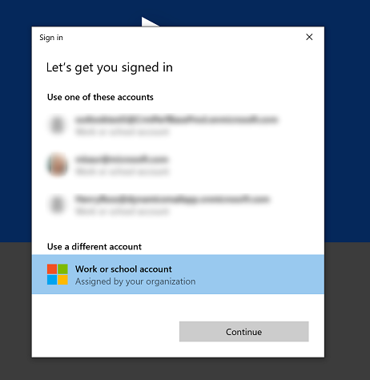
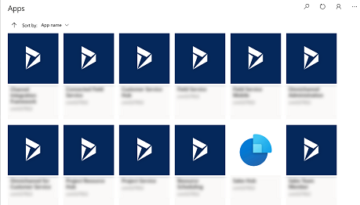
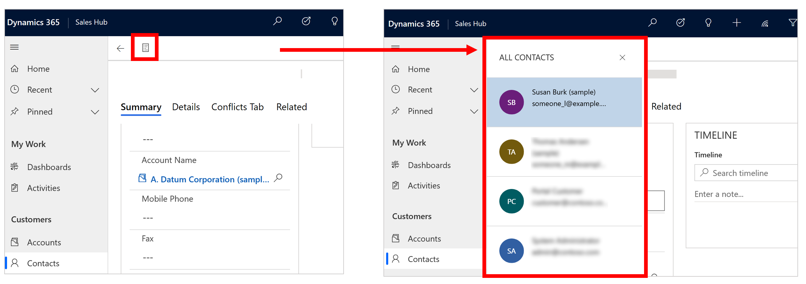
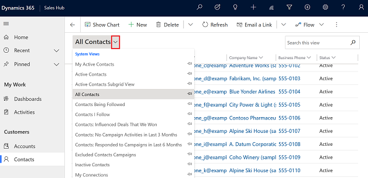
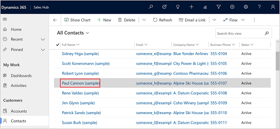
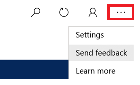

# Basic navigation for Dynamics 365 (Preview) app for Windows

[!INCLUDE [cc-beta-prerelease-disclaimer](../includes/cc-beta-prerelease-disclaimer.md)]

Use the Microsoft Dynamics 365 (Preview) app for Windows to run your customer engagement apps in Dynamics 365 (such as Dynamics 365 Sales, Dynamics 365 Customer Service, and Dynamics 365 Marketing) on your mobile device.

With early access, you can also use Dynamics 365 (Preview) app for Windows in offline mode. Offline mode is described [later in this topic](#set-up-mobile-offline-for-admins).

## Install Dynamics 365 (Preview) for Windows

Install the app from the Windows app store: [Install Microsoft Dynamics 365 (Preview) app for Windows](https://www.microsoft.com/store/apps/9N0RWZ9KZZT8)

**Note for administrators**: To distribute the app automatically, use the Microsoft Store for Business and Education to find, acquire, distribute, and manage apps for your organization or school. Configuration Manager supports managing Microsoft Store for Business apps on both Windows 10 devices with the Configuration Manager client and Windows 10 devices enrolled with Microsoft Intune. More information: [Manage apps from the Microsoft Store for Business and Education with Configuration Manager](/mem/configmgr/apps/deploy-use/manage-apps-from-the-windows-store-for-business)

## Sign in

Sign in to Dynamics 365 (Preview) app for Windows by using your work email address for the Dynamics 365 app that you use. If you need help with your sign-in information, contact your Dynamics 365 administrator.

1. On the Welcome screen, select **Sign in**.

   > [!NOTE]
   > If your administrator instructs you to change your region setting, select the gear icon , and then select your region. The default is **Global**.

     .

2. Enter your email address, select **Continue**, enter your password, and then select **Sign in**.

    > [!div class="mx-imgBorder"] 
    > 

3. From the list of apps that you have access to, select the app that you want to use.

    > [!div class="mx-imgBorder"] 
    > 

### Show non-production apps

By default, only production model-driven apps are shown in the list of apps. You can change this default setting.

1. On the **Apps** page, select **More**.

    > [!div class="mx-imgBorder"] 
    > 

2. Select **Settings**.

   > [!div class="mx-imgBorder"] 
   > 

3. Under **Model apps**, turn on the **Show non-production apps** toggle.

    > [!div class="mx-imgBorder"] 
    > 

4. Select the back arrow to go back to the **Apps** screen.

   > [!div class="mx-imgBorder"] 
   > 

## Home screen

Use the home screen to get to your work area, create a new record, search, switch apps, and more.

> [!div class="mx-imgBorder"] 
> 

Legend:

1. **Site map**: Select to expand or minimize the site map.
2. **Recent items**: View a list of records you recently used.
3. **Pinned items**: View and open your favorite (pinned) records.
4. **Entity navigator**: This area lists the entities available in the app.
5. **Area switcher**: Open this menu to move to another work area. The current work area is named here.
6. **Click to change app**: Select the current app name to go to the **Apps** page and select a different app.
7. **Go back**: Select to go back to the previous page. **Go back** is available on the form, view, and dashboard pages.
8. **Search**: Search for records in your app.
9. **Task flow**: Start automated task flows for common tasks.
10. **Relationship Assistant**: Use the assistant to monitor and track daily actions and communications.
11. **Add record**: Create a new record.
12. **Offline Status**: Work in offline mode when you don't have internet access.
13. **Advanced find**: Find the records you want in your app by using the advanced find search option.
14. **Add activity**: Create a new activity record.
15. **Settings**: Access app settings.
16. **Help**: Access online help.
17. **User info and sign out**: Access your user information, sign out of the app, or reconfigure the app.

## Site map

On the left pane, select **Site map**  to expand or minimize the site map.

> [!div class="mx-imgBorder"] 
> 

## Pin favorite records

The **Pinned** and **Recent** lists provide quick access to records that you've recently used or pinned to favorites. Use the **Recent** list to pin favorite records.

1. On the site map, select **Recent** .

2. From the list of records, select **Add to Pinned**  next to the record that you want to add to favorites.

3. When the record is pinned, you'll see a pin next to the record name.

   > [!div class="mx-imgBorder"] 
   > .

## Remove records from pinned items

1. On the site map, select **Pinned** .

2. Select **Remove from Pinned** next to the record that you want to remove from the favorites list.

   > [!div class="mx-imgBorder"] 
   > 

## Record set navigation

Navigate through multiple records by using record set navigation. The record-focused navigation improves productivity by letting you jump from record to record in the list and easily navigate back without losing your working list.

The number of records that you see in the record set navigation pane is based on the number of records that your system administrator has defined for the subgrid (record type).

**To use record set navigation**

1. On the left pane, select the type of record that you want to open. For example, **Contacts**.
2. Open a contact record, and then select **Open record set**  to open all records in the list and easily move from one record to another.

   > [!div class="mx-imgBorder"] 
   > 

## Change views

Each record type has system views and personal views. System views are
default views that already existed in the system or were created by your system customizer. Personal views are views that you created, or another user created and shared with you.

**To change a view**

1. Select a record type. For example, **Contacts**.

   > [!div class="mx-imgBorder"] 
   > 

2. Expand the menu, and then select the view you want.

   > [!div class="mx-imgBorder"] 
   > .

## Add a record quickly

1. On the command bar, select **Add** .

2. Select the type of record that you want to create.

   > [!div class="mx-imgBorder"] 
   > 

3. Fill in the required fields, and then do one of the following: Select **Save and Close**. or Expand the menu, and then select **Save & Create New**.

   > [!div class="mx-imgBorder"] 
   > 

## Edit a record

1. Select a record type. For example, **Contacts**.

   > [!div class="mx-imgBorder"] 
   > 

2. From the list of records, select the record that you want to edit.

   > [!div class="mx-imgBorder"] 
   > 

3. When you're done editing the record, it's automatically saved.

## Sign out

To sign out, select the profile button, and then select **Sign out**.

> [!div class="mx-imgBorder"] 
> 

## Set up mobile offline (for admins)

To allow users to use Dynamics 365 (Preview) app for Windows in offline mode, a Dynamics 365 administrator will need to set up mobile offline for your organization. More information: [Set up mobile offline synchronization](setup-mobile-offline.md)

## Work in offline mode (for users)

When your admin has enabled mobile offline, the next time you access the mobile app, you'll be prompted to download offline updates. After you download the updates, you can start using the mobile app in offline mode.

1. When you see the dialog box that asks you to download updates to work offline, select **Download**.

   > [!div class="mx-imgBorder"] 
   > 

2. Offline data automatically starts downloading in the background. You'll get a notification when the download is complete.

   > [!div class="mx-imgBorder"] 
   > 

## Download offline data later

If you didn't download offline data and selected **Skip for Now**, you can still download offline data when you're ready.

1. Open your app and on the nav bar, select the Wi-Fi button.

   > [!div class="mx-imgBorder"] 
   > 

2. On the **Offline Status** panel, select **Download offline updates**.

   > [!div class="mx-imgBorder"] 
   > 

3. Offline data automatically starts downloading in the background. You'll get a notification when the download is complete.

## See whether offline mode is available

When updates are downloaded, you can check to see whether mobile offline mode is available. Open your app, and on the nav bar, select the Wi-Fi button.

> [!div class="mx-imgBorder"] 
> 

The **Offline Status** page provides information about your offline status.

> [!div class="mx-imgBorder"] 
> 

**Legend**

1. **Status**: Tracks the offline status of the whole app and the status of each individual entity. When the status appears as **Available**, offline mode is available and data has been synced successfully.
2. **Entity**: Provides the offline status of each entity individually. For the available entities, you can also track the last time the entity was synced. Data is synced periodically in the background to ensure that you have access to the latest data when you go offline.
3. **Last Sync Date**: Indicates the last time your data was synced with the server.
4. **Work in offline mode**: Turn offline mode on or off with this toggle.

## Work in offline mode

When you turn on the **Work in offline mode** toggle, you'll see the notification "You are now working in offline mode."

> [!div class="mx-imgBorder"] 
> 

## Get back online and sync your changes

When you go back online, changes you've made are synchronized with your app.

1. On the nav bar, select the Wi-Fi button.

   > [!div class="mx-imgBorder"] 
   > 

2. Set the **Work in offline mode** toggle to off.

3. When you're back online, you'll get the notification "The connection was successfully restored." Your changes are automatically synchronized with your app.

   > [!div class="mx-imgBorder"] 
   > 

## Reconfigure the app

If you run into issues, you can always reconfigure the app. Select the profile button, and then select **Reconfigure**.

> [!div class="mx-imgBorder"] 
> 

## Send feedback

To send feedback about the app, go back to the **Apps** page, and then select **More** > **Send feedback**.

> [!div class="mx-imgBorder"] 
> 

## Known issues and unsupported features

### Web resources are not supported for offline

Web resources are not supported for Windows devices for offline mode.

### Media capture isn't supported

You can add notes, but can't capture and attach photos, videos, or audio. However, you can attach local files of any type, including photo, video, or audio.  

### Can't use the barcode scanner

You'll see the barcode scanner button  on multiple forms; however, it isn't supported in early access.

###  Power BI reports and Custom Pages are not supported

Embedded Power BI reports and Custom Pages are not supported in the Dynamics 365 (Preview) app for Windows.

[!INCLUDE[footer-include](../includes/footer-banner.md)]
