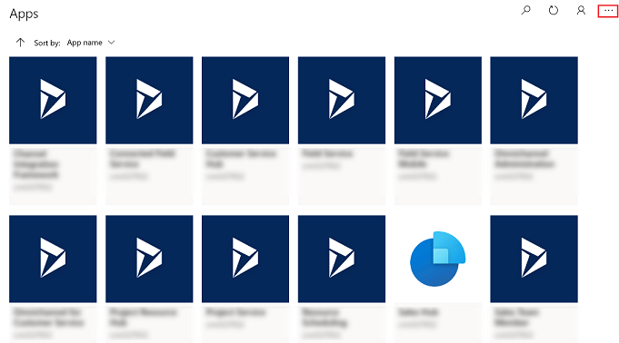
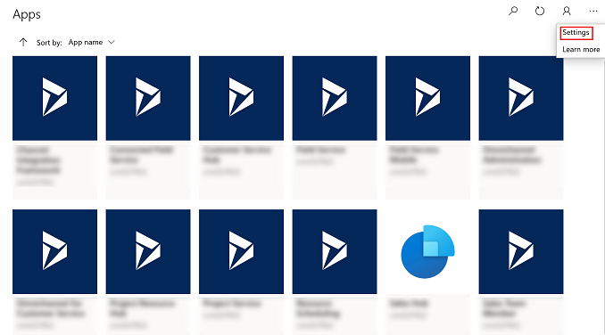
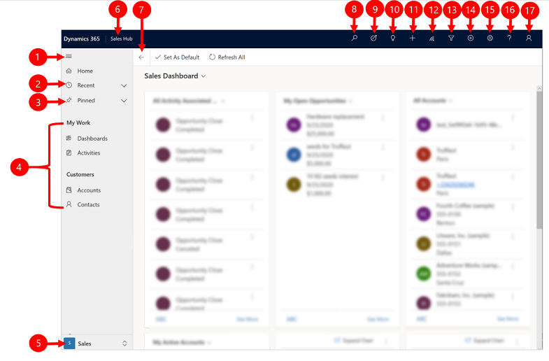
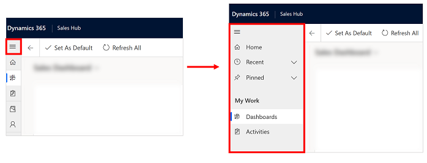
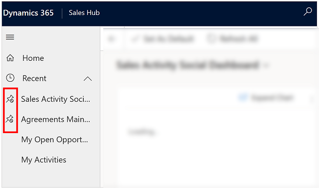
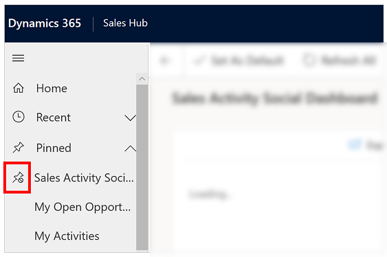
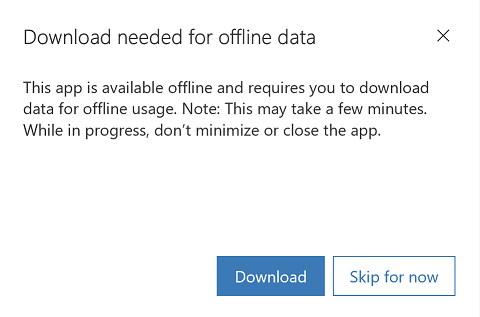
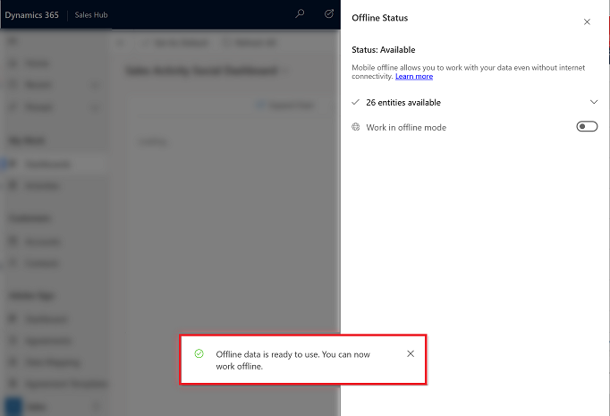
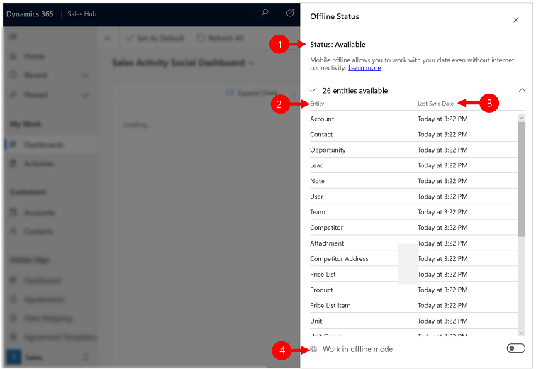
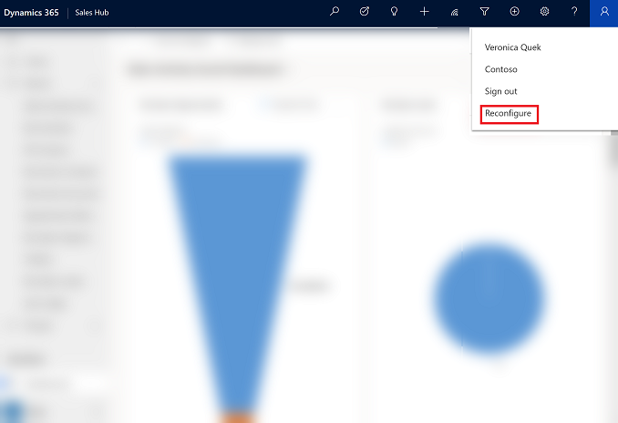

# Basic navigation for Dynamics 365 mobile app for Windows

Use the Microsoft Dynamics 365 (Preview) app to run your customer engagement apps in Dynamics 365 (such as Dynamics 365 Sales, Dynamics 365 Customer Service, and Dynamics 365 Marketing), on your mobile device.  

With this preview, the mobile offline feature is also available for Windows users.
   
# Sign in

Sign into the Microsoft Dynamics 365 Windows app quickly using your work email address for the Dynamics 365 app that you use. If you need help with your sign-in information, contact your Dynamics 365 administrator.

1. On the Welcome screen, select **Sign in**.

    > [!div class="mx-imgBorder"] 
    > .

2. Enter your email address, and then select **Next**. Then enter your password and then select **Sign in**.
    
    > [!div class="mx-imgBorder"] 
    > 

3. From the list of apps that you have access to, select the app that you want to use.
    
    > [!div class="mx-imgBorder"] 
    > 

## Show non-production apps

By default, only production model-driven apps are shown in the list of
apps.

1. To see apps from non-production environments, on the **Apps** page, select **More**.
        
    > [!div class="mx-imgBorder"] 
    > 

2. Select **Settings**.

   > [!div class="mx-imgBorder"] 
   > 

3. Under **Model apps**, set the **Show non-production apps** toggle to
    On. 
    
    > [!div class="mx-imgBorder"] 
    > 

4. Select the back arrow to go back to the **Apps** screen.

   > [!div class="mx-imgBorder"] 
   > 

## Sign out

To sign out select profile button and then select **Sign out**.

> [!div class="mx-imgBorder"] 
> 

## Home screen

Use the navigation to get to your work area, create a new record,
search, switch app, and more.

> [!div class="mx-imgBorder"] 
> 

Legend:

1. **Site map:** Select to expand or minimize the site map.

2. **Recent items**: View a list of records you recently used.

3. **Pinned items:** View and open your favorite (pinned) records.

4. **Entity navigator:** This area lists the entity available in the
    app.

5. **Area switcher:** Open this menu to move to another work area. The
    current work area is named here.

6. **Click to change app**:  Select the current app name to go to the
 **Apps** page and select a different app.

7. **Go back**: Use this button to go back to the previous page. This
    work on the form, view, and dashboard pages.

8. **Search:** Search for records in your app.

9. **Task flow**: Start automated task flows for common tasks.

10. **Relationship Assistant**: Use the assistant to monitor and track
    daily actions and communications.

11. **Add record**: Create a new record.

12. **Offline Status**: Work in offline mode when you don't have
    internet access.

13. **Advanced find**: Find the records you want in your app by using
    the Advanced Find search option.

14. **Add activity**: Create a new activity record.

15. **Settings**: Access app settings.

16. **Help**: Access online help.

17. **User info and sign out**: Access your use information, sign out,
    and reconfigure the app.

## Site map

From the navigation pane, select **Site Map** to expand or minimize the
site map.

> [!div class="mx-imgBorder"] 
> 

## Pin favorite records

The **Pinned** and **Recent** lists provide quick access to records that
you've recently used or pinned to favorites. Use the **Recent** list to
pin favorite records.

1. From the menu on the left, select **Recent items** .

2. From the list of records, select **Add to Pinned**  next to the record that you want to add to favorites.

3. When the record is pinned, you will see a pin next to the record.

  > [!div class="mx-imgBorder"] 
  > .

## Remove records from pinned items

1. To unpin a record from favorites, from the left select **Pinned items** .

2. Select **Remove from Pinned** next to the record that you want to remove from the favorites list.

   > [!div class="mx-imgBorder"] 
   > 

## Change views

Each record type has system views and personal views. System views are
default views already set in the system or they are created by your
system customizer. Personal views are views that you create, or they are
created by another user and shared with you.

1. To change view, select a record type. For example, contacts.

   > [!div class="mx-imgBorder"] 
   > 

2. Select the drop-down menu and then select the desired view.

   > [!div class="mx-imgBorder"] 
   > .

## Add a record quickly

1. To create a new record, on the command bar select add .

2. Select the type of record that you want to create.

   > [!div class="mx-imgBorder"] 
   > 

3. Fill in the required fields, and then select **Save and Close** or select the drop-down menu and select **Save & Create New**.

   > [!div class="mx-imgBorder"] 
   > 

## Edit a record

1. To edit a record, select a record type. For example, contacts.

   > [!div class="mx-imgBorder"] 
   > 

2. From the list of records, select the record that you want to edit.

   > [!div class="mx-imgBorder"] 
   > 

3. Edit the record and when you're done the record is automatically saved.

## Set up mobile offline (for admins)

To allows users to use the Dynamics 365 for Windows mobile app in offline mode, a Dynamics 365 administrator will need to set up mobile offline for their organization. For more information, see [Set up mobile offlinesynchronization](https://docs.microsoft.com/dynamics365/mobile-app/preview-setup-mobile-offline).

## Work in offline mode (for end-users)

When your admin has enabled mobile offline, the next time you access the mobile app, you will be prompted to download offline updates. Once you download the updates, you can start using the mobile app in offline mode.

1. When you see the dialog box that asks you to download updates to work offline, choose **Download**.
    
   > [!div class="mx-imgBorder"] 
   > 

2. Offline data automatically starts to download in the background. Once it's complete, you will get a notification letting you know the download is complete.

   > [!div class="mx-imgBorder"] 
   > 

## Download offline data later

If didn't want to download offline data and selected **Skip for Now** then you can still download offline data.

1. Open your app and on the nav bar select the Wi-Fi button.

   > [!div class="mx-imgBorder"] 
   > 

2. On the **Offline Status** pane, select **Download offline updates**.

   > [!div class="mx-imgBorder"] 
   > 

3. Offline data automatically starts to download in the background. Once it's complete, you will get a notification letting you know the download is complete.

## See if offline mode is available

When updates are downloaded, you can check to see if mobile offline is available. Open your app and on the nav bar select the Wi-Fi button.

   > [!div class="mx-imgBorder"] 
   > 
   
The **Offline Status** page provide information on your offline status.

   > [!div class="mx-imgBorder"] 
   > 

**Legend**

1. **Status**: Tracks the offline status of the whole app, and the
    status of each entity individually. When the status shows
    as **Available**, it indicates offline is available and data has
    synced successfully.

2. **Entity**: Provides the offline status of each entity individually.
    For the available entities, you can also track the last time the
    entity synced. Data is synced periodically in the background to
    ensure that you have access to the latest data whenever you go
    offline.

3. **Last Sync Date**: Indicates the last time your data was synced
    with the server.

4. **Work in offline mode**: Use the toggle to turn on Work in offline
    mode or turn it off.

## Work in offline mode

When you set the **Work in offline mode** toggle to on, you will this notification: **You are now working in offline mode**.

   > [!div class="mx-imgBorder"] 
   > 

## Get back online and sync your changes

Once you're back online, changes you've made are synchronized with your
app.

1. From the nav bar, select the Wi-Fi button.

   > [!div class="mx-imgBorder"] 
   > 

2. Set the **Work in offline mode** toggle to off.

3. When you back online, you will see a notification stating that, **The connection was successfully restored**. Your changes are automatically synchronized with your app.

   > [!div class="mx-imgBorder"] 
   > 

## Reconfigure the app

If you run into issue, you can always reconfigure the app. Select the profile button and then select **Reconfigure**.

   > [!div class="mx-imgBorder"] 
   > 

## Known issues and unsupported features

**Attachments are not supported**

You can add notes, but cannot attach photos, videos, and attachments. Also you cannot view the attachments that are already in the timeline.

**Cannot use the barcode scanner**

At multiple location in the experience (Search, Forms, ...) you can see the Barcode Scanner button .
This is not supported in the Private Preview.

**Embedded Power BI and canvas will not render**

Any embedded Power BI dashboard that requires authentication to access the report will not render.

