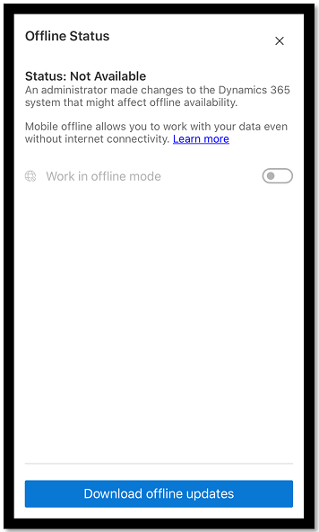
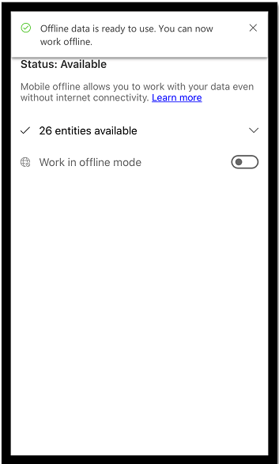

# Work offline on your mobile device

Work with your data in offline mode even when you don't have internet access. The Dynamics 365 for phones and tablets app provides a rich offline experience that lets you work with commands like create, read, update, and delete along with some special commands—so you always stay productive. Once you're back online, changes you've made are synchronized with your apps in the Common Data Service environment.

If you're working on a record and lose network connection, any updates made to the record are saved in offline mode and will be synchronized to Dynamics 365 app once you're back online. When the record is synchronized with the app, it follows the filter rule for availability in offline mode.

## Early access feature

If you have enabled early access, then you will have a different navigation experience. This topic calls out both experiences.

Your administrator has to opt in to early access updates for your environment and then install the updates to get this feature. More information: [Opt in to early access updates](https://docs.microsoft.com/power-platform/admin/opt-in-early-access-updates)

> [!NOTE]
> - The mobile offline feature is only available for iOS and Android devices.
> - To use the mobile offline feature, download the latest version of the Dynamics 365 for phones and tablet app from the app store. For iOS, version 13.19043.32 or later is supported; for Android, version 4.3.19043.33 or later supported.
> - The offline feature isn't supported for Dynamics 365 Customer Engagement (on-premises). 

## Download updates to work in offline mode

When your admin has [enabled mobile offline](setup-mobile-offline-for-admin.md
), the next time you access the mobile app, you will be prompted to download offline updates. Once you download the updates, you can start using the mobile app in offline mode.

1. When you see the dialog box that asks you to download updates to work offline, choose **Download**. 

   > [!div class="mx-imgBorder"] 
   >   
 
2. Offline data starts to download in the background. Do not close the app or disconnect from the internet until the download is complete.

## Download offline data later

If did not want to download offline data and choose **Skip for now**, you will not be able to use the app in offline mode until you manually download the updates. 

1. To manually download updates, do one of the following:

    - **Current**: From the nav bar, select  > **Offline Status**. 
    - **Early access**: From the Home screen, select the site map  > Offline .

2. On the **Offline Status** screen, select **Download offline updates**.

   > [!div class="mx-imgBorder"] 
   > 

3. The download will start and the status will change to **Initializing**.

   > [!div class="mx-imgBorder"] 
   > 
   
3. When Offline download is completed, you will get a notification indicating that you can start working in offline mode.

  |Current  |Early access  |
  |---------|---------|
  |     |          |

## Work in offline mode

Once the offline download is complete, you can use the mobile app in offline mode.

With no connectivity, you'll automatically have access to the downloaded data so you can continue working while you're on the go. The data will be automatically synced with the server as soon as the connectivity is restored.

With intermittent connectivity, it is recommended to switch to offline mode. As long as the offline mode is turned on, the updates that you make on your device will not be synced with the server and you can continue to work with the local data on your device. To push the changes you've made to the server and refresh your local data, set the **Work in offline mode** toggle to Off.

1. To start working in offline mode, do one of the following:

    - **Current**: From the nav bar, select  > **Offline Status**. 
    - **Early access**: From the Home screen, select the site map  > Offline .

2. Set the **Work in offline mode** toggle to On.

   > [!div class="mx-imgBorder"] 
   > 

## See if offline mode is availables

When offline updates are complete, you can check to see if mobile offline is available. 

- To check the offline status, do one of the following:   

    - **Current**: From the nav bar, select  > **Offline Status**. 
    - **Early access**: From the Home screen, select the site map  > Offline .
    
  
    > [!div class="mx-imgBorder"] 
    > 

Legend:

1. **Status**: Tracks the offline status of the whole app, and also the status of each entity individually. When the status shows as  **Available**, it indicates offline is available and data has synced successfully.

   > [!NOTE] 
   > The status here can be **Not Available** due to an error or if you missed downloading offline updates. If the status is **Not Available** due to missing the latest offline updates, then try downloading the updates again.
   
 2. **Entity**: Provides the offline status of each entity individually. For the available entities, you can also track the last time the entity synced. Data is synced periodically in the background to ensure that you have access to the latest data whenever you go offline.
   
 3. **Last Sync Date**: Indicates the last time your data was synced with the server.
 

 
### Check offline status from the main menu (current release only)

You can also see which entities are available in offline mode from the main menu.

- From the nav bar, select .

  -  A green Wi-Fi icon next to the entity name indicates that it is available in offline mode.
  -  A red Wi-Fi icon indicates that this entity is enabled for offline use but is not available to work in offline mode due to an error or missing updates.
  -  If no Wi-Fi icon is visible, it means your admin has not enabled the entity to use in offline mode.

     > [!div class="mx-imgBorder"] 
     > 
     
   

## Sync conflict resolution

Conflict errors can resolved based on the settings set by the admin. If your admin has set the conflict resolution to **No**, then the data value on your client device wins and there will be no sync errors. 

If your admin has set the conflict resolution to **Yes**, then the data value on the server wins. In this case, while syncing changes to the server, you might see some errors that are automatically resolved. Client changes are overwritten by server values.

## Clear cache from the device

If you used the mobile app on a phone or tablet temporarily and want to remove all your cached data before giving the device to someone else, you need to reconfigure the app.

- From the nav bar, select   > **User Information** > **Reconfigure**. 

     > [!div class="mx-imgBorder"] 
     > 

Reconfiguring deletes data and metadata for the current organization from the cache, however do not rely on this as a security measure.

Make sure you use the **Reconfigure** option before you sign out. If you sign in to another organization but you wanted to delete data for the previous organization that you were logged into, then you will need to sign back into that organization and use the **Reconfigure** option to delete data and metadata for that organization from the cache. 

## Mobile offline capabilities and limitations

For information on capabilities and limitations of mobile offline, see [Mobile offline capabilities and limitations](mobile-offline-capabilities.md).

