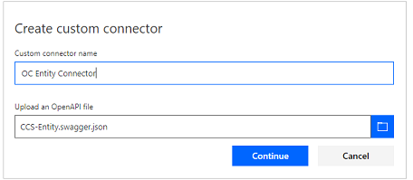
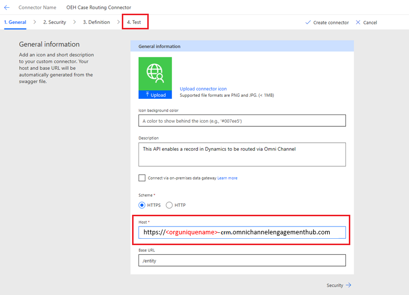

# Create and manage work streams

[!INCLUDE[cc-applies-to-update-9-0-0](../../includes/cc_applies_to_update_9_0_0.md)]

This topic explains how you can create a live chat work stream and a CDS entity work stream in the Omni-channel Engagement Hub.

## Create a new live chat work stream

Follow these steps to create a new live chat work stream.

1. In the omni-channel site map, select **Work Distribution \> Work Streams**.

    The **Active Work Streams** view is shown. 

    > [!div class=mx-imgBorder] 
    > 

2. On the command bar, select **New** to create a work stream.
3. In the **Summary** tab of the new work stream page, follow these steps:

   - In the **General information** section, provide the following information:  
      1. **Name**: Enter a name for the work stream.
      2. **Stream Source**: Select the channel that is supported for the work stream: **Live Chat** or **CDS Entity**. 
         > [!NOTE]
         > If you select **CDS Entity**, see the [CDS entity work stream](#cds-entity-work-stream) section later in this topic.
      3. **Capacity**: Specify the units of capacity that are required to process a conversation for the work stream.
      5. **Auto-close after inactivity**: Specify the amount of time after which a conversation is moved from the **Waiting** state to the **Closed** state because of inactivity. 
      6. Select **Save** to save the work stream.

    - In the **Work distribution** section, follow these steps: 
      1. Select whether the **Work distribution mode** should be **Push** or **Pick**.
      2. In the **Notification** field, select the type of notification setting.
      3. In the **Screen pop timeout** field, select the amount of time before the screen pop times out.
      4. Select the **Allowed Presences** from the drop-down list.

       > [!div class=mx-imgBorder] 
       > 

4. Define the routing rules in the **Routing Rule Items** tab. To know how to configure a routing rule, see [Create and manage routing rules in Omni-channel](routing-rules.md).

5. In the **Chat settings** tab, follow this step:

     - Add a new chat widget in the **Chat widget** section. For more information, see [Create a chat widget](set-up-chat-widget.md).

6. Add a new chat question and create a question library in the **Survey questions library** tab. For more information, see [Create a question library](create-question-library.md).

7. Select **Save** to save the live chat work stream.

After you've finished defining all the settings, the work stream is ready to receive conversations so that agents can start to work on them.

## Create a new CDS Entity work stream

CDS entity work streams help route entities from Common Data Service (CDS) to the Omni-channel Engagement Hub. For example, you can enable high-priority cases to be routed to omni-channel so that they can be automatically distributed and assigned to agents.

> [!NOTE]
> You can route any activity enabled entity.

To set up CDS entity routing, you need to configure a work stream in Omni-channel Engagement Hub
and set up a corresponding flow in Microsoft Flow. Follow the detailed steps as given below.

### In Omni-channel Engagement Hub

1. In the omni-channel site map, select **Work Distribution \> Work Streams**.
2. Fill in the **General information** section as given in [Create a new live chat work stream](#create-a-new-live-chat-work-stream).
    For CDS work stream, select **Stream Source** as **CDS Entity**.

    

    
1. Fill in the **Work distribution** section as given in [Create a new live chat work stream](#create-a-new-live-chat-work-stream).
2. In the **Work Stream Entity Configuration** section, select **Add** to add the entity that should be routed. A relationship is created between this entity and work stream.
3. Set up routing rules and queues for the work stream. For more information, see [Create a new live chat work stream](#create-a-new-live-chat-work-stream).

### In Microsoft Flow

1. Go to [portal.office.com](https://www.office.com/?auth=2&home=1), and select **Flow** in the list of apps.

   

2. Go to **Settings \> Custom Connectors**, and then select **Create Custom Connector** to create a custom connector.

    

3. Enter the name for the custom connector.

    

4. On the **Create Custom Connector** menu, select **Import an API file** and import **CSS-Entity.swagger.json** file. 

    > [!NOTE]
    > You can get **CSS-Entity.swagger.json** file from Insider portal. 

5. Update the host name in the **General Information** section in the following format:  
    *https://**orguniquename**-public.omnichannelengagementhub.com*

    You can get **orguniquename** from  [Organization unique name](../../developer/developer-resources-page.md#organization-unique-name).

    > [!div class=mx-imgBorder] 
    > 

6. Select **Test** to test the connector.

1. Select **Create connector** to create a new connector.

    

7. After the connector is created, select **New Connection**. A new connection is created, and the connection name is automatically selected.
8. Provide the following information, and then select **Test Operation** to test the connection:

      1. **Organization ID**: Enter your organization ID.
      2. **Work stream ID**: Enter the ID of your work stream. You can get the work stream ID. 
      3. **Entity logical name**: Enter the logical name of the CDS entity  that must be routed.
      4. **Entity set name**: Enter the entity name of the CDS entity that must be routed. (Typically, this is a plural form of the logical name.)
      5. **Record ID**: Use the Dynamics content to select the ID field.
      6. **Relationship name with work stream**: Enter the name of the entity relationship with the work stream. You can get this relationship name from **Settings** > **Customizations** > **Entities**.

         

      > [!NOTE]
      > You should receive response 202 when this connection is successfully set up. Usually this takes around 15 minutes.

9. Once the connection is successfully set up, go to **My Flows**.
10. Select **Create from Blank** to create a flow.

    

12. Search for the **Dynamics 365 - When a record is created** trigger and select it.

    

13. Select **New Step \> Add an action**. Search for your custom connector, and then select the action.
2. Provide the following information:

      1. **Entity Logical Name**: Enter the name of the CDS entity that must be routed.
      2. **Entity Set Name**: Enter the entity name of the CDS entity that must be routed. (Typically, this is a plural form of the logical name.)
      3. **Record ID**: Use the Dynamics content to select the ID field.
      4. **Name of Entity Relationship With**: Enter the name of the entity relationship with the work stream (for Incident **incident\_msdyn\_ocliveworkitems**).
      5. **Record details**: Use the Dynamics content. Select **value-key-item-output**.
      6. **Organization ID**: Enter the ID of your organization.
      7. **Work Stream ID**: Enter the ID of your work stream.

         
         
16. After all the information is entered, select **Test** to test the flow. Then select **I'll perform the trigger action and save the flow**.

    To test the flow with the entity, follow these steps:

    1. Create a new record for the entity that you've selected to route.
    2. Keep the record page filled in CDS entity. Immediately after you select **Save & test**, go to CDS entity, and save the record. (If you don't save the record immediately, the test operation might miss it.)

        After a successful run, you should see the following page.

        

Flow has been configured to route CDS entity to Omni-channel. You can now route CDS entities to the Omni-channel Engagement Hub using Microsoft Flow.

### See also 

[Understand work streams in the Omni-channel Engagement Hub](work-streams-introduction.md)

