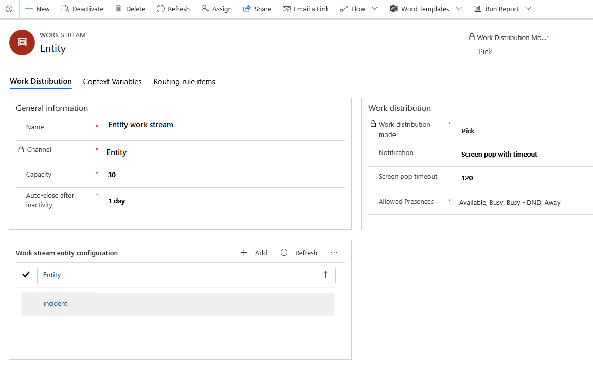
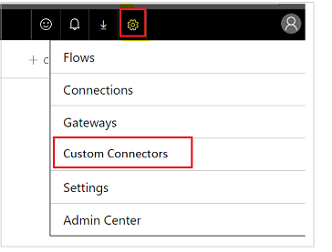
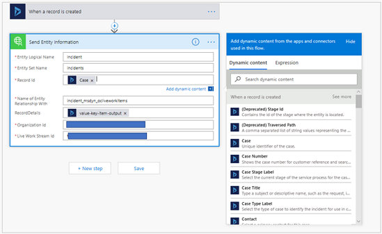
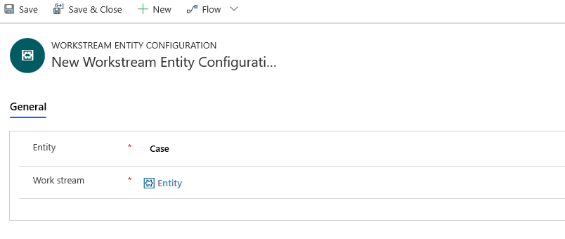

# Create a CDS entity channel

Applies to Dynamics 365 for Customer Engagement apps version 9.1.0

[!include[cc-beta-prerelease-disclaimer](../../includes/cc-beta-prerelease-disclaimer.md)]

CDS entity channels help route entities from Common Data Service (CDS) to the Omni-channel Engagement Hub. For example, you can enable high-priority cases to be routed to Omni-channel so that they can be automatically distributed and assigned to agents.

To set up CDS entity routing, you need to configure the following:

- A CDS entity work stream in **Work streams** in Omni-channel and a corresponding flow in **Microsoft Flow**. 
- A CDS entity channel in **Channels**.

## Set up a CDS entity work stream

### In Omni-channel Engagement Hub

1. In the Omni-channel site map, select **Work Distribution \> Work Streams**.
2. Fill in the **General information** section as given in [Create a work stream](work-streams-introduction.md#create-a-work-stream).
    For CDS work stream, select **Stream Source** as **CDS Entity**. 
3. Fill in the **Work distribution** section as given in [Create a work stream](work-streams-introduction.md#create-a-work-stream).
4. In the **Work stream entity configuration** section, select **Add** to add a new work stream entity configuration. For more information, see [Set up a CDS entity channel](#set-up-a-cds-entity-channel). 
3. Set up routing rules and queues for the work stream as given in [Create a work stream](work-streams-introduction.md#create-a-work-stream).

      > [!div class=mx-imgBorder]
      > 

### In Microsoft Flow

1. Go to [portal.office.com](https://www.office.com/?auth=2&home=1), and select **Flow** in the list of apps.

   

2. Go to **Settings \> Custom Connectors**, and then select **Create Custom Connector** to create a custom connector.

    
    
3. On the **Create Custom Connector** menu, select **Import an API file**  

4. Enter a name for the custom connector, import **CSS-Entity.swagger.json** file and select **Continue**.

    
    
    > [!NOTE]
    > You can get **CSS-Entity.swagger.json** file from Insider portal. 

5. Update the host name in the **General** tab in the following format:  
    *https://**orguniquename**-public.omnichannelengagementhub.com*

    You can get **orguniquename** from  [Organization unique name](../../developer/developer-resources-page.md#organization-unique-name).

    > [!div class=mx-imgBorder] 
    > 

6. Go to **Test** tab to test the connector.

1. Select **Create connector** to create a new connector.

    

7. After the connector is created, select **New Connection**. A new connection is created, and the connection name is automatically selected.
8. Provide the following information, and then select **Test Operation** to test the connection:

      1. **Organization ID**: Enter your organization ID.
      2. **Work stream ID**: Enter the ID of work stream configured in Dynamics 365. You can get this ID from URL of the work stream record page.  
      3. **Entity logical name**: Enter the logical name of the CDS entity that you choose to be routed.
      4. **Entity set name**: Enter the set name of the CDS entity that you choose to be routed. (Typically, this is a plural form of the logical name.)
      5. **Record ID**: Enter the ID of work stream entity configuration record, configured in Dynamics 365. You can get this ID from the URL of the work stream entity configuration record page.
      6. **Relationship name with work stream**: Enter the name of the entity relationship with the work stream. You can get this relationship name from **Settings** > **Customizations** > **Entities**.

         

      > [!NOTE]
      > You should receive response 202 when this connection is successfully set up. Usually this takes around 15 minutes.

9. Once the connection is successfully set up, go to **My Flows**.
10. Select **Create from Blank** to create a flow.

    

12. Search for the **Dynamics 365 - When a record is created** trigger and select it.

    

13. Select **New Step \> Add an action**. Search for the custom connector you configured, and then select the action to send entity information.
14. Provide the following information:

      1. **Entity Logical Name**: Enter the logical name of the CDS entity that you choose to be routed.
      2. **Entity Set Name**: Enter the set name of the CDS entity that you choose be routed. (Typically, this is a plural form of the logical name.)
      3. **Record ID**: Use **Add dynamic content** option to search for and select entity name. For example for case entity select **Case** from dyanmic content 
      4. **Name of Entity Relationship With**: Enter the name of the entity relationship with the work stream. You can get this relationship name from **Settings** > **Customizations** > **Entities**. For example for case entity the relationship name would be  **incident\_msdyn\_ocliveworkitems**.
      5. **Record details**: Use **Add dynamic content** option and select **value-key-item-output**.
      6. **Organization ID**: Enter the ID of your organization.
      7. **Work Stream ID**: Enter the ID of work stream configured in Dynamics 365. You can get this ID from the URL of the work stream record page.

         
         
16. After all the information is entered, save and select **Test** to test the flow. Then select **I'll perform the trigger action and save the flow**.

    To test the flow with the entity, create a new record for the entity that you've selected to route.
   
    After a successful run, you should see the following page.

    

## Set up a CDS entity channel

Follow these steps to set up a CDS entity channel.

1. In the Omni-channel site map, select **Channels \> CDS Entity**.

   The **Active Work Stream Entity Configuration** view is displayed.

2. On the command bar, select **New** to create a new CDS entity channel.
3. In the **General** tab:
 
    - Select the entity to be routed in the **Entity** drop-down list.

        > [!NOTE]
        > You can route any activity enabled entity.

    - Select the CDS entity work stream that you created in the previous section, [Set up a CDS entity work stream](#set-up-a-cds-entity-work-stream).

4. Select **Save** to save the work stream entity configuration. A relationship is created between this entity and work stream.

    > [!div class=mx-imgBorder]
    > 

### See also 

[Understand work streams in the Omni-channel Engagement Hub](work-streams-introduction.md)

