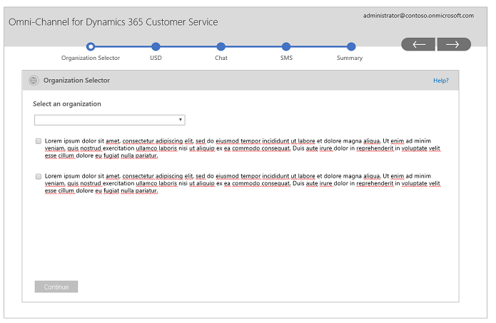
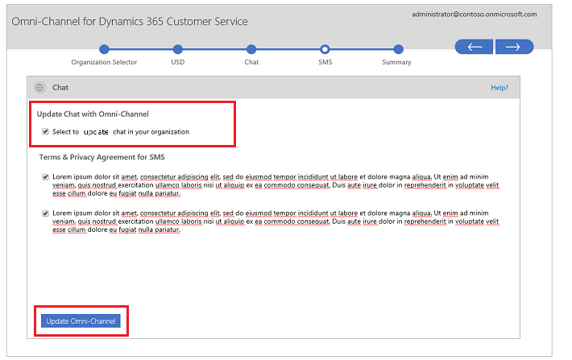
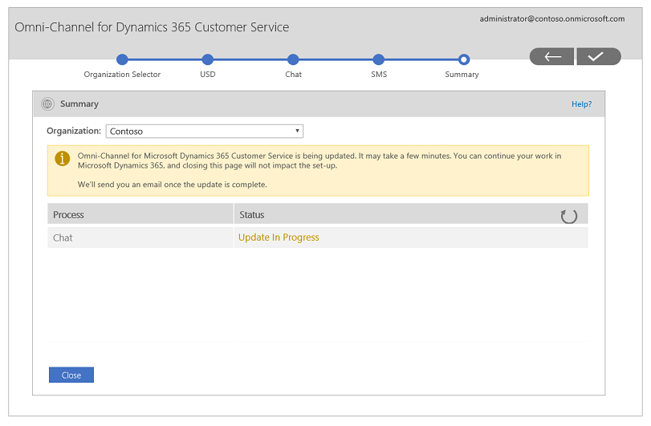

# Provision Omni-channel Engagement Hub

Omni-channel Engagement Hub is a cloud-based application that helps you extend the power of Microsoft Dynamics 365 for Customer Service. It lets customer service agents instantly connect to and engage with their customers, so that they can quickly resolve the queries.

Quick customer engagement and problem solving helps improve customer satisfaction. Omni-channel Engagement Hub provides a modern, customizable, high-productivity app that lets agents help customers across different channels via a unified interface. It lets organizations choose the channel that suits their business needs. It also ensures that a high level of responsive, quality service is received across channels.

As an administrator, you can avail the trial version of Omni-channel Engagement Hub by provisioning the package from **Dynamics Insider Portal**. You can set up the trial instance from **Dynamics 365 Administration Center** and start using it on one or more organizations.

> [!NOTE]
> If you've set up a trial version, you should purchase the license after the trial expires. Otherwise, your access to the application will be suspended. In this preview, only provisioning of the application is supported.

The following illustration shows the complete provisioning cycle for the Omni-channel Engagement Hub.

> [!NOTE]
> System users that have an omni-channel license provisioned for themselves are referred to as omni-channel users. For more informtation, see [Create and manage users](users-user-profiles.md).

Omni-channel Engagement Hub enables the following channels and capabilities for omni-channel users:

**Channels**

- Chat

**Capabilities**

- Routing and presence
- Profile and work distribution
- Enhanced agent and supervisor experience

## Provision Omni-channel Engagement Hub application

Follow these steps to set up Omni-channel Engagement Hub.

**Step 1**: Get the Omni-channel Engagement Hub package.

1. Access the [Dynamics Insider Portal](http://experience.dynamics.com/insider).
2. Log in with your Insider credentials.
3. On the Insider home page, search for **Omni-channel Engagement Hub**.
4. Select the program link in the search results and select **Join Now**. This will add you as a participant to the program.

    As we receive your details, we will enable the Omni-channel Engagement Hub package on your Dynamics 365 for Customer Engagement instance and you will recieve a confirmation email from Microsoft.

    Once you receive the email, you can access and start the setup by selecting **Manage** in the **Dynamics 365 Administration Center**.

    

**Step 2**: Install Omni-channel Engagement Hub in an organization.

   1. On the **Manage Omni-channel Instances** page, select **Add Org** to add an organization.   Omni-channel is installed on the organization that you add here.

       

       The **First run experience** wizard is displayed.

       

   2. Select the organization in the **Organization Selector** drop-down list. Select **Continue** to begin the installation on the org.

       

   4. Enable **Chat** as part of the omni-channel installation.   Select the check box to enable Chat on your org and select **Continue** to proceed.

       

       > [!NOTE]
       > This preview supports the installation of only the Chat channel. The installation will not continue if the Chat check box is not selected. 
   
   4. View the progress of the installation on the **Summary** page.

      

      Once the installation is completed successfully, select **Close** to close the **First run experience** wizard.

On successful installation, your org and your omni-channel application instance are displayed in the **Dynamics 365 Administration Center**.

> [!IMPORTANT]
> You can view the installation progress for multiple orgs by selecting them using the **Organization Selector** drop-down list.

## Update Omni-channel Engagement Hub

Follow these steps to update your Omni-channel Engagement Hub application.

1. Go to your omni-channel application instance in the **Dynamics 365 Administration Center** and select **Manage**.

2. Select the org that you want to update using **Organization Selector** drop-down list.

3. Select the check-box to update the **Chat** channel in omni-channel application instance. 

4. Select **Update Omni-channel** to begin updating the instance. Update action also ensures that any disruptions to the solution get rectified even if no changes are made. 

   

5. View the progress of the update on the **Summary** page.

   

Once the installation is completed successfully, select **Close** to close the wizard.

### See also

[Create and manage users](users-user-profiles.md)

[Understand unified routing and work distribution](unified-routing-work-distribution.md)
