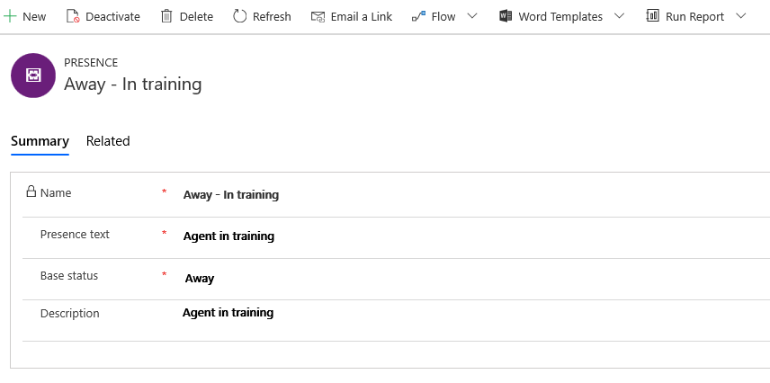
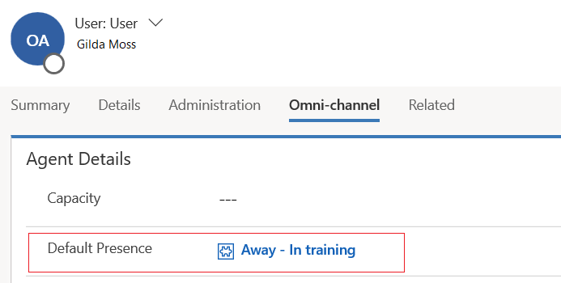

# Configure and manage presence status

Presence status indicates an agent's availability or status. Presence status stores, updates, and maintains the real-time status of all agents, with respect to their availability and capacity utilization. When presence status is effectively configured, you can connect customers with agents in real time, for all synchronous conversations (such as live chats) and for all asynchronous conversations (such as cases and leads).

A presence status consists of two elements:

- **Base status**: The base presence status which routing and work-distribution understands. There are five base presence statuses – **Available**, **Busy**, **BusyDND**, **Away**, and **Offline**.
- **Presence text**: The text that is associated with a specific base status. This is the text that is visible to agents and other users during run time. 

Out of the box, omni-channel provides the following presence statuses:

- Available
- Away
- Busy
- Busy DND
- Offline

> [!div class=mx-imgBorder]
> 

In addition to the out-of-box presence statuses, admins can configure custom presence statuses for agents. For example, if the agents on your team want to attend a training, you can create a custom **Away – In Training** presence status. In this way, no conversations can be assigned to these agents as they are in a training. The routing rules can also be modified to achieve the same.

> [!div class=mx-imgBorder]
> 

## Presence for agents

The presence status for agents can be updated either manually by the agents themselves or automatically as work is assigned to the agents.

For more information, see [Presence](../agent/agent-usd/introduction-agent-interface-omni-channel-engagement-hub.md#presence) in the agent interface.

## Default presence

The default presence status is the status that is set for agents when they first sign in to the omni-channel system after their last sign-out.

Admins can set the default presence status for an agent in the **Agent Details** section on the **Omni-channel** tab of the **User** entity.

> [!div class=mx-imgBorder]
> 

## Create a new presence record

Follow these steps to create a new presence record.

1. In the omni-channel site map, select **User Management \> Custom Presence**.

    The **Active Presences** view is shown.

2. On the command bar, select **New** to create a presence record.
3. On the **Summary** tab, provide the following information:

    1. **Name**: Enter a name for the custom presence status.
    2. **Presence Text**: Enter presence text that should be associated with the new custom entity.
    3. **Base Status**: Select the most applicable base status in the list.
    4. **Description**: Enter a brief description of the custom presence record.

4. Select **Save** to save the new presence record.

### See also

[Understand unified routing and work distribution](unified-routing-work-distribution.md)
