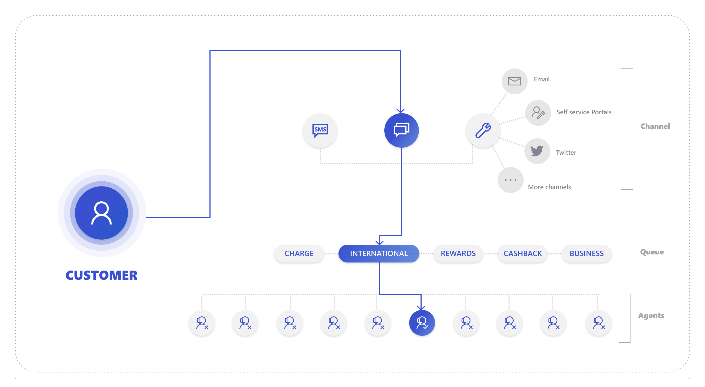

# Understand unified routing and work distribution

[!INCLUDE[cc-applies-to-update-9-0-0](../../includes/cc_applies_to_update_9_0_0.md)]

Unified routing and work distribution in Omni-channel Engagement Hub helps guarantee that work is efficiently and effectively allocated (routed). There are benefits for both agents and supervisors. Agents can prioritize their most urgent tasks, and supervisors can help balance the load by using real-time monitoring.

Here are some ways that efficient routing of work across channels can help:

- Work is directed and allocated to the correct set of agents.
- Agents always work on the most urgent tasks first.
- The time that agents spend on conversations is correctly tracked, and the agent workforce is used in the most efficient manner.
- The conversations and requests are unified across real-time channels – such as Live chat and asynchronous channels – such as Short Message Service (SMS), Cases, and custom entities.

Unified routing and work distribution identifies the availability of agents and allocates work to them based on the following criteria:

- The association of agents with queues and channels
- The real-time capacity and presence of agents

For example, a chat interaction that comes in from a customer has a specific query about international life insurance. In this case, unified routing and work distribution can help route the chat to an agent who is equipped to handle that query, as shown in the following illustration.

> [!div class=mx-imgBorder] 
> 

Unified routing and work distribution is a two-step process:

1. Routing uses routing rules to help guarantee that conversations are put into the correct omni-channel queues.
2. Work distribution allocates the different conversations to the available agents in real time, based on configured rules.

To effectively route and distribute work to agents, admins can set up the following items in Omni-channel Engagement Hub, as given in the below illustration:

  > [!div class=mx-imgBorder] 
  > 

To understand how routing and work distribution works with the help of a scenario, see [Understand how routing and work distribution works](routing-work-distribution-scenario.md).

To learn about unified routing and work distribution in more detail, see the following topics:

- [Enable users for Omni-channel](add-users-assign-roles.md)
- [Manage users](users-user-profiles.md)
- [Work with queues](queues-omni-channel.md)
- [Create and manage work streams](create-work-streams.md)
- [Set up record identification rule](record-identification-rule.md)
- [Configure and manage presence status](presence-custom-presence.md)
- [Create and manage routing rules](routing-rules.md)

## See also

[See how unified routing and work distribution works](routing-work-distribution-scenario.md)
