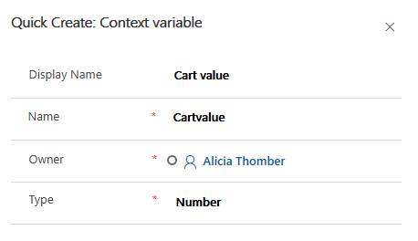

# Understand and create work streams 

Applies to Dynamics 365 for Customer Engagement apps version 9.1.0

[!include[cc-beta-prerelease-disclaimer](../../includes/cc-beta-prerelease-disclaimer.md)]

A work stream is a collection of routing & work distribution settings. Routing settings define how conversations should be routed to queues. Work distribution settings define how conversations should be allocated to agents within a queue. 

In Omni-channel, you can create the following types of work streams:

- Live chat work stream
- Entity work stream
- SMS work stream

> [!NOTE]
> A work stream can belong to multiple channels of same type, for example multiple chat channels. In this case, all the conversations from these channels inherit routing and work distribution settings of the work stream they belong to.

When work streams are linked with channels, the routing and work distribution settings defined in a work stream are inherited by the respective channels. For example, when you create a work stream for Live chat, you define work distribution settings, context variables, and routing rule items in the work stream. Now, when a chat channel is created, and this work stream is linked with the chat channel, the settings of the work stream apply to the chat channel also.

## Create a work stream

Follow these steps to create a new work stream in Omni-channel Engagement Hub.

1. In the Omni-channel site map, select **Work Distribution \> Work Streams**.

    The **Active Work Streams** view is shown. 

    > [!div class=mx-imgBorder] 
    > 

2. On the command bar, select **New** to create a work stream.

3. In the **Summary** tab of the new work stream, follow these steps:

   - In the **General information** section, provide the following information:  
      1. **Name**: Enter a name for the work stream.
      2. **Stream Source**: Stream source is defined as a medium via which a customer reaches out for support. For example, a customer can contact an agent through chat or SMS.     Select a channel from the drop-down list.
            - **Live Chat**
            - **Entity**
            - **SMS**

           > [!NOTE]
           > As you select the Stream source, the channel is updated at the top of the page. You cannot edit the channel.

      3. **Capacity**: When a conversation from a work stream is assigned to an agent, it consumes some capacity. The units of capacity blocked are defined as capacity in the work stream. For example, a conversation in the chat work stream has a capacity of 20 units. When this conversation is assigned to an agent, it blocks 20 units of agent's capacity.    Specify the units of capacity that are required to process a conversation for the work stream in the text box.
      
      4. **Auto-close after inactivity**: Enter the unit of time after which a conversation is moved from **Waiting** state to **Closed** state because of inactivity. 
      5. Select **Save** to save the work stream.

           > [!NOTE]
           > As you save the work stream, additional sections are displayed based on the work stream created. For more information, see [Link work streams with channels](#link-work-streams-with-channels).

    - In the **Work distribution** section, follow these steps: 

      1. Select whether the **Work distribution mode** should be **Push** or **Pick**.   Work distribution mode defines the experience of how agents can take up a conversation - via **Push** or **Pick** mode. 
            - In **Push** mode, a conversation is dispatched to agents automatically via a screen-pop. 
            - In **Pick** mode, a conversation is dispatched to agents when they explicitly pick a conversation from the **Open work items** in agent dashboard.
      2. In the **Notification** field, select the type of notification setting from the drop-down list.
            - Directly open session
            - Screen pop with timeout
            - Screen pop with decline
      3. In the **Screen pop timeout** field, select the time from the drop-down list in which the screen pop times out.
      4. Select the **Allowed Presences** from the drop-down list. Allowed presence helps in distributing conversations to agents based on their presence status. For example, if you want to allocate a chat conversation from a high priority customer, ensure that you look for only those agents that have their presence status as 'Available'. So, while defining properties for a work stream, select Allowable presence as Available.
For more information, see [Configure and manage presence status](presence-custom-presence.md).

      > [!div class=mx-imgBorder] 
      > 

4. View and quickly create context variables in the **Context variables** tab. Context variables enrich conversations with pre-chat data and channel data. These attributes can then be used to define routing rules to route conversations into different queues. 

    - Select **New** to create a new context variable in the **Quick Create** window. 
        - Enter **Display Name**. Name fiels is populated accordingly.
        - Select the **Type** of the variable from the drop-down list. You can choose from **Text** or **Number**.

            > [!div class=mx-imgBorder] 
            > 

5. Define routing rule items in the **Routing rule items** tab. Routing rule items are configured for each work stream, so that conversations can be routed to the correct queues. To know how to configure a routing rule, see [Create and manage routing rules in Omni-channel](routing-rules.md). 

6. Select **Save** to save the work stream.

## Link work streams with channels

For agents to receive conversations, the work streams should be linked with channels. There are some additional configurations that you need to set up in **Channels** so that conversations can be seamlessly assigned to agents. 

To know more about channels and how to set up channels, see the following topics: 
- Create a Chat channel
- [Create an Entity channel](create-entity-channel.md)
- Create an SMS channel

### See also

[Automatically identify customers using pre-chat responses](record-identification-rule.md)