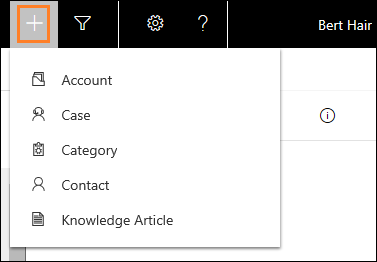

# Create a record

[!INCLUDE[cc-applies-to-update-9-0-0](../../../includes/cc_applies_to_update_9_0_0.md)]

When no records are linked to the conversation in the Omni-channel Engagement Hub, you can create a record using the quick create (**+**) option. After you create the record, it is automatically linked to the conversation.

1.  Select the **+** icon to create a new record.

2.  Select a record type from the list.  
 - Case
 - Contact
 - Account

 > [!div class=mx-imgBorder]
 > 

3. In the left pane, you can see a new record page. Specify the details in the form.

4. Select **Save and Close** to save the changes and close the form.

 > [!div class=mx-imgBorder]
 > 

After you save the changes, the record is linked to the conversation. You can see the linked conversation in the Customer summary page.

> [!div class="nextstepaction"]
> [Next topic: Search and link record to the conversation](csh-search-link-record.md)

## See also

- [Sign in to Dynamics 365 Customer Service Hub app](csh-sign-dynamics-365-customer-service-hub.md)
- [Introduction to the agent interface](csh-introduction-agent-interface-omni-channel-engagement-hub-customer-service-hub.md)
- [Know the sitemap navigation](csh-sitemap.md)
- [Navigate using the navigation bar](csh-navigation-bar.md)
- [Navigation bar buttons](csh-navigation-bar-buttons.md)
- [View agent dashboard and agent work items](csh-my-dashboard.md)
- [View communication panel](csh-conversation-control.md)
- [Set user presence](csh-set-user-presence-status.md)
- [View notifications and screen pops](csh-notifications-screen-pops.md)
- [View customer summary and know everything about customers](csh-customer-360-overview-of-the-existing-challenges.md)
- [Search for and share knowledge articles](csh-search-knowledge-articles.md)
- [Take notes specific to conversation](csh-take-notes.md)
- [View conversations and sessions in Dynamics 365 for Customer Engagement apps](csh-view-conversations-sessions-dynamics-365-apps.md)
- [View customer summary for an incoming conversation request](csh-view-customer-360-incoming-conversation-request.md)
