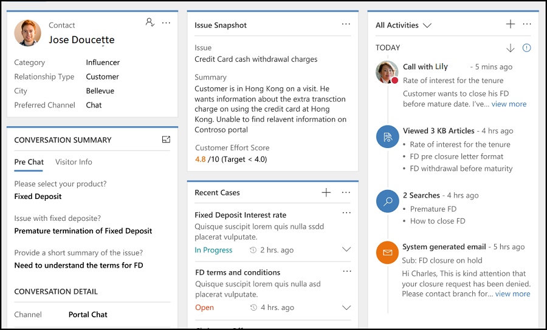

# View customer summary

Applies to Dynamics 365 for Customer Engagement apps version 9.1.0

[!include[cc-beta-prerelease-disclaimer](../../../includes/cc-beta-prerelease-disclaimer.md)]

One of the major challenges that customers face when contacting customer support is providing repetitive information about the issue with the support agent. Also, if the customer wants to review the status of the request later, the customer shares the same information with another support agent to explain the context of the engagement. To avoid this, the support agent needs access to customer information with details about the product/service, issue, case history, related cases, location, and so on.

Having this information ready when a customer contacts the support agent can reduce the hold time that the agent sends to retrieve the customer information, reduce the average handling time (AHT), and increase customer satisfaction with faster resolution of the issue.

## What is Customer summary?

Customer summary is a page where you can get complete information about a customer when you accept an incoming request from any channel. The default Customer summary view provides the following sections:

 - Customer profile

 - Conversation summary

 - Issue Snapshot

 - Recent cases

 - All activities

 

## Customer profile

This section provides details about the customer or account such as name, job, title, relationship type, city, category, primary contact for the account, and preferred channel of engagement.

## Conversation Summary

This section provides two tabs with details that help you to understand the information about the conversation with the customer. **Pre-chat** and **Visitor info** are the tabs in the Conversation summary card. The **Pre-chat survey** tab displays the survey answers against the questions that are requested by your organization, which helps your engagement with the customer. The **Visitor details** tab provides some information such as the customer is authenticated or not, browser used by the customer for contacting support, an operating system used by the customer, location of the customer, interacting language of the customer, and so on.

If the customer signs in to the portal to initiate a chat with the support, then as an agent, you can see the **Authenticated** field value as **Yes** in the **Visitor details** tab of the **Conversation summary** section. Otherwise, the **Authenticated** field value is shown as **No**.

## Issue Snapshot

For an incoming engagement request, the system links an existing case to engagement and displays it in the **Issue snapshot** section. This section displays information such as the title of the case, priority, status, product, and owner.

## Recent Cases

This section displays recent cases that relate to the customer.

### Recent Activities

This section displays case- and customer-related activities in the form of a timeline. You can create quick notes based on the discussion with the customer. Also, you can filter the timeline to view it based on Customer activities, Case activities, and Conversation activities.

> [!div class="nextstepaction"]
> [Next topic: Search for and share knowledge articles](csh-search-knowledge-articles.md)

## See also

- [View communication panel](csh-conversation-control.md)
- [View customer summary for an incoming conversation request](csh-view-customer-360-incoming-conversation-request.md)
