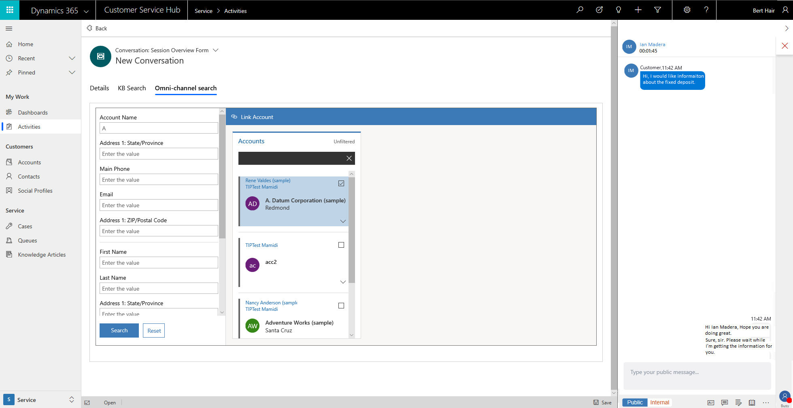

# Link and unlink a record to the conversation

Applies to Dynamics 365 for Customer Engagement apps version 9.1.0

[!include[cc-beta-prerelease-disclaimer](../../../includes/cc-beta-prerelease-disclaimer.md)]

The topic explains how to link and unlink a record to the conversation.

## Link a record to the conversation when doing inline search

> [!div class=mx-imgBorder]
> 

During inline search, the search results are displayed, and you can select a record to link the conversation to the selected record. After you link the record, the **Customer summary** form loads with the details.

> [!div class=mx-imgBorder]
> 

## Link a record to the conversation

Based on the search results, you can choose to link a record from the list. You can link only one record to a conversation.

  

1.  Select the  icon to view the selection list.  

2.  Select the check box next to the record you want to link.    

3.  Select the link button at the top.  

After you link the record to the conversation, the Customer summary page refreshes and reflects the details. Similarly, you can link other record types.

## Unlink a record from the conversation

You can unlink a record only when you are interacting with customer using the communication panel. That is, after you accept an incoming conversation request and view the **Customer summary** page, you can unlink the record from the conversation. 

To unlink a record, select the **X** button next to the customer name in the **Customer profile** form. After the record is removed, the **Customer profile** form is blank. 

## See also

- [View customer summary and know everything about customers](csh-customer-360-overview-of-the-existing-challenges.md)
- [Search for and share knowledge articles](csh-search-knowledge-articles.md)
- [Take notes specific to conversation](csh-take-notes.md)
- [View conversations and sessions in Dynamics 365 for Customer Engagement apps](csh-view-conversations-sessions-dynamics-365-apps.md)
- [View customer summary for an incoming conversation request](csh-view-customer-360-incoming-conversation-request.md)
- [Create a record](csh-create-record.md)