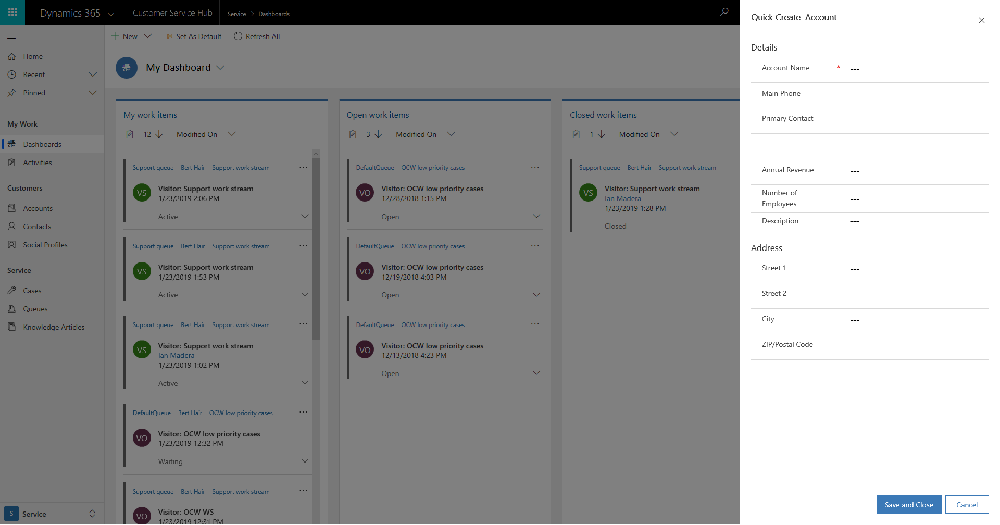

# Navigate using the navigation bar of Omni-channel Engagement Hub

The navigation bar buttons of Omni-channel Engagement Hub in Customer Service Hub contains the following:

1. **Search.** Do a simple search for a record.

2. **Task flow.** Create an automated task flow between your apps and services.

3. **Relationship assistant.**

4. **Quick create.** Add a new record.

5. **Advanced find.** Do an advanced search using filters, sorting, and criteria.

6. **Settings.** Set personal options.

7. **Help.** Get the help documentation.

8. **User.** See user information.

### Search

The search option lets you search records and open a record in a new active session. You can search for the following records using the search option:

 - Case

 - Contact

 - Account

### Create

The quick create option provides the list of related records (entities) that you can create. The following are the record types that you can create:

 - Activities

  - Appointment

  - Email

  - Phone Call

  - Task

 - Account

 - Case

 - Contact

 - Knowledge Article

Select the expand button next to Activities to create different activities.

 

When you select any record, the application displays a new quick create form. For example, select the **Account** record from the list. The application displays the **Quick Create: Account** form. Specify the details in the fields and save the form.

Similarly, for the other records, the application displays the quick create forms of the respective record.

> [!div class="nextstepaction"]
> [Next topic: View agent dashboard and agent work items](csh-my-dashboard.md)

## See also

- [Sign in to Dynamics 365 Customer Service hub](csh-sign-dynamics-365-customer-service-hub.md)
- [Introduction to the agent interface](csh-introduction-agent-interface-omni-channel-engagement-hub-customer-service-hub.md)
- [Know the sitemap navigation(csh-sitemap.md)
- [Navigate using the navigation bar](csh-navigation-bar.md)
- [Conversation control](csh-conversation-control.md)
- [View notifications and screen pops](csh-notifications-screen-pops.md)
- [View customer summary and know everything about customers](csh-customer-360-overview-of-the-existing-challenges.md)
- [View conversations and sessions in Dynamics 365 Customer Engagement apps](csh-view-conversations-sessions-dynamics-365-apps.md)
- [View customer summary for an incoming conversation request](csh-view-customer-360-incoming-conversation-request.md)
- [Create a record](csh-create-record.md)
- [Search and link record to the conversation](csh-search-link-record.md)