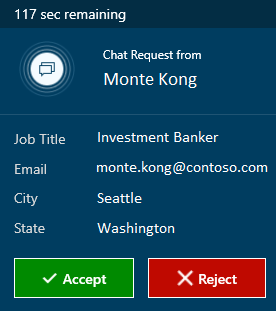

# View notifications and screen pops 

A notification is a visual alert you see as a dialog box each time you get a call, email, chat, or SMS engagement request from a customer. When you get a notification, you see the details of the customer with whom you are going to interact. In addition, in certain types of notifications, you see an accept and reject button that indicates the action you need to perform to accept or reject an incoming engagement request. When you accept the request, a screen pops up with the contextual information of the customer and case.

Some of the scenarios for which you can see the screen pop or notifications are:

-   Incoming chat

-   Incoming email

-   Case assignment

-   Case transfer

-   Case escalation

### Types of notifications

There are two types of notifications:

-   Toast notifications or floating notifications

-   Alert notifications

#### Toast notifications or floating notifications

A toast notification or floating notification is a notification message type where you receive information in a screen-pop dialog, which disappears after a stipulated time. If you select the notification, the associated session or application opens.

Toast notifications or floating notifications appear for SMS, email, chat, and voice scenarios. This kind of notification might have buttons that require action from you, depending on your business requirements.

#### Alert notifications

An alert notification is a type of notification where a dialog appears with actionable buttons. When you select the **Accept** button, a screen pops up with Customer 360 details. You need to take an action within the stipulated time; the screen-pop dialog vanishes when the time is up. If your business requires an auto-accept request for an incoming request based on the routing rules, you will see the notification with no buttons.

  

##### Incoming chat notification

You see a notification for an incoming chat request. When you accept the chat request, you’ll see a screen pop with details about the customer in the Customer 360 page. A simultaneous session starts, and a chat window expands in the left panel of the Unified Service Desk.

  

The details you’ll see for a chat channel are:

 - Customer profile

 - Snapshot

 - Conversation summary

 - Recent cases

 - Recent activities

> [!div class="nextstepaction"]
> [Next topic: Customer 360 overview of the existing challenges](csh-customer-360-overview-of-the-existing-challenges.md)

## See also

- [Sign in to Dynamics 365 Customer Service hub](csh-sign-dynamics-365-customer-service-hub.md)
- [Introduction to the agent interface](csh-introduction-agent-interface-omni-channel-engagement-hub-customer-service-hub.md)
- [Sitemap](csh-sitemap.md)
- [Navigation bar](csh-navigation-bar.md)
- [Navigation bar buttons](csh-navigation-bar-buttons.md)
- [View agent dashboard and agent work items](csh-my-dashboard.md)
- [Conversation control](csh-conversation-control.md)
- [View conversations and sessions in Dynamics 365 Customer Engagement apps](csh-view-conversations-sessions-dynamics-365-apps.md)
- [View customer summary for an incoming conversation request](csh-view-customer-360-incoming-conversation-request.md)
- [Create a record](csh-create-record.md)
- [Search and link record to the conversation](csh-search-link-record.md)