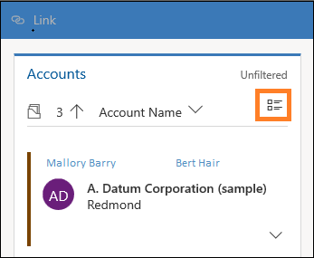

# Search and link a record in Omni-channel Engagement Hub

Applies to Dynamics 365 for Customer Engagement apps version 9.1.0

[!include[cc-beta-prerelease-disclaimer](../../../includes/cc-beta-prerelease-disclaimer.md)]

The topic explains how to search a record in Omni-channel Engagement Hub and link the record to the conversation.

## Search for a record

You can search for the records in two ways.

### Search for a record using inline search option

You accept an incoming conversation request, and there is no customer record identified in the Omni-channel Engagement Hub. In this case, use the inline search option in the **Customer profile** form and **Issue snapshot** form to search for a contact or account and case respectively.

The inline search is based on the Lookup View and Quick Find View. You can search the fields (attributes) that is based on the Lookup View and Quick View Field.

For **Customer profile**, you can search for Contact or Account entity. By default, you can search using the following fields.

<table>
    <tr>
        <th>Entity</th>
        <th>Fields</th>
    </tr>
    <tr>
        <td rowspan="4">Account</td>
        <td>Account Name</td>
    </tr>
    <tr>
        <td>Account Number</td>
    </tr>
    <tr>
        <td>Email</td>
    </tr>
    <tr>
        <td>Main Phone</td>
    </tr>
    <tr>
        <td rowspan="7">Contact</td>
        <td>Company Name</td>
    </tr>
    <tr>
        <td>Email</td>
    </tr>
    <tr>
        <td>First Name</td>
    </tr>
    <tr>
        <td>Last Name</td>
    </tr>
    <tr>
        <td>Middle Name</td>
    </tr>
    <tr>
        <td>Full Name</td>
    </tr>
    <tr>
        <td>Mobile Phone</td>
    </tr>  
 </table>

For the **Issue snapshot**, you can search for Case (Incident) entity. By default, you can search using the following fields.

<table>
<tr>
        <th>Entity</th>
        <th>Fields</th>
    </tr>
    <tr>
        <td rowspan="2">Case</td>
        <td>Case Number</td>
    </tr>
    <tr>
        <td>Case Title</td>
    </tr> 
 </table>

Only active views are displayed for the search results. Also, you can customize the **Quick Find View** and **Lookup View** to change the searchable fields as per your business requirements. More information [Understand views](/dynamics365/customer-engagement/customize/create-edit-views) and [Unified Interface Lookup view leverages Quick Find View](https://blogs.msdn.microsoft.com/crm/2018/11/02/unified-interface-lookup-now-leverages-quick-find-view/)

> [!div class=mx-imgBorder]
> 

After the search results, selecting a record links the conversation to the selected record and loads the **Customer summary** form with the details.

> [!div class=mx-imgBorder]
> 

### Search for a record using the search option

Search the Omni-channel records using the search option. When you select the Search icon, the search page launches in the application management toolbar. Specify the details and select **Search**. You will see the details in the form of a list.

  

1.  Select the search icon . The application launches the Omni-channel search tab.  

2. Specify any of the following values based on your search requirements.

 - Account Name
 - Address 1: State/Province
 - Main Phone
 - Email
 - Address 1: ZIP/Postal Code
 - First Name
 - Last Name
 - Address 1: State/Province
 - Business Phone
 - Email
 - Address 1: ZIP/Post Code
 - Case Number

3. Select **Search**. The search results appear.

  

## Link a record

Based on the search results, you can choose to link a record from the list. You can link only one record to a conversation.

  

1.  Select the  icon to view the selection list.  

 

2.  Select the check box next to the record you want to link.

   

3.  Select the link button at the top.

 

After you link the record to the conversation, the Customer summary page refreshes and reflects the details. Similarly, you can link other record types.

## See also

- [Sign in to Dynamics 365 Customer Service Hub app](csh-sign-dynamics-365-customer-service-hub.md)
- [Introduction to the agent interface](csh-introduction-agent-interface-omni-channel-engagement-hub-customer-service-hub.md)
- [Know the sitemap navigation](csh-sitemap.md)
- [Navigate using the navigation bar](csh-navigation-bar.md)
- [Navigation bar buttons](csh-navigation-bar-buttons.md)
- [View agent dashboard and agent work items](csh-my-dashboard.md)
- [View communication panel](csh-conversation-control.md)
- [Set user presence](csh-set-user-presence-status.md)
- [View notifications and screen pops](csh-notifications-screen-pops.md)
- [View customer summary and know everything about customers](csh-customer-360-overview-of-the-existing-challenges.md)
- [Search for and share knowledge articles](csh-search-knowledge-articles.md)
- [Take notes specific to conversation](csh-take-notes.md)
- [View conversations and sessions in Dynamics 365 for Customer Engagement apps](csh-view-conversations-sessions-dynamics-365-apps.md)
- [View customer summary for an incoming conversation request](csh-view-customer-360-incoming-conversation-request.md)
- [Create a record](csh-create-record.md)
