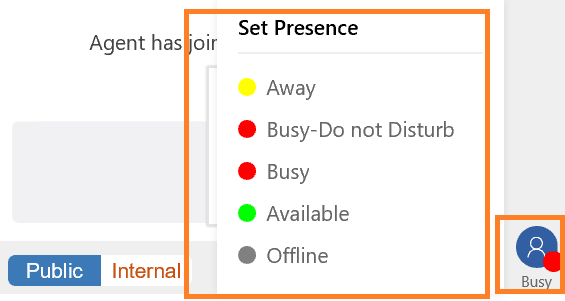

# Set user presence

[!INCLUDE[cc-applies-to-update-9-0-0](../../../includes/cc_applies_to_update_9_0_0.md)]

Presence is the indication of your (agent) availability or status. 

## Update your presence status

Presence status is updated in two ways: 
- **Manually** - Change the status manually according your availability.  To view and set the presence, select the status icon at the bottom-right corner and then select the status from the list to update your status manually. The list shows five standard presence statuses: 

  - Available
  - Away
  - Busy
  - Do Not Disturb
  - Offline

    Also, you may see any other additional presence statuses that your administrator configured for you.

  > [!div class=mx-imgBorder]
  > 

- **Automatically** - The status is set automatically based on the work item assignment. That is, when a conversation (work item) is assigned to you, the status is updated based on the capacity.

  a. When your capacity is completely utilized the presence is set to **BusyDND**.
  b. When your capacity is partially utilized the presence is set to **Busy**. 
  c. When your capacity is not utilized the presence is set to **Available**.

> [!div class="nextstepaction"]
> [Next topic: View notifications and screen pops](csh-notifications-screen-pops.md) 

## See also

- [Sign in to Dynamics 365 Customer Service Hub app](csh-sign-dynamics-365-customer-service-hub.md)
- [Introduction to the agent interface](csh-introduction-agent-interface-omni-channel-engagement-hub-customer-service-hub.md)
- [Know the sitemap navigation](csh-sitemap.md)
- [Navigate using the navigation bar](csh-navigation-bar.md)
- [Navigation bar buttons](csh-navigation-bar-buttons.md)
- [View agent dashboard and agent work items](csh-my-dashboard.md)
- [View communication panel](csh-conversation-control.md)
- [View customer summary](csh-customer-360-overview-of-the-existing-challenges.md)
- [View conversations and sessions in Dynamics 365 for Customer Engagement apps](csh-view-conversations-sessions-dynamics-365-apps.md)
