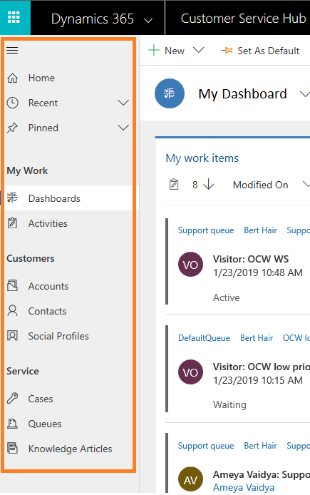

# Omni-channel Engagement Hub sitemap in Customer Service Hub application

The sitemap is a place for you to access the customer service record types. By default, the sitemap is in collapsed mode. To expand the sitemap, select the Sitemap icon .  

  

The Sitemap displays the following record types:

- **Dashboards**

    When you sign in to the application, you see a dashboard that gives you easy-to-read information about the tasks you are working on. There are several dashboards tailored for your role. To see the other dashboards, select the drop-down list next to **My dashboard**. Also, you can see any dashboard as your default view using the **Set As Default** option in the command bar. By default, you see **My Dashboard**, which displays information about the tasks that you work on.

- **Activities**

    Activities help you keep track of all your customer communications in the form of **Conversation** and **Session** record types. Activities are the details of interactions between the customer and you, such as history of the conversation, transcript of the conversation, session details, and more.

- **Accounts**

    Account records are used to store the information that you collect from the customer with whom you interact. That is, you store the details about the companies in the accounts. An account might have more than one contact associated with it.

- **Contacts**

    Contact records help you manage and store information about the customers you work with. Usually, multiple contacts work in the same organization, and as a result you can associate these contacts with the account (organization).

- **Social Profiles**

    Social profiles are the profiles that a contact or account of the customer has on social media. You use the social profiles to interact with the customer on social media.

- **Cases**

    Cases (tickets or incidents) are the requests, inquiries, issues, feedbacks, complaints, and so on about the product or service that your customers need assistance to resolve. The cases will be routed to the queues to which you are added as an agent.

- **Queues**

    Queues are the route where the cases are assigned to you. Your organization can create queues and agents based on the business requirement. This ensures that you get tasks from the queues to which you are added as an agent.

- **Knowledge articles**

    Knowledge articles are articles about the questions, issues, feedback, resolutions, best practices, and guidelines that are helpful. You can share the articles with the customers and help them to resolve the cases.   

> [!div class="nextstepaction"]
> [Next topic: Navigate using the navigation bar](csh-navigation-bar.md)

## See also

- [Sign in to Dynamics 365 Customer Service hub](csh-sign-dynamics-365-customer-service-hub.md)
- [Introduction to the agent interface](csh-introduction-agent-interface-omni-channel-engagement-hub-customer-service-hub.md)
- [Navigation bar buttons](csh-navigation-bar-buttons.md)
- [View agent dashboard and agent work items](csh-my-dashboard.md)
- [Conversation control](csh-conversation-control.md)
- [View notifications and screen pops](csh-notifications-screen-pops.md)
- [View customer summary and know everything about customers](csh-customer-360-overview-of-the-existing-challenges.md)
- [View conversations and sessions in Dynamics 365 Customer Engagement apps](csh-view-conversations-sessions-dynamics-365-apps.md)
- [View customer summary for an incoming conversation request](csh-view-customer-360-incoming-conversation-request.md)
- [Create a record](csh-create-record.md)
- [Search and link record to the conversation](csh-search-link-record.md)