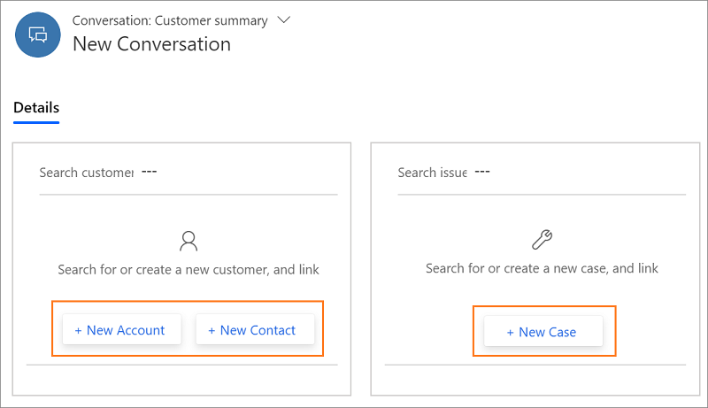
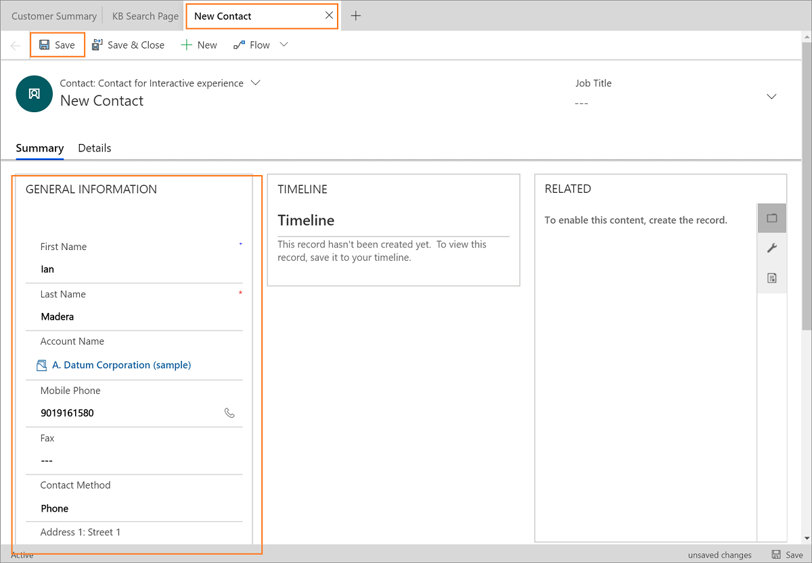
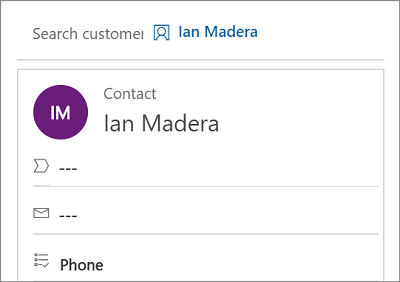
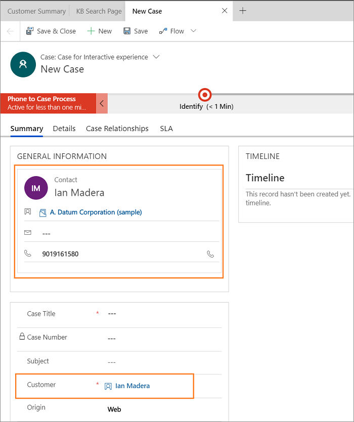

# Create a record

Applies to Dynamics 365 for Customer Engagement apps version 9.1.0

[!include[cc-beta-prerelease-disclaimer](../../../includes/cc-beta-prerelease-disclaimer.md)]

When no records are linked to the conversation in Omnichannel for Customer Service, you can create a record. You can create a new record in two ways:

- Create new record from the Customer Summary page
- Create new record using the quick create option

## Create new record from the Customer Summary page

In the customer summary page and on the customer and case form, you see an option to create a new record. When you select the add new option, a corresponding form opens in a new tab. You can fill in the details and save the record and the record is auto-linked to the conversation.

To create a new record:

1. Select one option in the Customer or Case section based on the record you want to create. After you select the option, a form opens in an application tab panel.
    
    | Option | Section | Description |
    |---------------------|------------------------|------------------------------------------------|
    | + Add Account | Customer | Select this option to create a new account record |
    | + Add Contact | Customer | Select this option to create a new contact record |
    | + Add Case | Case | Select this option to create a new case record |

    > [!div class=mx-imgBorder]
    > 

2. Specify the details in fields according to the form.

3. Select **Save**.

    > [!div class=mx-imgBorder]
    > 

After you save, the record is automatically linked to the conversation.

   > [!div class=mx-imgBorder]
   > 

If you create the case account or contact first and then start to create a case record, the case form links the customer that is already created and linked.

   > [!div class=mx-imgBorder]
   > 

## Create new record using the quick create option

Use the quick create (**+**) option in the nav bar to create a new record. After creating the record, you must manually search and link the record to the conversation.

To create a new record, follow the steps:

1.  Select the **+** icon to create a new record.

2.  Select a record type from the list.  
 - Case
 - Contact
 - Account

 > [!div class=mx-imgBorder]
 > 

3. In the left pane, you can see a new record page. Specify the details in the form.

4. Select **Save and Close** to save the changes and close the form.

 > [!div class=mx-imgBorder]
 > 

After you save the changes, you can link the record to the conversation. To learn more, see [Search and link a record to the conversation](oceh-search-link-unlink-record.md#search-for-records-using-inline-search-option)

> [!div class="nextstepaction"]
> [Next topic: Search, link, and unlink a record](oceh-search-link-unlink-record.md)

## See also

- [View customer summary and know everything about customers](oceh-customer-360-overview-of-the-existing-challenges.md)
- [View conversation and session activity types in the Customer Engagement apps](oceh-view-conversations-sessions-dynamics-365-apps.md)
- [View customer summary for an incoming conversation request](oceh-view-customer-360-incoming-conversation-request.md)
