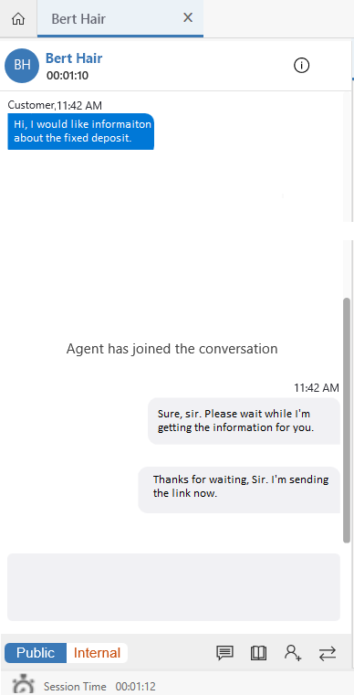

# View conversation control

The left control panel is a communication or conversation control that hosts conversations. From here, you can engage with your customers.

When you're using the chat conversation channel, you can send quick replies. You can also search for knowledge articles and share them with the customer that you're interacting with. You can even transfer the work item to another agent or queue.

If you need help to resolve the work item, you can use the **Consult** option. You can also switch from the public mode to the internal mode to send messages to internal participants (other agents and/or a supervisor).

   

## Internal and public messages

While you consult with another agent or a supervisor, the customer is also present. However, you might not want to share some messages with that customer. In this case, you can choose to reply only to the agent or supervisor. The messages that you send are then classified as **Internal**. Internal messages are visible only to the agent or supervisor. The customer who is on the interaction can't see them.

When you want to send a message to the customer, and also to the agent or supervisor who is also present on the interaction, select the **Public** button. The messages that you send are then classified as **public** messages..

You can use keyboard shortcuts to send internal and public messages:

- **Slash+I** – Press the Slash (/) key and the letter I to send an internal message to other agents and/or a supervisor.

- **Slash+P** – Press the Slash (/) key and the letter P to send a public message to all the participants in the interaction.

## Send quick replies in the chat

When you chat with a customer, your organization's processes might require that you work with a standard set of questions and answers. These questions and answers are stored as quick replies. Select the **Quick replies** button to retrieve the standard set of questions and replies when you interact with customers.

  

These questions and answers are stored as quick replies and you can use keyboard shortcut to see the list of quick replies.

You can use a keyboard shortcut to see the list of quick replies. Press the Slash (/) key and the letter Q (**/+Q**).

## Search for and share knowledge articles

From the conversation control, you can search for relevant knowledge articles, based on the context of the session, and then share the articles that you find with customers.

You can use a keyboard shortcut to open the knowledge article search control in the right panel. Press the Slash (/) key and the letters K and B (**/+K+B**). You can search for and share articles with customers through the conversation control. Select the **Send link** button to share the link to a knowledge article with the customer.

## Consult with agent or supervisor

While you're interacting with a customer, you might want the expertise of another agent or with supervisor. In this case, you can invite the agent or supervisor by selecting the **Consult** button in the chat panel.

  

You can use a keyboard shortcut to see the list of agents and/or the supervisor who are available for consultation. Press the Slash (/) key and the letters C and O (**/+C+O**).

**/co** (forward slash, letter c and letter o) is the keyboard shortcut to see list of agents and/or supervisor who are available for consult.

## Transfer the conversation

When you work on a conversation request, you might encounter the following scenarios:

-   You have minimal knowledge and want to route the request to another agent in the same queue.

-   You identify the request belongs to a different queue.

In these scenarios, you can transfer the request. You can transfer a request only to agents who are configured in the same work stream and queue. If the request belongs to another queue, when you transfer the request, routing rules will push the queue as appropriate.

> [!div class="nextstepaction"]
> [Next topic: View call scripts, take notes, and search knowledge articles](right-control-panel.md)

## See also

- [Sign in to Unified Service Desk – Omni-channel Engagement Hub](signin-unified-service-desk-omni-channel-engagement-hub.md)
- [Introduction to the agent interface in Omni-channel Engagement Hub](introduction-agent-interface-omni-channel-engagement-hub.md)
- [Introduction to agent dashboard](introduction-agent-dashboard.md)
- [Notifications and screen pop](notifications-screen-pop.md)
- [Customer 360 – know everything about customers](customer360-overview-existing-challenges.md)
- [View conversation and session forms in Dynamics 365 for Customer Engagement apps](view-omni-channel-conversation-omni-channel-session-dynamics365-apps.md)
- [View customer summary for an incoming conversation request](view-customer360-incoming-conversation-request.md)
- [Create a record](create-record.md)
- [Search and link a record](search-link-record.md)