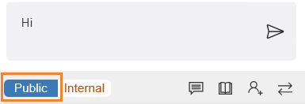
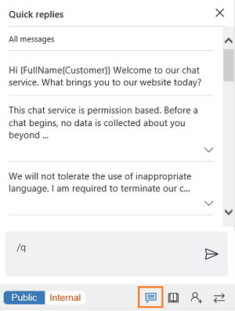

# View communication panel

Applies to Dynamics 365 for Customer Engagement apps version 9.1.0

[!include[cc-beta-prerelease-disclaimer](../../../includes/cc-beta-prerelease-disclaimer.md)]

The communication or conversation panel shows the exchange of messages between you and the customer. The communication panel can hosts different channels.

In the chat channel, you can see the following options:
 
 | Option           | Description                                   |
 |------------------|-----------------------------------------------|
 | Public           | Send messages to public |
 | Internal         | Send messages to internal users |
 | Quick replies    | Send templatized messages  |
 | Knowledge articles | Search for knowledge articles and share |
 | Consult          | View list to consult with other users | 
 | Transfer         | View list to transfer the request |

> [!div class=mx-imgBorder]
>    

## Internal and public messages

The communication panel allows you to send messages in two ways - **Internal** and **Public**. 

When you want to send messages only to the internal participants like other agents and/or supervisors, then use the **Internal** option. The internal messages are not shown to the customers.

> [!div class=mx-imgBorder]
> 

When you want to send messages to all the participants in the conversation including the customer, then use the **Public** option.

> [!div class=mx-imgBorder]
> 

You can use keyboard shortcuts to send internal and public messages:

- **/I** – Press the Slash (/) key and the letter I to send an internal message to other agents and/or a supervisor.

- **/P** – Press the Slash (/) key and the letter P to send a public message to all the participants in the interaction.

## Send quick replies in the chat

The communication panel provides you with the capability to send templatized messages to the customer with whom you're interacting. These templatized messages are stored as quick replies. Select the **Quick replies** button to retrieve the messages and send it to the customers.

> [!div class=mx-imgBorder]
>

You can use a keyboard shortcut to see the list of quick replies. Press the Slash (/) key and the letter Q (**/Q**).

## Search for and share knowledge articles

From the communication panel, you can launch the knowledge article search control using the knowledge article option. After launching the knowledge article search control, you can search for relevant knowledge articles, based on the context of the session, and then share the articles with the customers.

You can use a keyboard shortcut to launch the knowledge article search control in the right panel. Press the Slash (/) key and the letters K and B (**/KB**). You can search for and share articles with customers through the communication panel. Select the **Send link** button to share the link of a knowledge article with the customer. More information: [Search for knowledge articles](right-control-panel.md#search-for-knowledge-articles)

## Consult with agent or supervisor

The communication panel lets you to consult with other agents and/or supervisor using the consult option. You can invite the agent or supervisor by selecting the **Consult** button in the communication panel.

> [!div class=mx-imgBorder]
>  

You can use a keyboard shortcut to see the list of agents and/or the supervisor who is available for consultation. Press the Slash (/) key and the letter C (**/C**).

## Transfer the conversation

The communication panel allows you to transfer a conversation request. You can transfer the conversation (work item) either to an agent or a queue.

> [!div class=mx-imgBorder]
>

You can transfer a request only to agents who are configured in the same work stream and queue. If the request belongs to another queue and when you transfer the request, routing rules assign the conversation (work item) to the appropriate agent in the queue.

Use a keyboard shortcut to see the list of agents and/or the supervisor who is available for transfer. Press the Slash (/) key and the letters T (**/T**).

Use a keyboard shortcut to see the list of queues to transfer the conversation request. Press the Slash (/) key and the letters T and Q (**/TQ**).

> [!div class="nextstepaction"]
> [Next topic: View call scripts, take notes, and search knowledge articles](right-control-panel.md)

## See also

- [Introduction to the agent interface in Omni-channel Engagement Hub](introduction-agent-interface-omni-channel-engagement-hub.md)
- [View customer summary and know everything about customers](customer360-overview-existing-challenges.md)
- [View customer summary for an incoming conversation request](view-customer360-incoming-conversation-request.md)
- [Create a record](create-record.md)
- [Search for records](search-record.md)
- [Link and unlink a record](link-unlink-record.md)