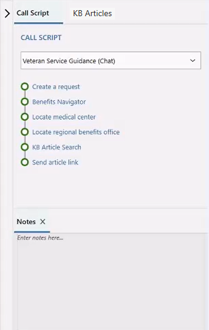
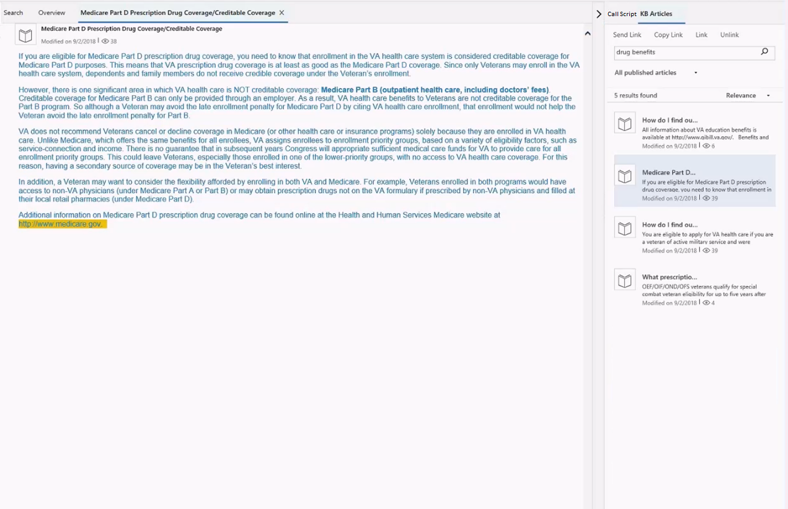

# View call scripts, take notes, and search knowledge articles

[!INCLUDE[cc-applies-to-update-9-0-0](../../../includes/cc_applies_to_update_9_0_0.md)]

The right panel consists of agent scripts, notes, and knowledge management search controls.

### Call script control

The **Call script** section in the right panel provides guidance about what you should say during calls, or what you should type during chat conversations.

> [!div class=mx-imgBorder]
>   

### Search for knowledge articles

Knowledge management plays an important part in the customer service process. Access to up-to-date information can help you provide quick and accurate answers to your customers, and therefore help reduce the average handling time.

Omni-channel Engagement Hub lets you use the rich knowledge base (KB) in Microsoft Dynamics 365 from the desktop. Therefore, you can quickly search for relevant knowledge articles while you're working on a case and can provide accurate answers to customers, without having to switch applications.

You can search for a KB article and open it as a tab on the Application tab management toolbar. You can also use the **Send Link** button to share the link to a KB article with the customer that you're interacting with. When you select **Send Link**, the link is pasted into the chat window (conversation control).

> [!div class=mx-imgBorder]
> 

> [!div class="nextstepaction"]
> [Next topic: View conversation and session forms in Dynamics 365 for Customer Engagement apps](view-omni-channel-conversation-omni-channel-session-dynamics365-apps.md)

## See also

- [Sign in to Unified Service Desk – Omni-channel Engagement Hub](signin-unified-service-desk-omni-channel-engagement-hub.md)
- [Introduction to the agent interface in Omni-channel Engagement Hub](introduction-agent-interface-omni-channel-engagement-hub.md)
- [View agent dashboard and agent work items](introduction-agent-dashboard.md)
- [View notifications and screen pops](notifications-screen-pop.md) 
- [View customer summary and know everything about customers](customer360-overview-existing-challenges.md)
- [View communication panel](left-control-panel.md)
- [View customer summary for an incoming conversation request](view-customer360-incoming-conversation-request.md)
- [Create a record](create-record.md)
- [Search and link a record](search-link-record.md)
