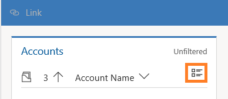

# Search for and link a record in Omni-channel Engagement Hub

[!INCLUDE[cc-applies-to-update-9-0-0](../../../includes/cc_applies_to_update_9_0_0.md)]

The topic explains how to search for a record in Omni-channel Engagement Hub and link it to a conversation.

## Search for a record
You can search for the records in two ways.

### Search for a record using the inline search option

You accept an incoming conversation request and there is no customer record identified in the Omni-channel Engagement Hub. In this case, use the inline search option in the **Customer profile** form and **Issue snapshot** form to search for a contact or account and case respectively.

The inline search is based on the Lookup View and Quick Find View. You can search the fields (attributes) that is based on the Lookup View and Quick View Field.

For **Customer profile**, you can search for Contact or Account entity. By default, you can search using the following fields.

<table>
    <tr>
        <th>Entity</th>
        <th>Fields</th>
    </tr>
    <tr>
        <td rowspan="4">Account</td>
        <td>Account Name</td>
    </tr>
    <tr>
        <td>Account Number</td>
    </tr>
    <tr>
        <td>Email</td>
    </tr>
    <tr>
        <td>Main Phone</td>
    </tr>
    <tr>
        <td rowspan="7">Contact</td>
        <td>Company Name</td>
    </tr>
    <tr>
        <td>Email</td>
    </tr>
    <tr>
        <td>First Name</td>
    </tr>
    <tr>
        <td>Last Name</td>
    </tr>
    <tr>
        <td>Middle Name</td>
    </tr>
    <tr>
        <td>Full Name</td>
    </tr>
    <tr>
        <td>Mobile Phone</td>
    </tr>  
 </table>

For the **Issue snapshot**, you can search for Case (Incident) entity. By default, you can search using the following fields.

<table>
<tr>
        <th>Entity</th>
        <th>Fields</th>
    </tr>
    <tr>
        <td rowspan="2">Case</td>
        <td>Case Number</td>
    </tr>
    <tr>
        <td>Case Title</td>
    </tr> 
 </table>

Only active views are displayed for the search results. Also, you can customize the **Quick Find View** and **Lookup View** to change the searchable fields as per your business requirements. More information [Understand views](/dynamics365/customer-engagement/customize/create-edit-views) and [Unified Interface Lookup view leverages Quick Find View](https://blogs.msdn.microsoft.com/crm/2018/11/02/unified-interface-lookup-now-leverages-quick-find-view/)

> [!div class=mx-imgBorder]
> 

After the search results, selecting a record links the conversation to the selected record and loads the **Customer summary** form with the details.

> [!div class=mx-imgBorder]
> 

### Search for a record using the search option

You can search for omni-channel records by using the search functionality. When you select the **Search** button, the **Search** page appears on the application management toolbar. Specify the details, and then select **Search**. The results appear in the form of a list.

1. Select the search icon , and select **Omni-channel Search**.

2. Specify any of the following values as per your search requirements:

 - Account Name
 - Address 1: State/Province
 - Main Phone
 - Email
 - Address 1: ZIP/Post Code
 - First Name
 - Last Name
 - Address 1: State/Province
 - Business Phone
 - Email
 - Address 1: ZIP/Post Code
 - Case Number

3. Select **Search**. The search results appear.

## Link a record

You can link a record in the list of search results to a conversation. You can link only one record to a conversation.

1. Select the  icon to view the selection list.

 > [!div class=mx-imgBorder]
 > 

2. Select the check box next to the record you want to link.

 > [!div class=mx-imgBorder]
 > 

3. Select the link button at the top.

 > [!div class=mx-imgBorder]
 > 

After you link the record to the conversation, the Customer summary form is refreshed and reflects the details. Similarly, you can link other record types.

## See also

- [Sign in to Unified Service Desk – Omni-channel Engagement Hub](signin-unified-service-desk-omni-channel-engagement-hub.md)
- [Introduction to the agent interface in Omni-channel Engagement Hub](introduction-agent-interface-omni-channel-engagement-hub.md)
- [View agent dashboard and agent work items](introduction-agent-dashboard.md)
- [View notifications and screen pops](notifications-screen-pop.md)
- [View customer summary and know everything about customers](customer360-overview-existing-challenges.md)
- [View communication panel](left-control-panel.md)
- [View call scripts, take notes, and search knowledge articles](right-control-panel.md)
- [View conversation and session forms in Dynamics 365 for Customer Engagement apps](view-omni-channel-conversation-omni-channel-session-dynamics365-apps.md)
- [View customer summary for an incoming conversation request](view-customer360-incoming-conversation-request.md)
- [Create a record](create-record.md)
