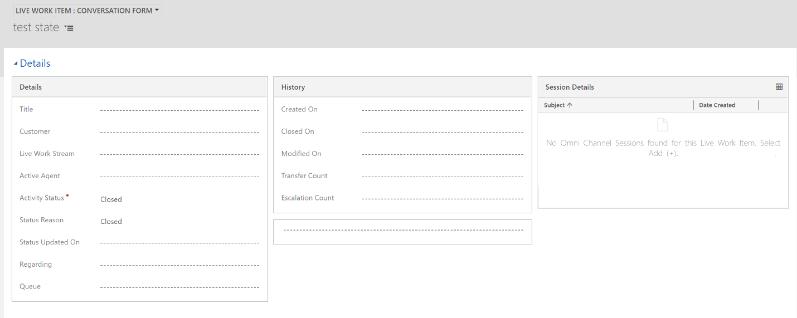

# View Omni-channel conversations and Omni-channel session in Dynamics 365 apps

Your organization may have a classification where certain agents work in the contact center that uses Omni-channel Engagement Hub and certain agents work in another contact center that uses Dynamics 365 apps like Customer Service Hub. In this case, if you are an agent who works on Dynamics 365 apps and needs to analyze the conversation request from Omni-channel Engagement Hub, you can find the information through **Activities** in Dynamics 365 for Customer Engagement apps.

You can find the following activity types in Dynamics 365 for Customer Engagement apps:

 - Conversation form

 - Omni-channel session

### Conversation form

The Conversation form displays information of an conversation request, which are as follows:

| Section         | Fields            |
|-----------------|-------------------|
| Details         | Title             |
|                 | Customer          |
|                 | Live work stream  |
|                 | Active agent      |
|                 | Activity status   |
|                 | Status reason     |
|                 | Status updated on |
|                 | Regarding         |
|                 | Queue             |
| History         | Create on         |
|                 | Closed on         |
|                 | Modified on       |
|                 | Transfer count    |
|                 | Escalation count  |
| Session details | Subject           |
|                 | Date created      |

  

### Session form

The Omni-channel session displays information of an conversation request, which are as follows:

| Section | Field           |
|---------|-----------------|
| Header  | Priority        |
|         | Due Date        |
|         | Activity Status |
| General | Subject         |
|         | Owner           |
|         | Regarding       |
|         | Name            |
|         | Created on      |
| Notes   | Notes           |

 

> [!div class="nextstepaction"]
> [Next topic: View Customer 360 for an incoming conversation request](view-customer360-incoming-conversation-request.md)

## See also

- [Sign in to Unified Service Desk – Omni-channel Engagement Hub](signin-unified-service-desk-omni-channel-engagement-hub.md)
- [Introduction to the agent interface in Omni-channel Engagement Hub](introduction-agent-dashboard.md)
- [Introduction to agent dashboard](introduction-agent-dashboard.md)
- [Notifications and screen pop](notifications-screen-pop.md)
- [Customer 360 – know everything about customers](customer360-overview-existing-challenges.md)
- [Conversation panel](left-control-panel.md)
- [Right control panel](right-control-panel.md)
- [Create a record](create-record.md)
- [Search and link a record](search-link-record.md)