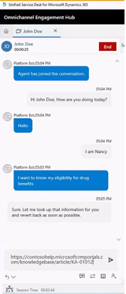

# Left control panel

The left control panel is a communication or conversation control panel. The conversation control hosts the engagement and you can engage with you customers.

Using the chat conversation channel, you can send Quick responses and KB Articles to the customer with whom you are interacting.

  

### Reply message as Internal and Public

While you consult with an agent or supervisor, the customer is also present, and you may not want to share certain messages with the customer. In this situation, you can choose to reply only to the agent or supervisor. The messages you send are visible only the agent or supervisor and are classified as **Internal**. The customer who is on the interaction cannot see the **Internal** messages.

When you want to send a message to the customer and agent and or supervisor who are present in the interaction, you can send these messages using the **Public** button. These messages are classified as public messages.

You can use the keyboard shortcut to reply only to the agent or supervisor and to all the participants in the interaction.

**/i** (forward slash, letter i) is the keyboard shortcut to send the message as internal to the agents and/or supervisor.

**/p** (forward slash, letter p) is the keyboard shortcut to send the message as public to the all the participants in the interaction.

### Send Quick responses in the chat

When you chat with a customer, your organization may have a process that requires you to interact with a set of standard questions and answers. You can use the **Quick responses** options to retrieve the standard set of questions and replies when you are interacting with the customers.

  

These questions and answers are stored as Quick responses and you can use keyboard shortcut to see the list of Quick responses.

**/q** (forward slash and letter q) is the keyboard shortcut to see list of Quick responses.

### Consult with agent or supervisor

When you are interacting with a customer, you want the expertise of another agent or with supervisor. In such scenario, you can Invite the agent or supervisor using consult option in the chat panel.

  

You can use the keyboard shortcut to see the list of available agents and/or supervisor with whom you can consult.

**/co** (forward slash, letter c and letter o) is the keyboard shortcut to see list of agents and/or supervisor who are available for consult.

### Transfer the engagement request

When you work on engagement request, you may come across the following scenarios:

-   You have minimal knowledge and want to route the request to another agent in the same queue.

-   You identify the request belongs to a different queue.

In above-mentioned scenarios, you can transfer the request. You can transfer the request only to the agents who are configured with in the same work stream and queue. If the request belongs to another queue, then you can transfer the request and the routing rules will push the queue accordingly.

