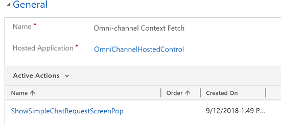

# Step 3: Create the events

Create the following events:

 - CreateCustomerSession

 - IncomingRequestRejected

 - TimedOut

 - Omni-channel Context Fetch

1. Sign in to Dynamics 365.

2. Go to **Settings** &gt; **Unified Service Desk**.

3. Select **Events** and select **+ New**.

4. In the new event page, specify the following details.

 | **Field**          | **Value**                       |
 |--------------------|---------------------------------|
 | Name               | CreateCustomerSession           |
 | Hosted Application | Omni-channel Popup Notification |

 

5. Save the event.

 Repeat the steps from 3 - 5 to create **IncomingRequestRejected**, **TimedOut**, and **Omni-channel Context Fetch** events.

 For the Omni-channel Context Fetch event, specify the following details.

 | **Field**          | **Value**                  |
 |--------------------|----------------------------|
 | Name               | Omni-channel Context Fetch |
 | Hosted Application | OmniChannelHostedControl   |

   

> [!div class="nextstepaction"]
> [Next topic: Step 4: Create an action call to display the notification](alertnotification-step4-create-action-call-display-notification.md)

## See also

- [Configure notification (Screen pop) for agents](configure-notification-screen-pop-agents.md)
- [Step 1: Create forms to define layout and behavior of the notification](alertnotification-step1-create-forms-define-layout-behavior-notification.md)
- [Step 2: Create hosted controls](alertnotification-step2-create-hosted-controls.md)
- [Step 5: Add the action calls to the events](alertnotification-step5-add-action-calls-events.md)
- [Step 6: Add the hosted controls, events, and action calls to the agent and supervisor configurations](alertnotification-step6-add-hosted-controls-events-action-callsagent-supervisor-configurations.md)
- [Configure toast notification in Unified Service Desk](configure-toast-notification-unified-service-desk.md)