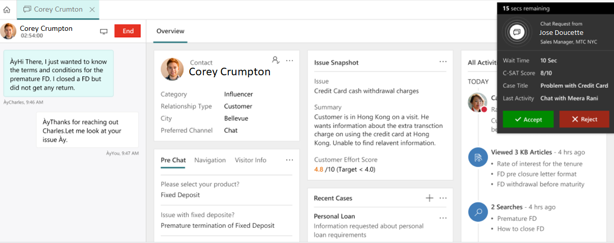

# Configure alert notifications in Unified Service Desk.

The process of configuring alert notification settings in Unified Service Desk involves multiple steps:

1.  Create forms with notifications definition (in Extensible Application Markup Language \[XAML\] format).

2.  Create Hosted Control.

3.  Create Events.

4.  Create Action Calls.

5.  Attach the Action Calls to Events

6.  Add the Hosted Controls, Actions, and Events to the Agent and Supervisor Configurations.

Consider a scenario where you receive an incoming chat conversation request. What is the interaction experience for this incoming chat conversation? You see an alert notification for the incoming conversation request. Therefore, the following events must be created:

-   Create an event to open a session when agent selects **Accept**

-   Create an event and action when agent selects **Reject**

-   Create an event and action when an agent does not act, and time is out after the **Wait Time**

## Create an event to open a session when agent selects Accept 

You must define an event and attach action calls so that an agent can accept an incoming request. When the agent selects the **Accept** button, he or she will experience the following actions:

-   The notification closes.

-   Communication control panel (chat or voice) expands.

-   Presence status of the agent is updated.

-   Omni-channel customer session is created.

-   Omni-channel session is accepted.

-   Session timer starts.

-   KB Articles search control opens.

-   Open agent session search page.

-   Load default agent script.

-   Load agent session Customer 360 page.

-   Focus on the Customer 360 page.

   

### Create an event and action when agent selects Reject 

You must define an event and attach action calls so that an agent can reject an incoming request. When the agent selects the **Reject** button, he or she will experience the following actions:

-   The notification closes.

-   Omni-channel session is rejected.

## Create an event and action when agent doesn't act, and time-out occurs after the specified wait Time value

You must define an event and an action call when an agent does not act in a stipulated time. The notification hides after the wait time. The agent will experience the following action:

-   The Omni-channel session times out.

> [!div class="nextstepaction"]
> [Next topic: Step 1: Create forms to define layout and behavior of the notification](alertnotification-step1-create-forms-define-layout-behavior-notification.md)

## See also

- [Configure notification (Screen pop) for agents](configure-notification-screen-pop-agents.md)
- [Step 2: Create hosted controls](alertnotification-step2-create-hosted-controls.md)
- [Step 3: Create events](alertnotification-step3-create-the-events.md)
- [Step 4: Create an action call to display the notification](alertnotification-step4-create-action-call-display-notification.md)
- [Step 5: Add the action calls to the events](alertnotification-step5-add-action-calls-events.md)
- [Step 6: Add the hosted controls, events, and action calls to the agent and supervisor configurations](alertnotification-step6-add-hosted-controls-events-action-callsagent-supervisor-configurations.md)
- [Configure toast notification in Unified Service Desk](configure-toast-notification-unified-service-desk.md)