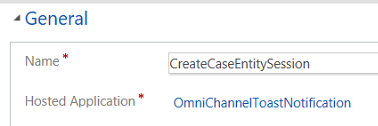

# Step 3: Create events 

Create the following events: 

 - CreateCaseEntitySession   

 - TimedOut 

 - Show FOO Entity Notification

Follow these steps to create the events.

1. Sign in to Dynamics 365. 

2. Go to **Settings** > **Unified Service Desk**. 

3. Select **Events** and select **+ New**. 

4. On the page for the new event, specify the following details.

 | Field               | Value                                |
 |---------------------|--------------------------------------|
 | Name                | **CreateCaseEntitySession**          |
 | Hosted Application  | **Omni-channel Toast Notification**  |

 > [!div class=mx-imgBorder]
 > 

5. Save the event. 

Repeat the steps from 3 - 5 to create **TimedOut** and **Show FOO Entity Notification** event.

For **Show FOO Entity Notification** event, specify the following.

 | Field               | Value                            |
 |---------------------|----------------------------------|
 | Name                | **Show FOO Entity Notification** |
 | Hosted Application  | **OmniChannelHostedControl**     |

 > [!div class=mx-imgBorder]
 > 
")

> [!div class="nextstepaction"]
> [Next topic: Step 4: Create an action call to display the notification](toastnotification-step4-create-action-call-display-notification.md)

## See also

- [Configure toast notification in Unified Service Desk](configure-toast-notification-unified-service-desk.md)
- [Step 1: Create forms to define layout and behavior of the notification](toastnotification-step1-create-forms-define-layout-behavior-notification.md)
- [Step 2: Create hosted controls](toastnotification-step2-create-hosted-controls.md)
- [Step 5: Add the action calls to the events](toastnotification-step5-add-action-calls-events.md)
- [Step 6: Add the hosted controls, events, and action calls to the agent and supervisor configurations](toastnotification-step6-add-hosted-controls-events-action-callsagent-supervisor-configurations.md)
- [Configure alert notification in Unified Service Desk](configure-alert-notification-unified-service-desk.md)
