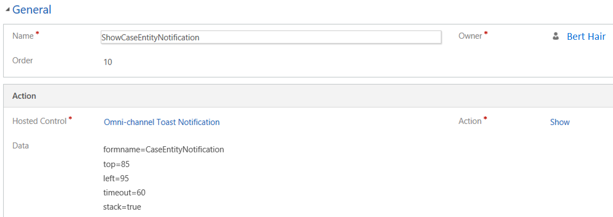
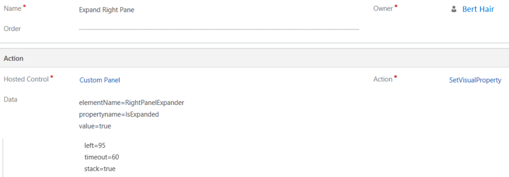

# Step 4: Create an action call to display the notification 

Applies to Dynamics 365 for Customer Engagement apps version 9.1.0

1. Sign in to Microsoft Dynamics 365 for Customer Engagement instance.

2. Go to **Settings** > **Unified Service Desk**. 

3. Select **Action Calls** and select **+ New**. 

4. On the page for the new action call, specify the following details. 

 | Field           | Value                            |
 |-----------------|----------------------------------|
 | Name            | CloseUSDToastNotification        |
 | Hosted Control  | Omni-channel Toast Notification  |
 | Action          | Close                            |

5. Save the action call.

 > [!div class=mx-imgBorder]
 > 

6. Repeat steps 3 through 5 to create the following additional action calls.

 | Field           | Value                                        |
 |-----------------|----------------------------------------------|
 | Name            | ShowCaseEntityNotification                   |
 | Order           | 10                                           |
 | Hosted Control  | Omni-channel Toast Notification              |
 | Action          | Show                                         |
 | data            | formname=CaseEntityNotification   top=85   left=95   timeout=60   stack=true   stackHeight=50   EntityDisplayName=\[\[EntityDisplayName\]+\]   EntityLogicalName=\[\[EntityLogicalName\]+\]   EntityId=\[\[EntityId\]+\]   ConversationId=\[\[ConversationId\]+\] |

 > [!div class=mx-imgBorder]
 > 

 | Field           | Value                          |
 |-----------------|--------------------------------|
 | Name            | Expand Right Pane              |
 | Hosted Control  | Custom Panel                   |
 | Action          | SetVisualProperty              |
 | data            | elementName=RightPanelExpander   propertyname=IsExpanded   value=true   left=95   timeout=60   stack=true                      |
 > [!div class=mx-imgBorder]
 > 

 | Field           | Value                 |
 |-----------------|-----------------------|
 | Name            | CreateCustomerSession |
 | Order           | 10                    |
 | Hosted Control  | CRM Global Manager    |
 | Action          | SetVisualProperty     |

 > [!div class=mx-imgBorder]
 > 

 | Field           | Value                                  |
 |-----------------|----------------------------------------|
 | Name            | Set Entity Session Property in Context |
 | Order           | 11                                     |
 | Hosted Control  | CRM Global Manager                     |
 | Action          | CopyToContext                          |
 | Data            | ISENTITYSESSION=True   CRMCONTACTID=010101                     |

 > [!div class=mx-imgBorder]
 > 

 | Field           | Value            |
 |-----------------|------------------|
| Name            | CollapseLeftPanel |
| Order           | 12                |
| Hosted Control  | Custom Panel      |
| Action          | SetVisualProperty |
| Data            | elementname=LeftPanelParent    propertyname=Visibility   value=$Expression('\[\[$Context.IsCaseSession\]+\]'=='True' || '\[\[$Context.ISENTITYSESSION\]+\]'=='True' || '\[\[$Session.IsGlobal\]+\]'=='True' || '\[\[$Context.cticallincoming\]+\]'=='1'? "Collapsed" : "Visible")  |

 > [!div class=mx-imgBorder]
 > 

 | Field           | Value                                  |
 |-----------------|----------------------------------------|
 | Name            | Load Form for Case Entity              |
 | Order           | 30                                     |
 | Hosted Control  | FOO Entity Page                        |
 | Action          | Open\_CRM\_Page                        |
 | Data            | LogicalName=\[\[EntityLogicalName\]+\]   id=\[\[EntityId\]+\]                    |

 > [!div class=mx-imgBorder]
 > 

 | Field           | Value                                       |
 |-----------------|---------------------------------------------|
 | Name            | OCSetSessionTabIdForEntitySession           |
 | Order           | 45                                          |
 | Hosted Control  | OmniChannelHostedControl                    |
 | Action          | OCSetSessionTabIdForEntitySession           |
 | Data            | ConversationId=\[\[ConversationId\]\]   SessionTabId=\[\[$Session.ActiveSession\]\]  |

 > [!div class=mx-imgBorder]
 > 

 | Field           | Value                       |
 |-----------------|-----------------------------|
 | Name            | OCSessionTimeout            |
 | Order           | 16                          |
 | Hosted Control  | OmniChannelHostedControl    |
 | Action          | OCSessionTimeout            |
 | Data            | ConversationId=\[\[cid\]\]  |

 > [!div class=mx-imgBorder]
 > 

> [!div class="nextstepaction"]
> [Next topic: Step 5: Add the action calls to the events](toastnotification-step5-add-action-calls-events.md)

## See also

- [Configure toast notification in Unified Service Desk](configure-toast-notification-unified-service-desk.md)
- [Step 1: Create forms to define layout and behavior of the notification](toastnotification-step1-create-forms-define-layout-behavior-notification.md)
- [Step 2: Create hosted controls](toastnotification-step2-create-hosted-controls.md)
- [Step 3: Create events](toastnotification-step3-create-the-events.md)
- [Step 6: Add the hosted controls, events, and action calls to the agent and supervisor configurations](toastnotification-step6-add-hosted-controls-events-action-callsagent-supervisor-configurations.md)
- [Configure alert notification in Unified Service Desk](configure-alert-notification-unified-service-desk.md)
