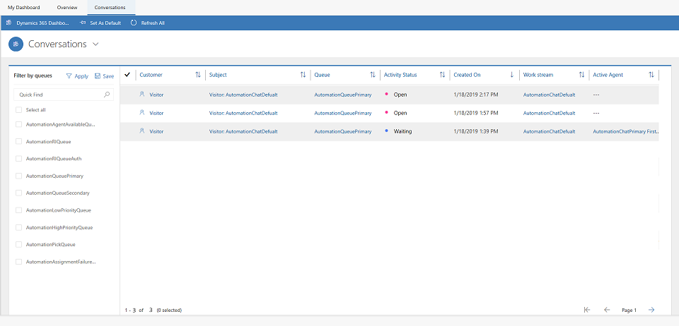

# Private preview: Omni-channel Engagement Hub for supervisors

[!INCLUDE[cc-beta-prerelease-disclaimer](../../includes/cc-beta-prerelease-disclaimer.md)]  

Customer service managers or supervisors are responsible for managing the agents who work with customers to resolve queries every day. Another important part of their job is to manage the volumes of service requests or queries that come into the contact center through different service channels.

Omni-channel Engagement Hub provides a dashboard that helps supervisors keep track of the work that their agents do. As a supervisor, you can use this dashboard to perform these tasks:

- Monitor key performance indicators (KPIs).
- Monitor agent quality and workload.
- Monitor unassigned workload.
- Manage agent and customer escalations.
- View detailed reports.

As a supervisor, you see the following tabs when you open the Omni-channel Engagement Hub app in Unified Service Desk:
> [!NOTE]
> If configuration errors occur, or if you can't view the dashboard, contact your system admin.

- **Overview**: This tab provides an overview of information about the health and KPIs of agents in your organization. For more information, see [Introduction to supervisor dashboards](introduction-supervisor-dashboards.md).
- **My dashboard**: This tab provides information about the conversations that you're handling, such as your active conversations, items that are available for you to pick, and closed conversations. For more information, see [Introduction to the agent interface in Omni-channel Engagement Hub](../agent/agent-usd/introduction-agent-interface-omni-channel-engagement-hub.md).
- **Conversations**: This tab provides information about the conversations that agents are handling that are in active, open, and waiting states. By viewing, you can get a holistic data of the conversations with the details such as customer, agent assigned, subject, queue, and activity status. Further, you can filter the conversations using the queues. Select the queues for which you want to view the conversations and then select **Apply**. The filter is applied, and conversations are displayed based on the selected queues. Select **Save** to set this filter as default and when you log in to Omni-channel Engagement Hub app in Unified Service Desk, you view conversations based on this filter.
    > [!IMPORTANT]
    > The conversations are view only and you cannot perform actions such as open, edit, or delete.  

    > [!div class=mx-imgBorder]
    > 

## In this section

- [Administer supervisor dashboard](configure-supervisor-dashboard.md)

## How tos

- [Configure the supervisor dashboard to appear in Omni-channel Engagement Hub](configure-supervisor-dashboard-display-omni-channel-engagement-hub.md)
- [Add users to the supervisor configuration](add-users-supervisor-configuration.md)
