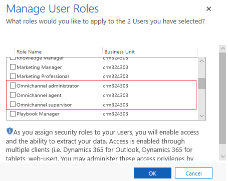

# Assign roles and enable users for Omnichannel for Customer Service

[!INCLUDE[cc-use-with-omnichannel](../../includes/cc-use-with-omnichannel.md)]

All users who are assigned the **Omnichannel administrator**, **Omnichannel supervisor**, or **Omnichannel agent** role are enabled for Omnichannel and become Omnichannel users. Additionally, agents and supervisors must be assigned the **Customer service app access** role along with the **Omnichannel agent** and **Omnichannel supervisor** role.

> [!NOTE]
> To configure Omnichannel, you must assign the **Omnichannel administrator** role with system administrator role.

Use the Microsoft 365 admin center to create user accounts for every user who needs access to Omnichannel for Customer Service. For more information, see [Create users in the Common Data Service platform and assign security roles](../../admin/create-users-assign-online-security-roles.md).

Follow these steps to assign roles to users in the **Advanced Settings**:

1. Select **Settings** > **Advanced Settings** on the command bar. The **Settings** page is displayed in a new browser tab.

2. Select **Settings** > **Security** > **Users**.

3. Select the user or users from the list for whom you want to assign a security role.

4. Select **Manage Roles** in the menu.

   Only the security roles available for that user's business unit are displayed.

5. In the **Manage User Roles** dialog box, select a security role or roles that you want to provide to the user, and then select **OK**.

    - Customer service app access
    - Omnichannel administrator
    - Omnichannel agent
    - Omnichannel supervisor
    - Productivity tools user (For users of Dynamics 365 Productivity Tools)
    - Productivity tools administrator (For administrator of Dynamics 365 Productivity Tools)

    > [!div class=mx-imgBorder]
    > 

To view and manage users in omnichannel for Customer Service, see [Manage users in Omnichannel for Customer Service](users-user-profiles.md).

## Understand roles and their privileges

Each role in Omnichannel for Customer Service can perform a set of actions based on the privileges.

> [!NOTE]
<<<<<<< HEAD
> Omnichannel for Customer Service users (agents and supervisors) must be assigned **Customer service app access** role.
=======
> Omnichannel users (agents and supervisors) should be assigned **Customer service app access** and **Customer Service Representative** role.
>>>>>>> 2e7592782403bf29114c0bdd2884604ca060cc22

|Role  |Privileges  |
|---------|---------|
|**Omnichannel Administrator**      |  Can view user list/presence list/work stream list/queue list/PBI config list       |
|    |    Can edit roles of a user     |
|    |   Can edit default presence and default capacity of a user      |
|    |   Can edit queue assignment of a user    |
|    |   Can add/edit/delete presence     |
|    |   Can add/remove users from presence   |
|    |   Can add/edit/delete presence associations     |
|    |   Can add/edit/delete work streams   |
|    |   Can add/edit/delete channel settings, context settings, routing rules      |
|    |   Can add/edit/delete queues    |
|    |   Can add/remove agents from queue    |
|    |   Can view/add/edit/delete quick replies     |
|    |   Can add/edit/delete PBI config    |
|    |   Can view add/edit/delete operating hours    |
|    |   Can view add/edit/delete auth settings     |
|**Omnichannel Supervisor**     |  Can view user list/presence list/work stream list/queue list/PBI config list       |
||Can edit default presence and default capacity of a user|
|| Can edit queue assignment of a user|
|| Can add/remove users from presence |
|| Can add/remove agents from queue| 
|| Can view/add/edit/delete quick replies|
|| Can view operating hours |
|**Omnichannel Agent**  |Can view user list/presence list/work stream list/queue list|
|| Can view quick replies|
|**Productivity tools user**| Can read agent script |
|| Can read agent script step |
|| Can read workflow |
|| Can read `msdyn_actioninputparameter` |
|| Can read `msdyn_actionoutputparameter` |
|| Can read `msdyn_inputparameters`|
|| Can read `msdyn_macroconnector` |
|| Can read `msdyn_parameterdefinition` |
|| Can read `msdyn_designeroptions` |
|| Can read `msdyn_macroactiontemplate` |
|| Can read macro action |
|**Productivity tools administrator**| Can create/read/write/append/delete agent script |
|| Can create/read/write/append/delete agent script step |
|| Can create/read/write/append/delete agent script workflow |
|| Can read `msdyn_actioninputparameter`|
|| Can read `msdyn_actionoutputparameter`|
|| Can read `msdyn_inputparameters`|
|| Can read `msdyn_macroconnector` |
|| Can read `msdyn_parameterdefinition` |
|| Can read `msdyn_designeroptions` |
|| Can read `msdyn_macroactiontemplate` |
|| Can read `msdyn_macrosolutionconfiguration` |
|| Can create/read/write/append/delete macro action |
||

### See also

[Provision Omnichannel for Customer Service](omnichannel-provision-license.md)  
[Manage users in Omnichannel for Customer Service](users-user-profiles.md)  
[Guide agents with scripts](agent-scripts.md)  
[Automate tasks with macros](macros.md)
