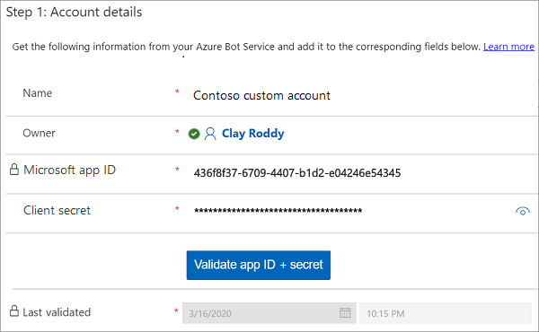
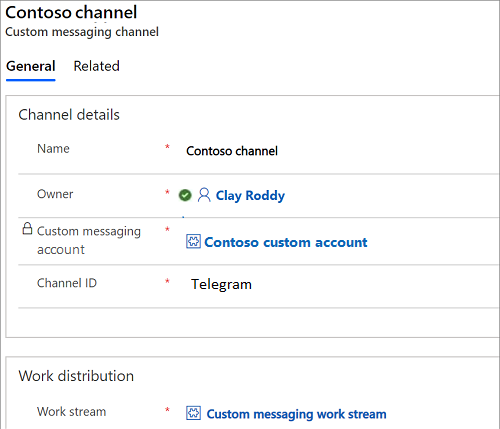
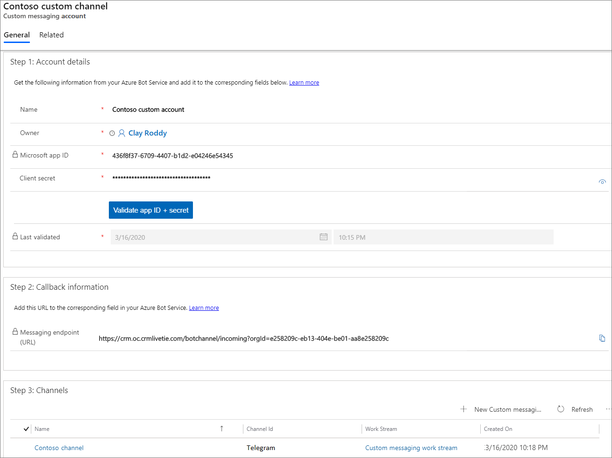

# Preview: Configure a Custom messaging channel

[!INCLUDE[cc-use-with-omnichannel](../../includes/cc-use-with-omnichannel.md)]

[!include[cc-beta-prerelease-disclaimer](../../includes/cc-beta-prerelease-disclaimer.md)]

> [!IMPORTANT]
> - A preview is a feature that is not complete, as it may employ reduced privacy, security, and/or compliance commitments, but is made available before it is officially released for general availability so customers can get early access and provide feedback. Previews are provided “as-is,” “with all faults,” “as available,” and without warranty.​
> - This preview features does not come with technical support and Microsoft Dynamics 365 Technical Support won’t be able to help you with issues or questions.  If Microsoft does elect to provide any type of support, such support is provided "as is," "with all faults," and without warranty, and may be discontinued at any time.​
> - Previews are not meant for production use, especially to process Personal Data or other data that is subject to heightened compliance requirements, and any use of "live" or production data is at your sole risk.  All previews are subject to separate [Terms and Conditions](../../legal/dynamics-insider-agreement.md).

## Overview of custom channel

Many organizations have in-house messaging channels that they use to interact with their customers. Also, many customers use social messaging channels for their personal communication needs, and these customers prefer using the messaging channels to engage with businesses. Expectations of customer service via social channels are rising to the point that customers now expect the same level of service they’re used to from call and live chat to those on social channels. 

So as an organization, you want the ability to integrate your in-house, social, or any other messaging channels with Omnichannel for Customer Service. 

The custom channel feature lets you integrate your in-house, social, or any other messaging channels with Omnichannel for Customer Service so as to engage with customers.

A few social messaging channel integration that are supported are as follows:

- Kik
- Telegram
- [Direct Line](#bring-channels-using-direct-line)

## Prerequisites

- Make sure channels are provisioned in your environment.

## End-to-end walk-through

[Step 1: Register your messaging channel](#step-1-register-your-messaging-channel)

[Step 2: Add the messaging channel to bot channel registration](#step-2-add-the-messaging-channel-to-bot-channel-registration)

[Step 3: Create a work stream](#step-3-create-a-work-stream)

[Step 4: Create a custom channel](#step-4-create-a-custom-channel)

## Step 1: Register your messaging channel

To integrate your messaging channel with Omnichannel for Customer Service, register your channel in **Azure Bot Service**. To learn how to register, see [Register a bot with Azure Bot Service](https://docs.microsoft.com/azure/bot-service/bot-service-quickstart-registration).

After you register, save the **Microsoft App ID** and **Client secret** values safely for future use. These two values are required to create a custom channel configuration in the Omnichannel Administration app.  To learn more, see [Get registration password](https://docs.microsoft.com/azure/bot-service/bot-service-quickstart-registration#get-registration-password).

You need to use it as follows:

| Azure Bot Channel Registration field | Omnichannel Administrator custom channel field |
|------------------------------|------------------------------------------------------|
| Microsoft App ID | Microsoft App ID |
| Client secret | Microsoft App Secret |

## Step 2: Add the messaging channel to bot channel registration

After registering your messaging channel, add the messaging channel to the bot channel registration. To learn more, see [Connect a bot to channels](https://docs.microsoft.com/azure/bot-service/bot-service-manage-channels).

## Step 3: Create a work stream

After you add the messaging channel to the Bot Channel registration in Azure Bot Service, create a work stream for the custom channel. To create a custom channel work stream, follow the steps:

1. Sign in to Omnichannel Administrator.

2. Select **Work Streams** under **Work Distribution Management**.

3. Select **+ New** to create a new work stream.

4. Specify the values for the fields.

5. Select the **Custom (preview)** option for the **Channel** field.

6. Select **Save** to save the changes.

You've created a work stream for custom channel. To learn more, see [Create work streams](work-streams-introduction.md).

To configure other options in the work stream, see the following:

- [Skill based routing](overview-skill-work-distribution.md)
- [Productivity tools](productivity-tools.md)
- [Smart assist](smart-assist.md)
- [Templates](templates-overview.md)

## Step 4: Create a custom channel

After you create a work stream for custom channel, you need to create a custom channel with the details of the **Microsoft App ID** and **Password** that you retrieved while registering your messaging channel in Azure Bot Service.

To create a custom channel, follow the steps:

1. Sign in to Omnichannel Administrator.

2. Select **Custom (preview)** under **Channels**.

3. Select **+ New** in the **Active Custom Messaging Account** view.

4. In the New **Custom Messaging Account** page, specify the values for the following fields.

    | Section | Field | Description | Example  value |
    |-------------|-------------------|---------------------------|--------------------------------------|
    | Account Details |Name| Specify a name for the custom channel.| Contoso custom channel |
    | Account Details |Description| Specify the description for your reference. | The custom channel is used for the Contoso Ltd customers.|
    | Account Details |Microsoft App ID| Copy and paste the **Microsoft App ID** that saved earlier from the Azure Bot Channel Registration page.   To learn more, see [Get registration password](https://docs.microsoft.com/azure/bot-service/bot-service-quickstart-registration#get-registration-password). | cae1d83e-8b07-4fca-8072-c2eb3444vxyz |
    | Account Details |Microsoft App Secret| Copy and paste the **Client secret** that you saved earlier from the Azure Bot Channel Registration page.    To learn more, see [Get registration password](https://docs.microsoft.com/azure/bot-service/bot-service-quickstart-registration#get-registration-password).| |

5. Select **Validate App ID & Secret**  to validate the **Microsoft App ID** and **Microsoft App Secret** values. After the validation, a toast notification is displayed. Also, the **Last Validated** field shows time and date. This ensures that bots are active and client secret refreshes are consumed. 

    > [!div class=mx-imgBorder]
    > 

6. Select **Save** to save the changes. After you save, in the **Callback Information** section, the **Message Endpoint (URL)** field is generated with a URL. Copy the URL from the field.

    > [!div class=mx-imgBorder]
    > 

7. Go to **Azure Portal** > **Bot Channel Registration** page, and paste the URL in the **Message endpoint** field, and save the changes.

8. In the **Channels** section, select **+ Add Custom Messaging Channel**. The **New Custom Messaging Channel** page is displayed to you.

    After you create a **Custom Messaging Account**, you need to create custom messaging channel, which is the actual channel from which Omnichannel for Customer Service agents will receive messages from the customer.

9. In the **New Custom Messaging Account** page, specify the values for the following fields.

    | Section | Field | Description | Example  value |
    |-------------|-------------------|---------------------------|--------------------------------------|  
    | Details | Name | Specify a name for the custom channel | Contoso channel |
    | Details | Description | Provide a description for your reference | This channel is used for Contoso customers. |
    | Details | Custom Messaging Account | The **Custom Messaging Account** field is populated. However, you can change the value using the lookup. | Contoso custom channel |
    | Details | Channel ID | Select a channel from the list. The options are:   - Kik   - Telegram   - Direct Line |
    | Work Distribution | Work Stream | Select a work stream from the lookup. | Contoso custom channel work stream |

    > [!Note]
    > A **Custom Messaging Account** can have multiple unique channel IDs. We recommend you not to add two or more same Channel IDs to a **Custom Messaging Account**. For example, for **Contoso custom channel**, you can't add two or more **Kik** Channel ID.

    > [!div class=mx-imgBorder]
    >  

10. Select **Save** to save the custom messaging application channel.       

11. Select the browser back button to go to the custom messaging application page. You can see that the custom messaging channel is added in the **Channels** section. 

12. Select **Save** to save the configurations.

    > [!div class=mx-imgBorder]
    > 

## Bring channels using Direct Line

The Bot Framework **Direct Line** channel is another way to integrate your messaging channels into the Omnichannel for Customer app.

For more information, see .

## See also

[Skill based routing](overview-skill-work-distribution.md) 
[Productivity tools](productivity-tools.md) 
[Smart assist](smart-assist.md) 
[Templates](templates-overview.md)