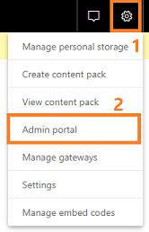
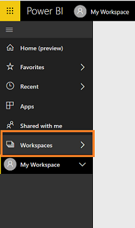
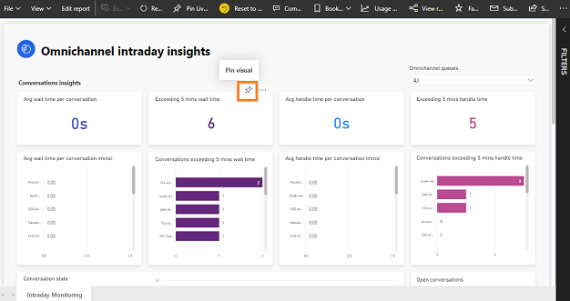
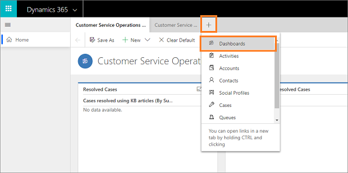
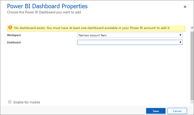
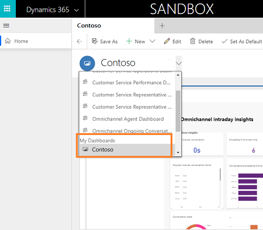
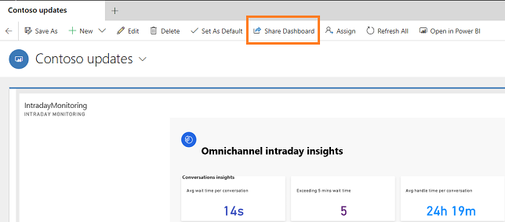
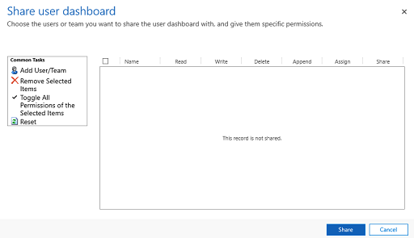
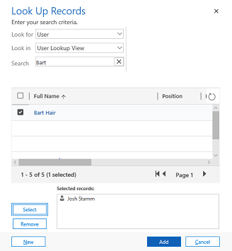
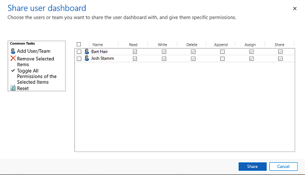

# Configure intraday insights dashboard

Supervisors have a dual responsibility with respect to agents and customers. They monitor and manage agents, and make sure that they remain highly productive. At the same time, they help guarantee a superior experience for customers. To help supervisors carry out this dual responsibility, the dashboard consists of real-time monitoring and intraday health tracking of agent productivity and performance.

> [!IMPORTANT]
> The supervisor dashboards that are based on Power BI such as Intraday insights dashboard and live monitoring are not available on Government Community Cloud (GCC). 

As an administrator, you must configure the intraday insights dashboard in your organization before supervisors can use it. Before you configure this dashboard, you have to perform the common tasks and then tasks that are specific to **Unified Service Desk** and **Omnichannel for Customer Service** app on web.

Let's look at the common tasks that you have to perform to configure **Unified Service Desk** and **Omnichannel for Customer Service** app on web:  

1. [Review prerequisites](#review-prerequisites)
2. [Configure Power BI workspace](#configure-power-bi-workspace)
3. [Verify workspace creation in Power BI](#verify-workspace-creation-in-power-bi)
4. [Configure dashboards in Power BI](#configure-dashboards-in-power-bi)

To configure the dashboard on **Unified Service Desk**, follow these steps:

1. [Perform the common tasks](#common-tasks-to-configure-intraday-insights-dashboard).
2. [Configure Unified Service Desk to display supervisor dashboard](#configure-unified-service-desk-to-display-supervisor-dashboard)
3. [Add users to supervisor configuration](#add-users-to-supervisor-configuration)
4. [Update client cache version](#update-client-cache-version)

To configure the dashboard on **Omnichannel for Customer Service** app on web, follow these steps:

1. [Perform the common tasks](#common-tasks-to-configure-intraday-insights-dashboard).
2. [Configure supervisor dashboard in Omnichannel for Customer Service app on web](#configure-supervisor-dashboard-in-omnichannel-for-customer-service-app-on-web)
3. [Share dashboard in Omnichannel for Customer Service app on web](#share-dashboard-in-omnichannel-for-customer-service-app-on-web)

## Common tasks to configure intraday insights dashboard 

You must perform these common tasks before you go ahead and configure intraday insights dashboard for **Unified Service Desk** and **Omnichannel for Customer Service** app on web.

### Review prerequisites

Review the following prerequisites before configuring the supervisor dashboard: 

-  You have administrative privileges for Dynamics 365 for Customer Service and Power BI. 

-  You must have **Power BI Pro** or **Power BI Premium** license for all supervisors. 

-  You must enable to embed Power BI reports in Dynamics 365 for **Omnichannel for Customer Service** app on web.
    1.	Sign in to **Dynamics 365 for Customer Service** and go to **Settings** > **Administration** > **System Settings**.
    2.	Go to **Reporting** tab and configure **Allow Power BI visualization embedding** as **Yes**.
    
      > [!div class=mx-imgBorder]
      > 
    
    3.	Select **OK**.

-  As a system administrator, you must configure the following in Power BI service:

   1. Create a security group in Azure Active Directory (AAD) and add **Omnichannel for Customer Service** to that security group. To learn more, see [Manage app and resource access using Azure Active Directory groups](https://docs.microsoft.com/en-us/azure/active-directory/fundamentals/active-directory-manage-groups). 

   2. As a Power BI admin, you need to enable service principal in the **Developer settings** in the Power BI admin portal and the security group that you created in Azure AD.
        a.  Sign in to [Power BI service](http://app.powerbi.com) and go to **Settings** > **Admin portal**.
           
         > [!div class=mx-imgBorder]
         >  

        b.  In the Admin portal, go to **Tenant settings** > **Developer settings** > **Allow service principals to use Power BI APIs**.

        c.  Enable **Allow service principals to use Power BI APIs** and specify the security group that you want to give access.
        
         > [!div class=mx-imgBorder]
         > 

        d. Select **Apply**. 

-  Verify that your administrator has allowed **Omnichannel for Customer Service** app to read and write data on behalf of users in your organization. To learn more, see [Provide data access consent](omnichannel-provision-license.md).  

### Configure Power BI workspace

You must configure the Power BI workspace using the **Omnichannel Administration** app to import the datasets and reports for Power BI. Follow these steps to create the supervisor datasets to your workspace.

1.  Sign in to **Dynamics 365 for Customer Service** and open **Omnichannel Administration** app. 

    > [!div class=mx-imgBorder]
    > 

2.  From the **Site Map** , select **Supervisor Experience**, **Overview Dashboard**.  

    > [!div class=mx-imgBorder]
    > 

    The Power BI configuration view opens.

    > [!div class=mx-imgBorder]
    > 

3.  Select **+ New**. 

    The **Power BI Configuration** form opens.

    > [!div class=mx-imgBorder]
    > 

4.  In the **Power BI workspace** section, select **Create New Workspace** and enter a name for the workspace in **Power BI workspace** (this name must be unique).

    > [!div class=mx-imgBorder]
    >   
    
    -OR-

    If you want to add an existing Power BI workspace, select **Add existing work space** and the existing workspaces are listed. Select the workspace that you want to add.

    > [!div class=mx-imgBorder]
    >   
        
5.  Select **Configure**. The workspace creation takes a few seconds and a confirmation message is displayed with the generated workspace ID.

    > [!div class=mx-imgBorder]
    >   

    In Power BI, a workspace is created.

6.  Save and close the configuration. 

    After you save the configuration, it may take up to 15 minutes for the datasets, dashboard, and reports to appear in your created workspace.

    > [!NOTE]
    > You can also see the status of different configuration stages such as workspace, dashboard, and datasets. When a workspace is created successfully, all the statuses will be in Green check. If failed, the respective configuration stage check will be in Red, and an error message is displayed. Resolve the error and create the workspace again.

   > [!IMPORTANT]
   > - You can configure only one record in **Omnichannel Administration** app. 
   > - If you want to create a new configuration, deactivate and delete the existing configuration.
   > - You can edit an existing configuration to update the Power BI workspace details.

### Verify workspace creation in Power BI

To verify the creation of workspace in Power BI, follow these steps:

1.  Sign in to **Power BI** service.

2.  Go to **Workspaces** and verify that a workspace with the name that you have entered is created.

    > [!div class=mx-imgBorder]
    >   

3.  Open the workspace that you have created and verify that the following are available:

    -   An empty dashboard with the name of the workspace.

    -   The report and datasets **IntradayMonitoring**.

### Configure dashboards in Power BI

Configuring the Power BI workspace provides you only the **IntradayMonitoring** report. Create the dashboard out of **IntradayMonitoring** Power BI report after it is available.

> [!NOTE]
> If you want the dashboards with faster refresh rate, import the **LiveMonitoring** Power BI report. Pin tiles to the dashboard from this report for the metrics you want to view with faster refresh. This dashboard consists of Active and open conversations, Conversations exceeding 5 min wait time, Conversations exceeding 5 min handle time, Total conversations transferred, and Open conversations.

Follow these steps to configure Power BI dashboards.

1.  In [Power BI Service](https://app.powerbi.com), open the reports that are available in the workspace. To learn more, see [Open a report in Power BI service](https://docs.microsoft.com/en-us/power-bi/consumer/end-user-report-open).

2.  Pin the required tiles to dashboards. To learn more, see [Pin a tile to a Power BI dashboard from a report](https://docs.microsoft.com/en-us/power-bi/service-dashboard-pin-tile-from-report).

    The following screen shows how to pin a visual to the dashboard.

   > [!div class=mx-imgBorder]
   >   

3.  Select **Set as featured** for the created dashboard.

4.  Share the dashboard with supervisor users. This allows supervisors to access the dashboards. To learn more, see [Share your Power BI dashboards and reports with coworkers and others](https://docs.microsoft.com/en-us/power-bi/service-share-dashboards).  

5.  For Unified Service Desk configuration, copy the URL of the dashboard.  

   The dashboard is ready, and you can configure the **Unified Service Desk** or **Omnichannel for Customer Service** on web to make the dashboard available for supervisors.

## Configuration tasks for Unified Service Desk 

After you complete the common tasks, you must perform the tasks defined in this section to complete the configuration for Intraday insights dashboard for **Unified Service Desk**.

### Configure Unified Service Desk to display supervisor dashboard

You must configure the **Unified Service Desk** to display the supervisor intraday insights dashboard when a supervisor signs in to the workspace in Omnichannel. To configure the **Unified Service Desk**, follow these steps:

1.  Sign in to **Dynamics 365 for Customer Service** and go to **Settings** > **Unified Service Desk**.

    The Unified Service Desk settings page opens.

2.  Select **Action Calls** and open **Load Supervisor Dashboard**.

3.  In the **Action** section, enter the **Data** as “*url=* *https://powerbi.com/dashboards/&lt;id&gt;*” that you copied in [Configure dashboards in Power BI](#configure-dashboards-in-power-bi). Also, add the parameters **chromeless=1** and **nosignupcheck=1** at the end of the URL.  

    For example,

    url=*https://powerbi.com/dashboards/g12466b5-a452-4e55-8634-xxxxxxxxxxxx?chromeless=1&nosignupcheck=1*

4.  Save and close the settings page.

The supervisor dashboard is configured and available. Add users to supervisor configuration to view the dashboards when signing on to the Omnichannel in **Unified Service Desk**. 

### Add users to supervisor configuration

You must add users in the supervisor configuration to access any supervisor dashboard in **Unified Service Desk**. To add users in supervisor configuration, follow these steps:

1.  Sign in to Dynamics 365 for Customer Service.

2.  Go to **Settings** > **Unified Service Desk** and then select **Configuration**.

3.  On the configuration page, select **Supervisor Configuration**.

    > [!div class=mx-imgBorder]
    >   

4.  On the **Users** section, select **+ Add User record** and enter the user name to add the user.

    > [!div class=mx-imgBorder]
    >   

5.  Save and close the configuration.

    Users are added to the supervisor dashboard and when they sign in to Omnichannel on Unified Service Desk, the supervisor dashboard tabs are available.

### Update client cache version

Update the client cache version number to reduce the amount of bandwidth required at the startup of the Unified Service Desk client on the computers of agents, and over the life cycle of the client application.

To learn more, see [Client caching overview](https://docs.microsoft.com/en-us/dynamics365/customer-engagement/unified-service-desk/admin/configure-client-caching-unified-service-desk?view=dynamics-usd-4.1).  

1.  Sign in to **Dynamics 365 for Customer Service**.

2.  Go to **Settings** > **Unified Service Desk** and then select **Options**.

    > [!div class=mx-imgBorder]
    >   
 
3.  Select **ClientCacheVersionNumber**.

    > [!div class=mx-imgBorder]
    >   

4.  In the **Value** box, updated the existing alphanumeric number. For example, the existing alphanumeric number is OC2019\_04\_010 and updated this number as OC2019\_04\_011.

    > [!div class=mx-imgBorder]
    >   

5.  Select **Save**.

## Configuration tasks for Omnichannel for Customer Service app on web

After you complete the common tasks, you must perform the tasks defined in this section to complete the configuration for Intraday insights dashboard for **Omnichannel for Customer Service** on web.

### Configure supervisor dashboard in Omnichannel for Customer Service app on web

To view the supervisor dashboards in **Omnichannel for Customer Service** on web, you must add the Power BI dashboard to your app.

1.  Sign in to **Omnichannel for Customer Service** app.

2.  On the site map, select add icon (**+**) and then select **Dashboards**.

    > [!div class=mx-imgBorder]
    >   

3.  On the dashboard page, select **New** > **Power BI Dashboard**.

    > [!div class=mx-imgBorder]
    >   

4.  On the **Power BI Dashboard Properties** dialog, select **Workspace** in which you have the dashboards and then select **Dashboard**.

    > [!div class=mx-imgBorder]
    >   

5.  Select **Save**.

    The supervisor dashboard is added to **Omnichannel for Customer Service** on web.

To learn more, see [Add or edit Power BI visualizations on your dashboard](/dynamics365/customer-engagement/basics/add-edit-power-bi-visualizations-dashboard)

### Share dashboard in Omnichannel for Customer Service app on web

You must share the Intraday insights dashboard with supervisors in your organization to access the dashboard in **Omnichannel for Customer Service**. To share the dashboard, follow these steps:

1.  Sign in to **Omnichannel for Customer Service** app.

2.  From the dashboard view selector, under **My Dashboards**, select the intraday insights dashboard that you want to share with supervisors. In this example, we are selecting **Contoso**.

   > [!div class=mx-imgBorder]
   >   

3.  Select **Share Dashboard**.

   > [!div class=mx-imgBorder]
   >   

4.  On the **Share user dashboard** dialog, select **Add User/Team**.

   > [!div class=mx-imgBorder]
   >   

5.  On the **Look Up Records** dialog, search for the team or users you want to add and select **Select**.

   > [!div class=mx-imgBorder]
   >   

6.  Select **Add**. 

    The users/teams are added to the share list

7. Select the users and privileges that you want to grant. Select **Share**.

   > [!div class=mx-imgBorder]
   >   

    The Intraday insights dashboard is shared with the users or teams that you have selected.

### See also

[Introduction to Intraday insights dashboard](../supervisor/intro-intraday-insights-dashboard.md)
