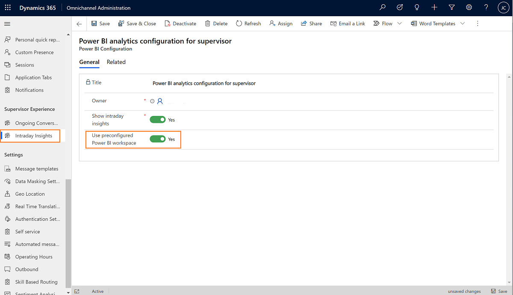
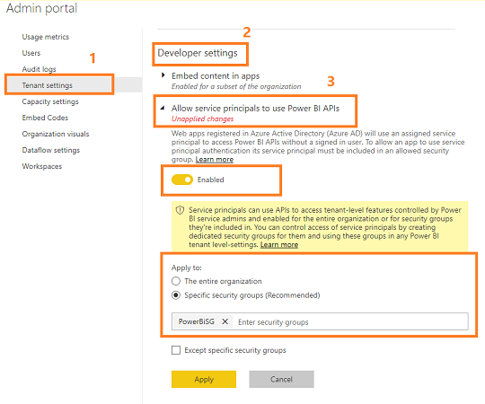
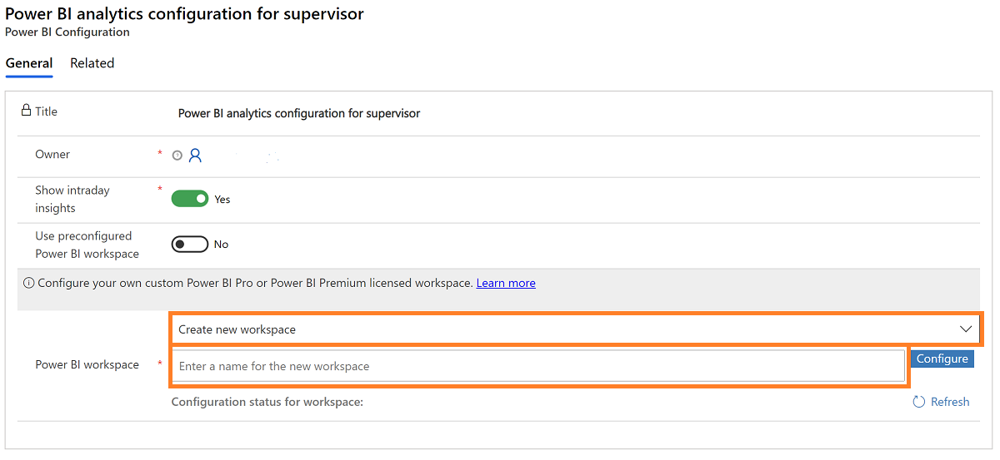
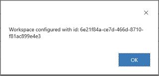
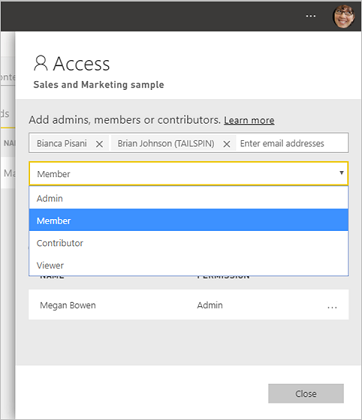
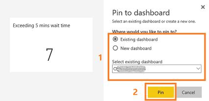
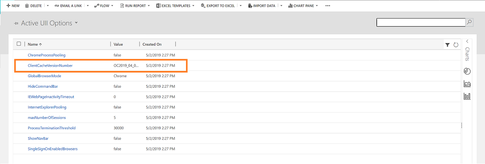

# Configure intraday insights for supervisors

[!INCLUDE[cc-use-with-omnichannel](../../includes/cc-use-with-omnichannel.md)]

> [!Important]
> This feature is intended to help customer service managers or supervisors enhance their team’s performance and improve customer satisfaction. This feature is not intended for use in making, and should not be used to make, decisions that affect the employment of an employee or group of employees, including compensation, rewards, seniority, or other rights or entitlements. Customers are solely responsible for using Dynamics 365, this feature, and any associated feature or service in compliance with all applicable laws, including laws relating to accessing individual employee analytics and monitoring, recording, and storing communications with end users. This also includes adequately notifying end users that their communications with agents may be monitored, recorded, or stored and, as required by applicable laws, obtaining consent from end users before using the feature with them. Customers are also encouraged to have a mechanism in place to inform their agents that their communications with end users may be monitored, recorded, or stored.

Supervisors have a dual responsibility with respect to agents and customers. They monitor and manage agents and make sure they remain highly productive. At the same time, they help provide a superior experience for customers. To help supervisors carry out this dual responsibility, the insights consist of intraday health tracking of agent productivity and performance.

You can use intraday insights in the following ways: 

- As a preconfigured Power BI workspace that doesn't require a Power BI license; intraday insights can’t be customized. **Note**: The preconfigured Power BI workspace version of intraday insights is only available for organizations that are provisioned in a public cloud and isn't available in Unified Service Desk (USD). 

- Using a Power BI Pro or Power BI Premium license for supervisors and administrators; intraday insights can be customized. 

As an administrator, you must configure intraday insights before supervisors can use it. To configure intraday insights for your organization, follow the scenario that is applicable for your environment: 

| Provisioning scenario | Need to customize intraday insights? | Details |
|----------------------|-------------------------|-----------------------------|
| New organization created in August 2020 or later | No | Intraday insights is preconfigured and non-customizable by default. For more information, see [Intraday insights in a preconfigured Power BI workspace](#intraday-insights-in-a-preconfigured-power-bi-workspace). |
| Existing organization with customized intraday insights | Yes | No further action needed. |
| Existing organization with customized reports wanting to switch to preconfigured Power BI workspace version | No | Convert your reports to a non-customized version of intraday insights by following the steps in [Intraday insights in a preconfigured Power BI workspace](#intraday-insights-in-a-preconfigured-power-bi-workspace). |
| Existing or new organization with need for customized intraday insights | Yes | Follow the steps in [Configure customized intraday insights reports](#configure-customized-intraday-insights-reports). | 

## Intraday insights in a preconfigured Power BI workspace

As an administrator for a new organization, intraday insights is configured by default, so you don’t need to take extra steps to configure it, but if you want to switch from using customized reports to using the preconfigured Power BI workspace, follow the steps in this section. The preconfigured Power BI workspace feature allows you to access intraday insights without customizing the reports.

To enable the preconfigured Power BI workspace: 

1.  Sign in to **Dynamics 365 Customer Service** and open the **Omnichannel Administration** app. 

    > [!div class=mx-imgBorder]
    > 

2.  From the **Site Map** , select **Supervisor Experience** > **Intraday Insights**.  

    > [!div class=mx-imgBorder]
    > 

    The Power BI configuration view opens.

3.  Select **+ New**. 

    The **Power BI Configuration** form opens, where you can verify that **Use preconfigured Power BI workspace** is enabled or select it to enable it.

    > [!div class=mx-imgBorder]
    > 

4.  Save and close the page.

## Configure customized intraday insights reports

As an administrator, if you want to customize the intraday insights reports for your organization, you can configure the insights for the **Omnichannel for Customer Service** app on the web and for **Unified Service Desk**.

### Prerequisites

Review the following prerequisites before configuring the supervisor insights: 

-  You have administrative privileges for Dynamics 365 Customer Service and Power BI. 

-  You have a **Power BI Pro** or **Power BI Premium** license for all supervisors and administrators.

-  As a system administrator, allow the **Omnichannel for Customer Service** app to read and write data on behalf of users in your organization. To learn more, see [Provide data access consent](omnichannel-provision-license.md).

-  The Omnichannel supervisor role has been assigned to supervisor users in your organization to access the report and dashboard. To learn more, see [Enable users for Omnichannel for Customer Service](../administrator/add-users-assign-roles.md).

-  As a system administrator, you must create and add a security group for Power BI service. Follow these steps to create and add a security group:

   1. Create a security group in Azure Active Directory (Azure AD) and add **Omnichannel for Customer Service** as a member to that security group. To learn more, see [Create a basic group and add members using Azure Active Directory](https://docs.microsoft.com/azure/active-directory/fundamentals/active-directory-groups-create-azure-portal). 

   2. As a Power BI admin, you need to enable service principal in the **Developer settings** in the Power BI admin portal and the security group that you created in Azure AD.
   
      a. Sign in to [Power BI service](https://app.powerbi.com) and go to **Settings** > **Admin portal**.
           
         > [!div class=mx-imgBorder]
         >  

      b. In the Admin portal, go to **Tenant settings** > **Developer settings** > **Allow service principals to use Power BI APIs**.

      c. Enable **Allow service principals to use Power BI APIs** and specify the security group to which you want to give access.
        
         > [!div class=mx-imgBorder]
         > 

      d. Select **Apply**.

### Configure Intraday insights for the Omnichannel for Customer Service app on the web

Follow these steps to configure Intraday insights for the Omnichannel for Customer Service app on the web:

1. [Configure Power BI workspace in Omnichannel Administration app](#configure-the-power-bi-workspace-in-the-omnichannel-administration-app)

2. [Share workspace and reports with supervisors](#share-workspace-and-reports-with-supervisors)

#### Configure the Power BI workspace in the Omnichannel Administration app

You must configure the Power BI workspace using the **Omnichannel Administration** app to create datasets and reports in Power BI. When configured, the supervisor users in your organization can see the Intraday insights reports as an app tab. Follow these steps to configure the Power BI workspace to display Intraday insights reports as an app tab in the **Omnichannel for Customer Service** app on the web.

1.  Sign in to **Dynamics 365 Customer Service** and open the **Omnichannel Administration** app. 

    > [!div class=mx-imgBorder]
    > 

2.  From the **Site Map** , select **Supervisor Experience** > **Intraday Insights**.  

    > [!div class=mx-imgBorder]
    > 

    The Power BI configuration view opens.

3.  Select **+ New**. 

    The **Power BI Configuration** form opens.

    > [!div class=mx-imgBorder]
    > 

4. Set the **Show intraday insights** option to **Yes** to make intraday insights an app tab on the home session for supervisors. 

    > [!div class=mx-imgBorder]
    > 
  
5.  In the **Power BI workspace** section, select **Create new workspace** and enter a name for the workspace in **Power BI workspace** (this name must be unique).

    > [!div class=mx-imgBorder]
    >    
    
    -OR-

    If you want to add an existing Power BI workspace, select **Add existing workspace** and the existing workspaces are listed. Select the workspace that you want to add.

    > [!div class=mx-imgBorder]
    >   
        
6.  Select **Configure**. The workspace creation takes a few seconds and then a confirmation message is displayed with the generated workspace ID.

    > [!div class=mx-imgBorder]
    >   

    In Power BI, a workspace is created.

7.  Save and close the configuration. 

    After you save the configuration, it might take up to 15 minutes for the datasets, dashboard, and reports to appear in your created workspace.

    > [!NOTE]
    > You can also see the status of different configuration stages such as workspace, dashboard, and datasets. When a workspace is created successfully, all the statuses will have a green check. If failed, the respective configuration stage check will be red, and an error message is displayed. Resolve the error and create the workspace again.

8. In [Power BI Service](https://app.powerbi.com), share the reports with supervisor users to access the report in the **Omnichannel for Customer Service** app on the web. To learn more, see [Share Power BI dashboards and reports with coworkers and others](https://docs.microsoft.com/power-bi/service-share-dashboards).

   > [!IMPORTANT]
   > - You can configure only one record in the **Omnichannel Administration** app. 
   > - If you want to create a new configuration, deactivate and delete the existing configuration.
   > - You can edit an existing configuration to update the Power BI workspace details.

#### Share workspace and reports with supervisors

1.  Sign in to [Power BI Service](https://app.powerbi.com).

2.  Go to **Workspaces** and verify that a workspace with the name that you have entered is created.

    > [!div class=mx-imgBorder]
    >   

3. Open the workspace that you have created and verify that the following are available:

    - An empty dashboard with the name of the workspace.

    - The report and datasets **Intraday Monitoring**.

4.  Select **Access**.

    > [!div class=mx-imgBorder]
    > 

5. Add email address of the security groups, distribution lists, Office 365 groups, or individuals to these workspaces as members, contributors, or admins.  

    > [!div class=mx-imgBorder]
    > 

6. Select **Add** > **Close**.

7. Select the report and share with supervisor users to access the report as an app tab in the **Omnichannel for Customer Service** app on the web. To learn more, see [Share Power BI dashboards and reports with coworkers and others](https://docs.microsoft.com/power-bi/service-share-dashboards).

### Configure customized intraday insights for Unified Service Desk 

Before you configure the Intraday insights for Unified Service Desk, you must [configure Intraday insights for the Omnichannel for Customer Service app on the web](#configure-intraday-insights-for-the-omnichannel-for-customer-service-app-on-the-web). This configures the Power BI datasets, reports, and dashboards for Omnichannel for Customer Service and enables you to configure the insights for Unified Service Desk. 

You must perform the following tasks to configure the Intraday insights for **Unified Service Desk**:

1. [Configure Intraday insights for Omnichannel for Customer Service app on the web](#configure-intraday-insights-for-the-omnichannel-for-customer-service-app-on-the-web)
2. [Configure dashboard in Power BI](#configure-dashboard-in-power-bi)
3. [Configure Unified Service Desk to display Intraday insights](#configure-unified-service-desk-to-display-intraday-insights)
4. [Add users to supervisor configuration](#add-users-to-supervisor-configuration)
5. [Update client cache version](#update-client-cache-version)

> [!NOTE]
> Supervisor and agent sentiment notifications are not available in Omnichannel for Customer Service on Unified Service Desk.

#### Configure dashboard in Power BI

Configuring the Power BI workspace provides you only the **Intraday Monitoring** report. Create the dashboard out of the **Intraday Monitoring** Power BI report after it is available.

> [!IMPORTANT]
> In Power BI settings for **Intraday Monitoring**, DO NOT select the option **Take over**. If you select this option, the dataset will not connect to the datasource and you will have to reconfigure Intraday insights. 

Follow these steps to configure Power BI dashboards:

1.  In [Power BI Service](https://app.powerbi.com), open the reports that are available in the workspace. To learn more, see [Open a report in Power BI service](https://docs.microsoft.com/power-bi/consumer/end-user-report-open).

2.  Pin the required tiles to dashboards. 

    The following screenshot shows how to pin a visual to the dashboard.

    > [!div class=mx-imgBorder]
    >   

    Choose the dashboard to which you want to pin and select **Pin**. The report is pinned to the chosen dashboard.

    > [!div class=mx-imgBorder]
    >   

    To learn more, see [Pin a tile to a Power BI dashboard from a report](https://docs.microsoft.com/power-bi/service-dashboard-pin-tile-from-report).

3.  Select **Set as featured** so the created dashboard will display at the top each time you open the Power BI service.

4.  Share the dashboard and reports with supervisor users. This allows supervisors to access the dashboards. To learn more, see [Share Power BI dashboards and reports with coworkers and others](https://docs.microsoft.com/power-bi/service-share-dashboards).  

5.  For Unified Service Desk configuration, copy the URL of the dashboard.  

    The dashboard is ready, and you can configure the **Unified Service Desk** to make this dashboard available for supervisors.

#### Configure Unified Service Desk to display Intraday insights

You must configure **Unified Service Desk** to display the supervisor Intraday insights when a supervisor signs in to the workspace in Omnichannel. To configure **Unified Service Desk**, follow these steps:

1.  Sign in to **Dynamics 365 Customer Service** and go to **Settings** > **Unified Service Desk**.

    The Unified Service Desk settings page opens.

2.  Select **Action Calls** and open **Load Supervisor Dashboard**.

3.  In the **Action** section, enter the **Data** as `url= https://powerbi.com/dashboards/<id>;` that you copied in [Configure dashboard in Power BI](#configure-dashboard-in-power-bi). Also, add the parameters **chromeless=1** and **nosignupcheck=1** at the end of the URL.  

    For example:

    url=`https://powerbi.com/dashboards/g12466b5-a452-4e55-8634-xxxxxxxxxxxx?chromeless=1&nosignupcheck=1`

4.  Save and close the settings page.

The supervisor insights is configured and available. Add users to the supervisor configuration to view the dashboards when signing on to Omnichannel in **Unified Service Desk**. 

#### Add users to supervisor configuration

You must add users in the supervisor configuration to access any supervisor insights in **Unified Service Desk**. To add users in supervisor configuration, follow these steps:

1.  Sign in to Dynamics 365 Customer Service.

2.  Go to **Settings** > **Unified Service Desk** and then select **Configuration**.

3.  On the configuration page, select **Supervisor Configuration**.

    > [!div class=mx-imgBorder]
    >   

4.  On the **Users** section, select **+ Add User record** and enter the user name to add the user.

    > [!div class=mx-imgBorder]
    >   

5.  Save and close the configuration.

    Users are added to the supervisor dashboard and when they sign in to Omnichannel on Unified Service Desk, the supervisor dashboard tabs are available.

#### Update client cache version

Update the client cache version number to reduce the amount of bandwidth required at the startup of the Unified Service Desk client on the computers of agents, and over the lifecycle of the client application.

To learn more, see [Client caching overview](https://docs.microsoft.com/dynamics365/customer-engagement/unified-service-desk/admin/configure-client-caching-unified-service-desk?view=dynamics-usd-4.1).  

1.  Sign in to **Dynamics 365 Customer Service**.

2.  Go to **Settings** > **Unified Service Desk** and then select **Options**.

    > [!div class=mx-imgBorder]
    >   
 
3.  Select **ClientCacheVersionNumber**.

    > [!div class=mx-imgBorder]
    >   

4.  In the **Value** box, update the existing alphanumeric number. For example, if the existing alphanumeric number is OC2019\_04\_010, update it to OC2019\_04\_011.

    > [!div class=mx-imgBorder]
    >   

5.  Select **Save**.

### See also

[Introduction to Intraday insights](../supervisor/intro-intraday-insights-dashboard.md)

[Customize KPIs for Intraday insights](customize-kpis-intraday-insights.md)
