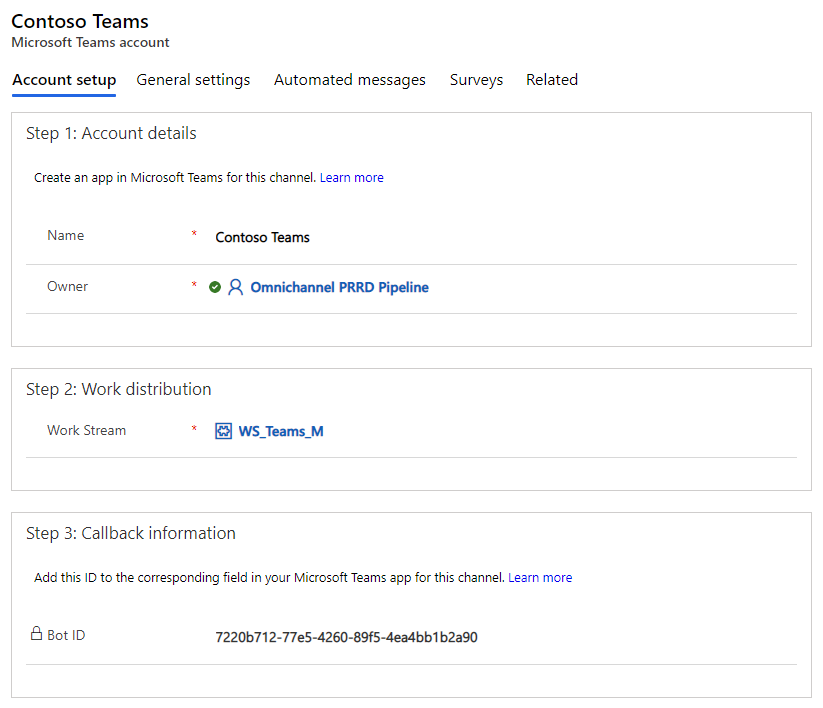

# Preview: Configure a Microsoft Teams Channel

[!INCLUDE[cc-use-with-omnichannel](../../includes/cc-use-with-omnichannel.md)]

[!include[cc-beta-prerelease-disclaimer](../../includes/cc-beta-prerelease-disclaimer.md)]

> [!IMPORTANT]
> 
> - A preview is a feature that is not complete, as it may employ reduced privacy, security, and/or compliance commitments, but is made available before it is officially released for general availability so customers can get early access and provide feedback. Previews are provided “as-is,” “with all faults,” “as available,” and without warranty.​
> - This preview feature does not come with technical support and Microsoft Dynamics 365 Technical Support won’t be able to help you with issues or questions.  If Microsoft does elect to provide any type of support, such support is provided "as is," "with all faults," and without warranty, and may be discontinued at any time.​
> - Previews are not meant for production use, especially to process Personal Data or other data that is subject to heightened compliance requirements, and any use of "live" or production data is at your sole risk.  All previews are subject to separate [Terms and Conditions](../../legal/dynamics-insider-agreement.md).

## Microsoft Teams channel

Microsoft Teams as an engagement channel for support of internal functions, such as technical support, human resources, and finance,
allows organizations to connect their employees with internal support personnel using Omnichannel for Customer Service.

## Prerequisites

Make sure that the following prerequisites are met:

- Teams is provisioned in your environment. For information, see [Provision Omnichannel for Customer Service](omnichannel-provision-license.md)
  > [!NOTE]
  >
  > To enable Teams channel in an existing Omnichannel environment, you must upgrade to the latest version of Omnichannel for Customer Service. For more information, see [Upgrade Omnichannel for Customer Service](upgrade-omnichannel.md).
- An app is created and configured in **Teams** > **App Studio**.

## Configure a Microsoft Teams channel in Omnichannel

### Step 1: Create a work stream

Perform the following steps to create a work stream:

1. Sign in to Omnichannel Administrator.
2. Select **Work Streams** under** Work Distribution Management**.
3. Select **New**. The **New Work Stream** page appears.
4. Specify details in the **General information** and **Work distribution** sections. For information, see [Understand and create work streams](work-streams-introduction.md).
5. Select **Teams** in **Channels**.
6. Select **Save**. The work stream for Teams is saved.

> [!NOTE]
>
> To configure other options in the work stream, see the following:
>
> - [Skill-based routing](overview-skill-work-distribution.md)
> - [Productivity tools](productivity-tools.md)
> - [Smart assist](smart-assist.md)
> - [Templates](templates-overview.md)

### Step 2: Create a Teams channel

Perform the following steps to create a Teams channel in Omnichannel.

1. In Omnichannel Administrator, select **Teams** under **Channels**. The **New Teams Channel** page appears.

2. In **Step 1: Account details**, enter the following details:
   - **Name:** Specify a name for the channel.
   - **Owner:** Accept the default value or specify a different value.
3. In **Step 2: Work distribution**, select the work stream that you created for Teams.
4. Select **Save**. The Teams channel is saved.
5. In **Step 3: Callback information**, copy the value that is displayed in **Bot ID**.
    > [!div class=mx-imgBorder]
    > 

### Step 3: Configure Teams details

Perform the following steps to configure the Omnichannel information in the Teams app:

1. In the Teams app, go to **App Studio** > **Manifest editor**, and select the app that you configured for Omnichannel.
2. Select the ellipses > **Edit**.
3. Select **Bots** > **Edit**, and paste the **Bot ID** value in the box that appears under **Connect to a different Bot id**.
4. Make sure that you've configured the options in **App details**.
5. Select **Test and distribute**, and then select **Install** to test your app.

### See also

[Channels in Omnichannel](channels.md)
 
[Use Microsoft Teams channel](../agent/agent-oc/teams-channel.md)