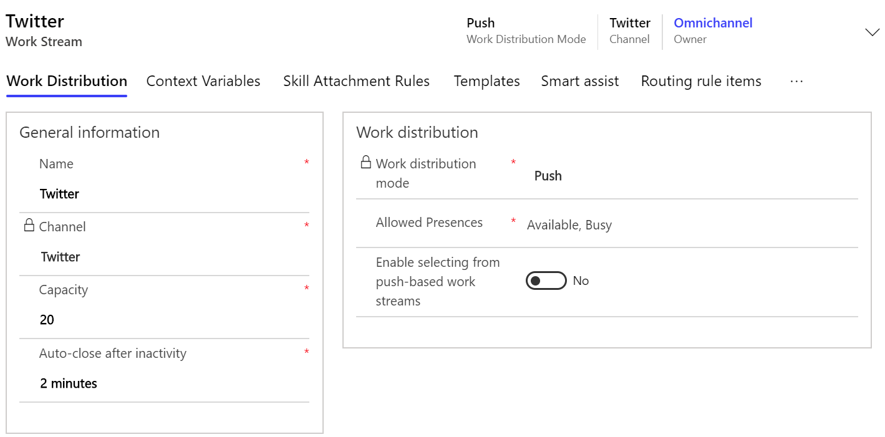
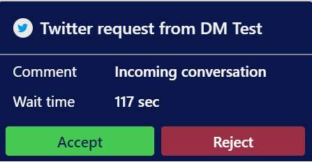

# Configure a Twitter Direct Message channel

[!INCLUDE[cc-use-with-omnichannel](../../includes/cc-use-with-omnichannel.md)]

Many customers use social messaging channels like Twitter Direct Message (DM) for their personal communication needs. Many also prefer using these messaging channels to engage with businesses. The asynchronous nature of these channels gives customers the convenience of getting their issues resolved as and when they find time, unlike real-time channels like Chat for Dynamics 365 where the session ends when the chat window is closed.

The Twitter channel gives you an incredible opportunity to capitalize on the social media trend and engage with your customers in a seamless and personalized experience.

**Prerequisites**: Following are the prerequisites before configuring the Twitter channel in Omnichannel for Customer Service:

1.	Create a Twitter handle. More information: [Create and Manage a Twitter business profile](https://business.twitter.com/en/basics/create-a-twitter-business-profile.html)
2.	Enable direct message for your Twitter handle. More information: [Enable Direct Message](https://help.twitter.com/en/using-twitter/direct-messages#receive)
3.	Create a Twitter application. Apply for a developer account, not a team account. Create a Twitter developer environment. More information: [App Development](https://developer.twitter.com/en/docs/basics/apps/overview)

After completing the prerequisites, you can add the Twitter channel for your organization by following these steps:

1.	[Create a Twitter work stream](#step-1-create-a-twitter-work-stream)
2.	[Create a Twitter channel](#step-2-create-a-twitter-channel-and-add-a-Twitter-handle)
3.	[Create routing rules](#step-3-create-routing-rules)

## Step 1: Create a Twitter work stream

1.	Sign in to Omnichannel Administration.

2.	Go to **Work Distribution Management** > **Work Streams**.

3.	Select **New** to create a Twitter work stream.

4.	On the **Work Distribution** tab, in the **Channel** field, select **Twitter**.

    > [!div class=mx-imgBorder]
    > 

5.	Specify other details as required.

6.	Select **Save**.

## Step 2: Create a Twitter channel and add a Twitter handle

1.	Go to **Channels** > **Twitter**.

2.	Select **New** to create a Twitter channel.

3.	On the **New Twitter Application** page, provide the following account details:

    - **Name**: Name of the Twitter application. 

    - **Consumer API key**: Key of the Twitter application. Go to the Twitter developer portal > Twitter app dashboard > select **Details** > **Keys and tokens** and copy the value in the **API key** field.

    - **Consumer API Secret**: Application secret of the Twitter application. Go to the Twitter developer portal > Twitter app dashboard > select **Details** > **Keys and tokens** and copy the value in the **API secret key** field.
    
    - **Environment name**: Environment of the Twitter application. Go to the Twitter developer portal > Dev environments > select **Dev environment label**.

    More information about the Twitter app: [Setting up your Twitter app](https://developer.twitter.com/en/docs/basics/apps/overview)
  
    > [!div class=mx-imgBorder]
    > 

4.	Select **Save**. After you save the record, the **Twitter** channel is enabled. The Callback URL has been generated. The next step is to save it.

5. To save the Callback URL in the Twitter app dashboard of the developer portal, go to the Twitter developer portal > Twitter app dashboard > select **Details** > **App details** > **Edit** > Copy the **Callback URL** from Omnichannel and paste it into the **Callback URLs** field.
 
> [!div class=mx-imgBorder]
> 

6. Add a Twitter handle: In the **Twitter app** section, select **+ New Twitter handle** to add Twitter handle(s).

7.	On the **New Twitter handle** page, provide the following information:

    - **Name**: Not the Twitter handle, but a name that you can reference. 

8.	Select **Sign on to Twitter**. A pop-up window displays. Sign in using the Twitter handle and password that will be added here.
    > [!NOTE]
    > If you receive a message that says pop-up windows are blocked, select to always allow them.

9. **Work Stream**: Browse and select the work stream you created for the Twitter channel.
 
> [!div class=mx-imgBorder]
> 

5. Select **Save** to save the record. The Twitter channel setup is complete.

  > [!NOTE]
  > You can add multiple handles to a Twitter Application channel.

## Create Routing Rules

1.	Go to **Work Distribution Management** > **Work Streams**.
2.	Open the work stream you created in [Step 1](#step-1-create-a-twitter-work-stream).
3.	On the **Routing rules items** tab, create a routing rule to transfer the message to an appropriate agent. Select the entity as **Twitter Engagement Context**. For example, you can create a rule to transfer Twitter chat from a customer named Twitter to the default queue.
 
> [!div class=mx-imgBorder]
> 

## Customer and agent experiences

A customer can initiate a conversation in any of the following ways:

- Twitter app on a mobile device
- Twitter app on a desktop device
- [www.twitter.com](www.twitter.com)

If a customer initiates a conversation from the Twitter web site and then later switches to the mobile device, the previous conversation persists, and the customer can continue the conversation.

The agent receives the notification of the incoming chat request along with the customer details. More information: [View notifications](../agent/agent-oc/oc-notifications.md)

> [!div class=mx-imgBorder]
> 

If the customer is identified based on name, the conversation is automatically linked to the contact record and the customer summary is populated. More information: [View customer summary](../agent/agent-oc/oc-customer-summary.md)

If the customer is not identified based on name, a new contact record can be created.

## Privacy notice

By enabling this feature, your data will be shared with Twitter and flow outside of your organization's compliance and geo boundaries (even if your organization is in a Government Cloud environment). Please consult the feature technical documentation for more information [here](https://docs.microsoft.com/azure/bot-service/bot-service-channel-connect-facebook?view=azure-bot-service-4.0).

Customers are solely responsible for using Dynamics 365, this feature, and any associated feature or service in compliance with all applicable laws, such as laws relating to monitoring, recording, and storing communications with their end users. This includes adequately notifying end users that their communications with agents may be monitored, recorded, or stored and, as required by applicable laws, obtaining consent from end users before using the feature with them. Customers are also encouraged to have a mechanism in place to inform their agents that their communications with end users may be monitored, recorded, or stored.

### See also

[Understand and create work streams](work-streams-introduction.md) 
[Create and manage routing rules](routing-rules.md)
