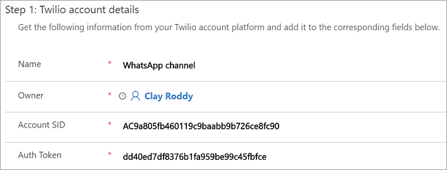
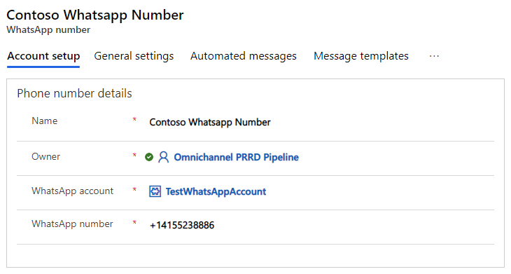
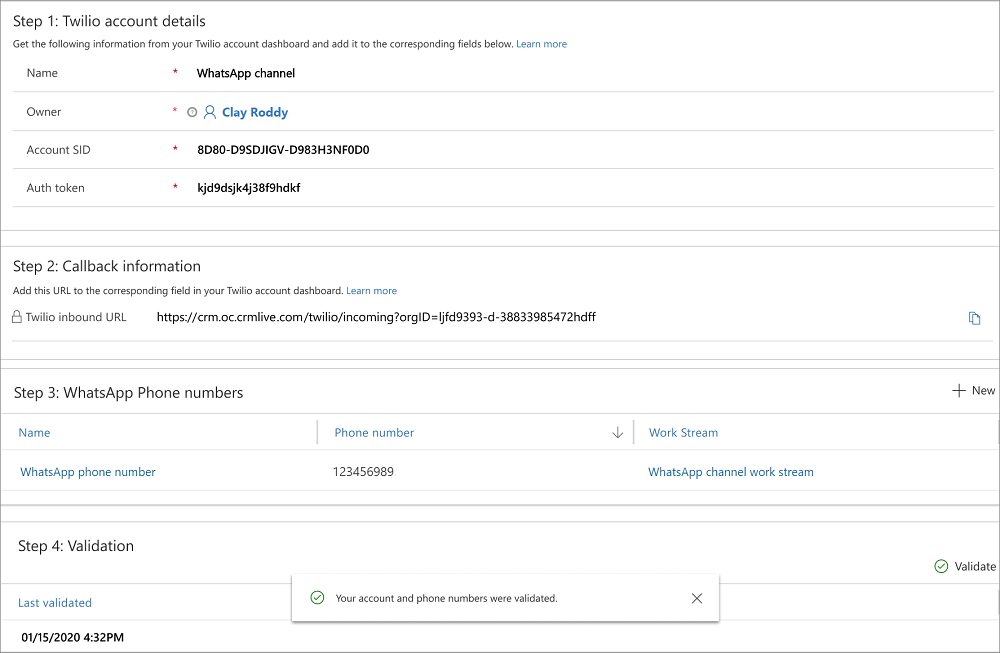

# Preview: Configure a WhatsApp channel through Twilio

[!INCLUDE[cc-use-with-omnichannel](../../includes/cc-use-with-omnichannel.md)]

[!include[cc-beta-prerelease-disclaimer](../../includes/cc-beta-prerelease-disclaimer.md)]

> [!IMPORTANT]
> - A preview is a feature that is not complete, as it may employ reduced privacy, security, and/or compliance commitments, but is made available before it is officially released for general availability so customers can get early access and provide feedback. Previews are provided “as-is,” “with all faults,” “as available,” and without warranty.​
> - This preview feature does not come with technical support and Microsoft Dynamics 365 Technical Support won’t be able to help you with issues or questions.  If Microsoft does elect to provide any type of support, such support is provided "as is," "with all faults," and without warranty, and may be discontinued at any time.​
> - Previews are not meant for production use, especially to process Personal Data or other data that is subject to heightened compliance requirements, and any use of "live" or production data is at your sole risk.  All previews are subject to separate [Terms and Conditions](../../legal/dynamics-insider-agreement.md).

## Overview of WhatsApp channel through Twilio

Many customers use social messaging channels like WhatsApp for their personal communication needs. Customer expectations are rising, and many prefer using the WhatsApp channel to engage with businesses. Expectations of customer service via social channels such as WhatsApp are rising to the point that customers now expect the same level of service from WhatsApp that they’re used to from call and live chat. 

The success of social media customer service, like all other customer service, depends on the quality of care provided. Communications from agents should be timely, accurate, sensitive, brief, and friendly, which ultimately improves the customer satisfaction and brand loyalty.

The WhatsApp channel feature lets you integrate WhatsApp through Twilio with Omnichannel for Customer Service so as to engage with customers who prefer the WhatsApp channel.

## Prerequisites

- Make sure channels are provisioned in your environment.

- Obtain a Twilio account with appropriate subscription.

- Connect Twilio Number to your WhatsApp Business Profile. To learn more, see [Connect your Twilio Number to your WhatsApp Business Profile](https://www.twilio.com/docs/sms/whatsapp/tutorial/connect-number-business-profile). 

## WhatsApp message type and 24 hours session rule

- **Session messages**: According to WhatsApp, session messages are incoming messages from a customer or outgoing replies by an agent to the incoming messages, within 24 hours. A messaging session starts when agents receive a message from a customer. It lasts for 24 hours from the most recently received message. Session messages do not need to follow a template, and can include media attachments.

- **24 hours session rule**: A messaging session starts when an agent receives a message from a customer or replies to the incoming message from the customer. When a customer sends a message, the agent has 24 hours to reply from the time the agent received it. However, after 24 hours, if the agent tries to send a message to the customer, an error is displayed, saying **This conversation has exceeded the 24 hour limit to respond to the customer.**

## End-to-end walk-through

[Step 1: Fetch Twilio account details](#step-1-fetch-twilio-account-details)

[Step 2: Create a work stream](#step-2-create-a-work-stream)

[Step 3: Create a WhatsApp channel](#step-3-create-a-whatsapp-channel)

## Step 1: Fetch Twilio account details

To integrate a WhatsApp channel through Twilio with Omnichannel for Customer Service, you need to go to your Twilio account and fetch the **ACCOUNT SID** and **AUTH TOKEN** values. Save those safely. These two values are required to create a WhatsApp channel configuration in the Omnichannel Administration app.

Go to your **Twilio Console Dashboard** > **Settings** > **General** to fetch the details.

## Step 2: Create a work stream

1. Sign in to Omnichannel Administrator.

2. Select **Work Streams** under **Work Distribution Management**.

3. Select **+ New** to create a new work stream.

4. Specify the values for the fields.

5. Select the **WhatsApp (preview)** option for the **Channel** field.

6. Select **Save** to save the changes.

You've created a work stream for the WhatsApp channel. To learn more, see [Create work streams](work-streams-introduction.md).

To configure other options in the work stream, see the following:

- [Skill-based routing](overview-skill-work-distribution.md)
- [Productivity tools](productivity-tools.md)
- [Smart assist](smart-assist.md)
- [Templates](templates-overview.md)

## Step 3: Create a WhatsApp channel

After you create a work stream for the WhatsApp channel through Twilio, you need to create a WhatsApp channel in the Omnichannel Administrator app.

To create a WhatsApp channel, follow these steps:

1. Sign in to Omnichannel Administrator.

2. Select **WhatsApp (preview)** under **Channels**.

3. In the **New WhatsApp** page, specify the values for the following fields:

    | Section | Field | Description | Example  value |
    |-------------|-------------------|---------------------------|--------------------------------------|
    | Twilio account details |Name| Specify a name for the WhatsApp channel.| WhatsApp channel |
    | Twilio account details |Account SID | Fetch the value from your Twilio account and paste it here. | AC9a805fb460119c9baabb9b726ce8fc90 |
    | Twilio account details |Auth Token | Fetch the value from your Twilio account and paste it here. | dd40ed7df8376b1fa959be99c45fbfce |

    > [!div class=mx-imgBorder]
    >      

4. Select **Save**. After you save, in the **Callback information** section, the **Twilio inbound URL** field is generated with a URL. Copy the URL from the field, and paste it in your Twilio console. 

   > [!div class=mx-imgBorder]
   >  

5. Go to your Twilio console, and select **Phone Numbers** and then select the WhatsApp phone number. Under **Messaging**, paste the URL you copied from step 4 in the **Twilio inbound URL** field.

    > [!div class=mx-imgBorder]
    >  

6. In the **WhatsApp phone numbers** section, select **+ Add New WhatsApp Number**. The **New Custom Messaging Channel** page is displayed.

7. In the **New WhatsApp Number** page, specify the values for the following fields:

    | Section | Field | Description | Example  value |
    |-------------|-------------------|---------------------------|--------------------------------------|  
    | Phone number details | Name | Specify a name for the WhatsApp channel. | WhatsApp phone number |
    | Phone number details | WhatsApp Account | The **WhatsApp Account** field is populated. However, you can change the value using the lookup. | WhatsApp channel |
    | Phone number details | WhatsApp Number | Specify the WhatsApp number. | 123456989 |
    | Work distribution | Work stream | Select a work stream from the lookup. | WhatsApp channel work stream |

    > [!div class=mx-imgBorder]
    > 

8. Select **Save** to save the WhatsApp phone number.

9. Select the back button on the browser to go to the WhatsApp channel page. You can see that the WhatsApp phone number is added in the **WhatsApp phone numbers** section.

10. Select **Save** to save the configurations.

11. In the **Validation** section, select **Validate** to validate the Account SID, Auth token, and phone numbers.  After you validate, a toast notification displays with the success or error.

    > [!div class=mx-imgBorder]
    > 

## See also

[Skill-based routing](overview-skill-work-distribution.md) 
[Productivity tools](productivity-tools.md) 
[Smart assist](smart-assist.md) 
[Templates](templates-overview.md)
