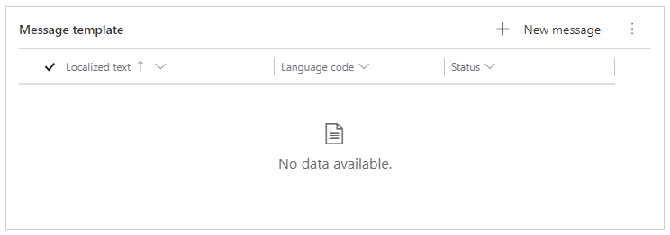

# Preview: Create message templates

[!INCLUDE[cc-use-with-omnichannel](../../includes/cc-use-with-omnichannel.md)]

[!include[cc-beta-prerelease-disclaimer](../../includes/cc-beta-prerelease-disclaimer.md)]

> [!IMPORTANT]
>
> - A preview is a feature that is not complete, as it may employ reduced privacy, security, and/or compliance commitments, but is made available before it is officially released for general availability so customers can get early access and provide feedback. Previews are provided "as-is," "with all faults," "as available," and without warranty.​
> - This preview feature does not come with technical support and Microsoft Dynamics 365 Technical Support won't be able to help you with issues or questions.  If Microsoft does elect to provide any type of support, such support is provided "as is," "with all faults," and without warranty, and may be discontinued at any time.​
> - Previews are not meant for production use, especially to process Personal Data or other data that is subject to heightened compliance requirements, and any use of "live" or production data is at your sole risk.  All previews are subject to separate [Terms and Conditions](../../legal/dynamics-insider-agreement.md).

Message templates enable the one-time creation of reusable messages that can be sent to multiple customers. With message templates, you can maintain high-quality content and avoid spam in the ecosystem. You can save time and personalize the messages by using placeholder values that can be replaced with dynamic content when the message is sent.

To create a message template:

1. Log in to the Omnichannel Administration app. 

2. Under **Settings**, click **Message templates**.

3. Click **New**.

4. Enter a name.

5. Select a channel (SMS only in this preview).

6. Enter a description.

    > [!div class=mx-imgBorder]
    > 

7. Click **Save**. After saving the template, the **Message template** panel appears. 

    > [!div class=mx-imgBorder]
    > 

8. Click **New message** and create a message using localized text in each language you want to support.

    > [!div class=mx-imgBorder]
    > 
    
9. Click **Save & Close** to see your localized message appear in the list of message templates.

## See also

[Configure outbound messaging](outbound-messaging.md)  
[Configure an SMS channel for Telesign](configure-sms-channel.md)  
[Configure an SMS channel for Twilio](configure-sms-channel-twilio.md)  
[Configure a WhatsApp a channel through Twilio](configure-whatsapp-channel.md) 
