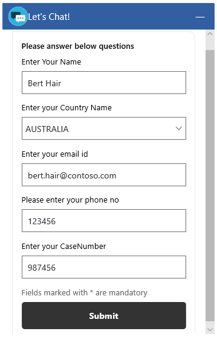

# Embed chat widget in your website or Power Apps portal

[!INCLUDE[cc-use-with-omnichannel](../../includes/cc-use-with-omnichannel.md)]

## Embed chat widget in your web portal

To embed a chat widget in your web portal:

1.	Sign in to Omnichannel Administration.
2.	Go to **Channels** &gt; **Chat**.
3.	Open the chat widget you want to embed in your website.
4.	On the **Basic details** tab, copy the widget snippet code from the **Code snippet** section.
5.  Paste the chat widget snippet code in the HTML source of your website. 

## Embed chat widget in your Power Apps portal

To embed a chat widget in Power Apps portals:

1.	Sign in to Omnichannel Administration.
2.	Go to **Channels** &gt; **Chat**.
3.	Open the chat widget you want to embed in Power Apps portals.
4.	On the **Basic details** tab, copy the widget snippet code from the **Code snippet** section.
    > [!div class=mx-imgBorder]
    > 
5.	[Open the Portal Management app](https://docs.microsoft.com/powerapps/maker/portals/configure/configure-portal).
6.	Go to **Portal** > **Content Snippets**.
7.	Find the **Chat Widget Code** content snippet and open it.
    > [!div class=mx-imgBorder]
    >     
8.	On the **General** tab, scroll-down to the **Value (HTML)** section.
9.	Paste the chat widget snippet code in the **HTML** tab.
    >[!div class=mx-imgBorder]
    > 
10.	Save the changes. The chat widget is now embedded into the portal.

## Customer experience of chat widget

After the chat widget is configured, it has the following capabilities:

- **Minimized mode**: By default, the chat widget is shown in minimized mode. If any messages are received while the widget is in this mode, a count of the messages is shown.

    > [!div class=mx-imgBorder]
    > 

- **Maximized mode**: A user can maximize the chat widget to start a conversation with an agent.

- **System events**: System-generated messages are shown for events, such as when an agent joins a chat, or a chat is transferred to another agent.

    > [!div class=mx-imgBorder]
    > 

- **Keyboard shortcut**: During the chat session, the customer can press **Ctrl+/** to return the cursor to the message send box from elsewhere on the page. 

- **Pre-chat survey**: If a survey has been configured by an admin, it's shown to the user before the conversation is started. This survey also helps the user connect to an appropriate agent.

    > [!div class=mx-imgBorder]
    > 

- **End chat**: A customer can end the chat by selecting the **Close chat** button. A confirmation message is displayed before ending the chat.

> [!NOTE]
> For advanced configuration like embedding chat widget on specific web pages, see [Manage portal content](../../portals/manage-portal-content.md).

### See also

[Add a chat widget](add-chat-widget.md)  
[Configure a pre-chat survey](configure-pre-chat-survey.md)  
[Configure agent display name](agent-display-name.md) 
[Configure file attachment capability](configure-file-attachment.md) 
[Create quick replies](create-quick-replies.md)  
[Create and manage operating hours](create-operating-hours.md)  
[Create chat authentication settings](create-chat-auth-settings.md)  
