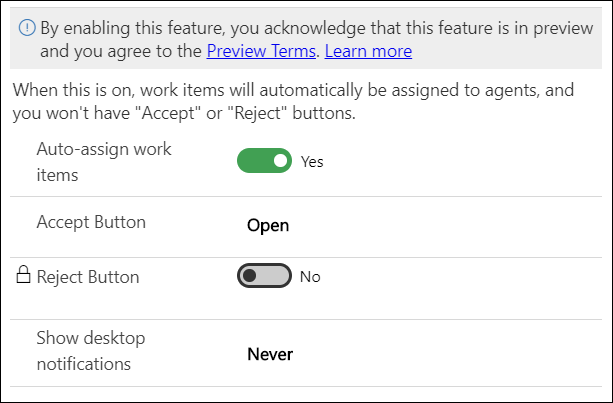

# Enable notifications to be accepted automatically

[!INCLUDE[cc-use-with-omnichannel](../../includes/cc-use-with-omnichannel.md)]

[!include[cc-beta-prerelease-disclaimer](../../includes/cc-beta-prerelease-disclaimer.md)]

## Introduction

Some conversation requests from customers do not need an immediate response. For such requests, you can enable the auto-accept option in notification templates. When an incoming notification appears, the conversation is assigned to the agent automatically, either instantly or after the timeout period elapses. The agent will not be able to accept or reject the conversation.

## Enable conversation notifications to be accepted automatically

Perform the following steps to enable auto-accept behavior:

1. In the Omnichannel Administration app, select **Notifications** under **Agent Experience** in the sitemap.
2. On the Omnichannel Configuration page, select the template in which you want to enable incoming conversation notifications to be accepted automatically.
3. On the ***<notification_name>* Notification Template** > **General** tab, set the toggle to **Yes** for **Auto-assign work items**. The label for **Accept Button** changes to **Open** and the toggle for **Reject Button** is disabled.
4. Select **Save**.

   > 

### See also

[Manage notification templates](notification-templates.md)