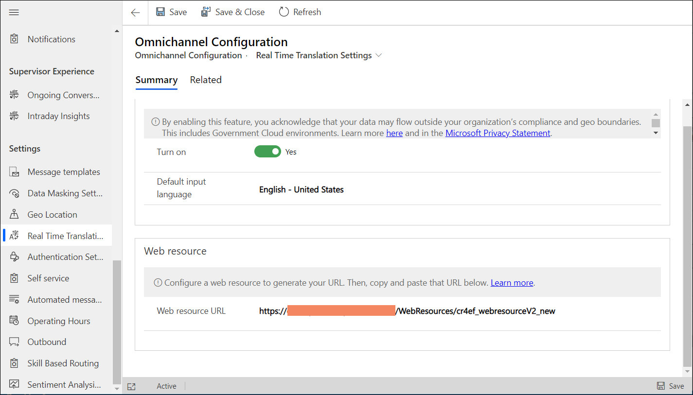

# Enable language translation for conversations

[!INCLUDE[cc-use-with-omnichannel](../../includes/cc-use-with-omnichannel.md)]

[!include[cc-beta-prerelease-disclaimer](../../includes/cc-beta-prerelease-disclaimer.md)]

## Overview

The real-time message translation feature allows agents to support customers in a language they elect to be serviced in. When you enable language translation in the Omnichannel Administration app, messages between the customer and support agent and messages among the support agents, such as supervisors or SMEs, who consult and collaborate internally, are translated. The real-time translation feature is enabled as a plug-in that exposes APIs to bring in third-party translation services and also provides a native implementation.

All the languages that are supported in Omnichannel for Customer Service are supported for the agent in the conversations. For the list of supported languages, see [Language availability](../international-availability.md).

> [!Important]
> The language translation feature is not supported in Omnichannel for Customer Service on Unified Service Desk.

## Prerequisites

You must add a web resource and make sure that the required language translation services are configured. More information: [Add a web resource for real-time translation](../developer/how-to/add-web-resource-real-time-translation.md).

## Enable real-time translation for agent and customer conversations

1. Sign into the **Omnichannel Administration** app, and select **Real Time Translation** under **Settings**.
2. On the **Omnichannel Configuration·Real Time Translation Settings** page, in the **General Information** area, set the toggle for **Turn on** to **Yes**.
3. In **Default input language**, select the language for agents to converse with customers. The translation engine translates the customer messages for agents to the language specified. By, default, it is set to English(en-US).
4. In the **Web resource** area > **Web resource URL** box, specify the link of the web resource.
    > [!div class=mx-imgBorder]
    > 
5. Select **Save**.

### See also

[Real-time language translation of conversations for agents and customers](../agent/agent-oc/oc-real-time-translation.md)  
