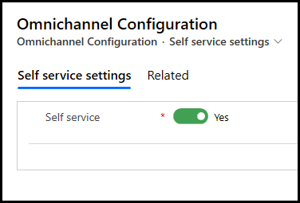

# Enable self-service settings for customer actions in a conversation summary

[!INCLUDE[cc-use-with-omnichannel](../../includes/cc-use-with-omnichannel.md)]

## Overview

The self-service feature displays information about the recent actions that a customer performed before starting a conversation with an agent. This information helps agents understand customer issues and provide a personalized service for enhanced customer satisfaction.

The data about the recent actions that you track is stored in an entity where it's passed as part of context with self-service [action type](../agent/agent-oc/oc-customer-summary.md#self-service) for a conversation that has been successfully closed between the customer and agent. A record is created for each self-service action. To learn more, see [msdyn_visitorjourney Entity Reference](../developer/reference/entities/msdyn_visitorjourney.md).

## Enable self service

Perform the following steps to enable self service.

1. Add a code snippet in the customer self-service portal that is configured for your organization. For information about the code snippet, see [Pass self service history as context](../developer/reference/methods/setcontextprovider.md#pass-customers-portal-navigation-as-context) and [msdyn_visitorjourney](../developer/reference/entities/msdyn_visitorjourney.md#msdyn_type-options).
 
3. Sign in to the Omnichannel Administration app.

4. Under **Settings**, select **Self service**. The **Omnichannel Configuration** page appears.

5. On the **Self service settings** tab, set the **Self service** toggle to **Yes**.

  > [!div class='mx-imgBorder']
  > 
 
5. Select **Save**. The **Self service** tab will appear for the agent when a chat is started with a customer.

### See also

[Self service](../agent/agent-oc/oc-customer-summary.md#self-service)
