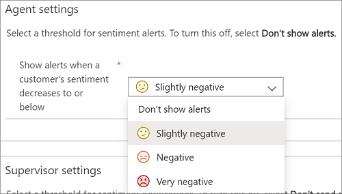
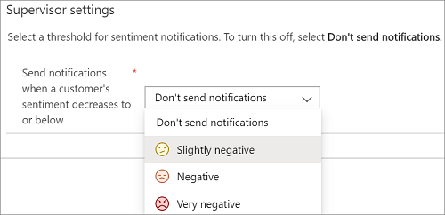

# Analyze real-time customer sentiment

[!INCLUDE[cc-use-with-omnichannel](../../includes/cc-use-with-omnichannel.md)]

Sentiment analysis settings in Omnichannel for Customer Service provides agents and supervisors with real-time insight regarding how customers are interacting with agents during chat sessions.

The Sentiment Analysis Settings page contains three sections:

- [Sentiment analysis](#sentiment-analysis)
- [Agent settings](#agent-settings)
- [Supervisor settings](#superviosr-settings)

## Sentiment analysis

To let agents and supervisors see the customer's satisfaction levels instantly while communicating with the customer, you need to enable the sentiment analysis.

> [!NOTE]
> Sentiment analysis is enabled by default.

1. Sign in to **Omnichannel Administration**.

2. Under **Settings**, select **Sentiment Analysis**, and then select **Real-Time Sentiment Analysis**.

3. In the **Sentiment analysis** section, set the **Monitor real-time customer sentiment** toggle to **Yes**, and then select **Save**.

4. Set the **Sentiment drivers reporting** toggle to **Yes**.

  > [!div class=mx-imgBorder]
  > 

After you enable real-time customer sentiment, you can view scores in the [Omnichannel Insights dashboards](configure-historical-sentiment-dashboard-supervisor.md).

## Agent settings

Agents can view the customer sentiment in the communication panel for an conversation session that is active and in focus. For session that is not in focus, the alert is shown on the session panel.

You can show alerts to the agents when a customer's sentiment decreases to or below a particular value. You can set the customer's sentiment to any of the following values:

- Don't show alerts
- Slightly negative
- Negative
- Very negative

For example: You the set the threshold value as **Slightly negative**. When the customer's sentiment reaches **Slightly negative** or any other sentiment value below this, an alert is displayed to agent.

1. Sign in to **Omnichannel Administration**.

2. Under **Settings**, select **Sentiment Analysis**, and then select **Real-Time Sentiment Analysis**.

3. In the **Sentiment analysis** section, set the **Monitor real-time customer sentiment** toggle to **Yes**, and then select **Save**.

  > [!div class=mx-imgBorder]
  > 

To turn off agent alerts, select **Don't show alerts**.

## Supervisor settings

Supervisors can use the **Omnichannel Ongoing Conversation** dashboard to view customer sentiment in real time during conversations between customers and agents.

You can show notifications to the supervisors when a customer's sentiment decreases to or below a particular value. You can set the customer's sentiment to any of the following values:

- Don't show notifications
- Slightly negative
- Negative
- Very negative

For example: You the set the threshold value as **Slightly negative**. When the customer's sentiment reaches **Slightly negative** or any other sentiment value below this, a notification is displayed to the supervisor.

1. Sign in to **Omnichannel Administration**.

2. Under **Settings**, select **Sentiment Analysis**, and then select **Real-Time Sentiment Analysis**.

3. In the **Sentiment analysis** section, set the **Monitor real-time customer sentiment** toggle to **Yes**, and then select **Save**.

  > [!div class=mx-imgBorder]
  > 

To turn off supervisor notification, select **Don't send notifications**.

## Multi-language sentiment

Multi-language sentiment scoring is enabled by default. Conversations in more than 40 languages are scored. The languages are listed in the following table.

<table>
<tbody>
<colgroup span = "3">
<col width = "34%"></col>
<col width = "33%"></col>
<col width = "33%"></col>
</colgroup>
<tr>
<td>Arabic 
Bulgarian 
Chinese (Hong Kong SAR) 
Catalan 
Chinese Simplified 
Chinese Traditional 
Croatian 
Czech 
Danish 
Dutch 
English 
Estonian 
Finnish 
French 
</td>
<td>German 
Greek 
Hebrew 
Hindi 
Hungarian 
Indonesian 
Italian 
Japanese 
Korean 
Latvian 
Lithuanian 
Malay 
Norwegian 
Polish 
</td>
<td>Portuguese 
Romanian 
Russian 
Serbian (Cyrillic) 
Serbian (Latin) 
Slovak 
Slovenian 
Spanish 
Swedish 
Thai 
Turkish 
Ukrainian 
Vietnamese 
</td>
</tbody>
</table>

### See also

[Monitor conversations](../supervisor/monitor-conversations.md)
