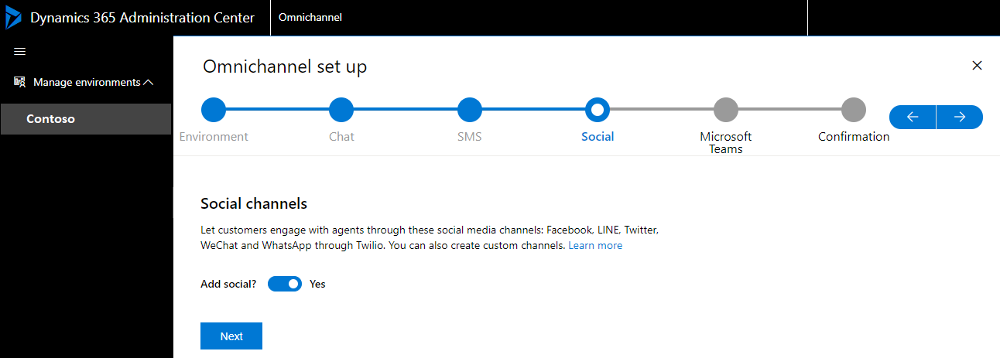
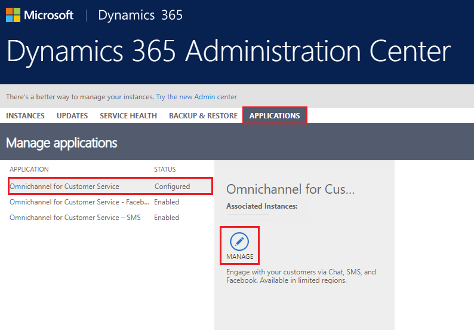

# Provision Omnichannel for Customer Service

[!INCLUDE[cc-use-with-omnichannel](../../includes/cc-use-with-omnichannel.md)]

Omnichannel for Customer Service provides a modern, customizable, high-productivity app that lets agents help customers across different channels via a unified interface. It lets organizations choose the channel that suits their business needs. It also ensures that a high level of responsive, quality service is received across channels.

> [!NOTE]
> - Before you can provision Omnichannel for Customer Service in your organization, a **Global Tenant Admin** must [Provide data access consent](#provide-data-access-consent).
> - Ensure that all the prerequisites are set up before the app is provisioned. More information, see [Prerequisites](../system-requirements-omnichannel.md#prerequisites). 

Looking for an upgrade? See [Upgrade Omnichannel for Customer Service](upgrade-omnichannel.md) for more information.

## Provide data access consent

To allow Omnichannel for Customer Service to read and write data on behalf of users, follow these below steps:

1. Go to [Data access consent URL](https://go.microsoft.com/fwlink/?linkid=2070932).
2. Sign in using **Global Tenant Admin** credentials.
3. Select the checkbox **Consent on behalf of your organization**.
4. Select **Accept** to grant data access consent.

    > [!div class=mx-imgBorder]
    > 

## Provision Omnichannel for Customer Service application

> [!IMPORTANT]
> To be able to provision the Omnichannel for Customer Service application, you must have both **Global Tenant Admin** and **Dynamics 365 System Admin** permissions for your organization.

### Set up Omnichannel for Customer Service

> [!NOTE]
> Ensure that you have provided data access consent before you proceed with the setup. For more information, see [Provide data access consent](#provide-data-access-consent).

1. In **Dynamics 365 Administration Center**, go to the **Applications** tab, select **Omnichannel for Customer Service**, and then select **Manage**.
      
    > [!div class=mx-imgBorder]
    > 

    The **Manage Omnichannel environments** page is displayed.

    > [!NOTE]
    > The Omnichannel for Customer Service option will appear only if you have an active subscription of Chat for Dynamics 365 Customer Service or Dynamics 365 Digital Messaging. For more information on pricing, click [here](https://dynamics.microsoft.com/customer-service/overview/#pricing). You can also get a free 30-day trial if you have the required prerequisites, see [Try channels for Dynamics 365 Customer Service](../try-channels.md) for more information.

2. On the **Manage Omnichannel Instances** page, select **Add Org** to add an organization. Omnichannel is set up on the organization environment that you add here.
   
    > [!div class=mx-imgBorder]
    > 

    > [!IMPORTANT]
    > As an admin, you can configure Omnichannel in multiple environments. You can view the status of all organization environments where the Omnichannel app has been configured in the **Manage environments** view.

3. Select the environment in the drop-down list. 

    > [!div class=mx-imgBorder]
    > 

4. Click the **Chat** tab and slide the toggle to enable the Chat channel for your organization. 

    > [!div class=mx-imgBorder]
    > 

5. Click the **SMS** tab and slide the toggle to enable SMS. Select the check box to confirm that you agree to the SMS terms.

    > [!div class=mx-imgBorder]
    > 

    > [!IMPORTANT]
    > You must select the check box for **SMS Terms** to enable SMS and proceed with the setup.

6. Click the **Social** tab and slide the toggle to enable social channels. 

    > [!div class=mx-imgBorder]
    > 
    
7. Click the **Microsoft Teams** tab and slide the toggle to enable Microsoft Teams. 

    > [!div class=mx-imgBorder]
    > 

7. On the **Confirmation** page, verify your selections and click **Finish** to provision Omnichannel for Customer Service in your organization.

    The setup can take several minutes. You may close the window and check after some time, or refresh to check if it's complete. Once the setup is complete, the selected channels are enabled in your environment.

    > [!div class=mx-imgBorder]
    > 
    
    The organization and the enabled channels are also available in the **Manage Instances** view.

    > [!div class=mx-imgBorder]
    > 

## Update Omnichannel for Customer Service application

After Omnichannel for Customer Service application is successfully provisioned, you can update the environment by enabling or disabling the required channels.

1.	In **Dynamics 365 Administration Center**, go to the **Applications** tab, select **Omnichannel for Customer Service**, and then select **Manage**.
 
    > [!div class=mx-imgBorder]
    > 

    The **Manage Omnichannel instances** page is displayed.

2.	On the **Manage** page, choose the environment you want to update. The summary of configured channels is displayed.

    > [!div class=mx-imgBorder]
    > 

3. Select the channel to be enabled. For example, in this procedure, we will enable the Social channels.

4. On the **Social** tab, slide the toggle to enable social channels in your environment.

    > [!div class=mx-imgBorder]
    > 

5. If required, you can also disable the previously enabled channel. For example, in this procedure, we will disable the Social channel. 

   On the **Social** tab, slide the toggle to enable social channels in your environment. A confirmation message is displayed to remove the channel. Select **Remove**.

    > [!div class=mx-imgBorder]
    > 

7. Select **Save** on the toolbar at the top of the page to start updating the instance.

8. Once the update is complete, the status is displayed on the **Summary** tab.

    > [!div class=mx-imgBorder]
    > 

> [!NOTE]
> If you disable all channels, Omnichannel for Customer Service will be removed from your organization.

### See also

[Upgrade Omnichannel for Customer Service](upgrade-omnichannel.md) 
[Understand and create work streams](work-streams-introduction.md) 
[Manage users](users-user-profiles.md)
