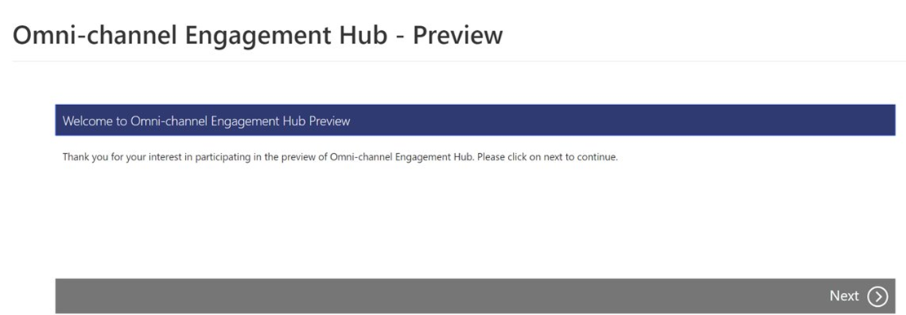

# Provision Omnichannel for Customer Service

Applies to Dynamics 365 for Customer Engagement apps version 9.1.0

Omnichannel for Customer Service provides a modern, customizable, high-productivity app that lets agents help customers across different channels via a unified interface. It lets organizations choose the channel that suits their business needs. It also ensures that a high level of responsive, quality service is received across channels.

> [!NOTE]
> Before you can provision Omnichannel for Customer Service on your org, a **Global Tenant Admin** must [Provide data access consent](#provide-data-access-consent).     Ensure that all the prerequisites are set up before the app is provisioned. More information, see [Pre-requisites](../system-requirements-omnichannel.md#pre-requisites). 

Looking for an upgrade? See [Upgrade Omnichannel for Customer Service](upgrade-omnichannel.md) for more information.

## Provide data access consent

To allow Omnichannel for Customer Service to read and write data on behalf of users, follow these below steps:

1. Go to [Data access consent URL](https://go.microsoft.com/fwlink/?linkid=2070932).
2. Sign in using **Global Tenant Admin** credentials.
3. Select the checkbox **Consent on behalf of your organization**.
4. Select **Accept** to grant data access consent.

    > [!div class=mx-imgBorder]
    > 

## Provision Omnichannel for Customer Service application

> [!IMPORTANT]
> Ensure that you are either a **Global Tenant Admin** or **Dynamics 365 Service Admin** of your Dynamics 365 org to be able to provision the Omnichannel for Customer Service application.

### Step 1: Sign up for Omnichannel for Customer Service preview

To get the Omnichannel for Customer Service app, sign up for the Omnichannel for Customer Service preview from the Insider portal.

1. Go to [Dynamics Insider Portal](http://experience.dynamics.com/insider) and sign in with your Microsoft account.
2. Search for and open **Omnichannel for Customer Service preview** in the **Upcoming and Active Public Preview Programs** list.

    > [!div class=mx-imgBorder]
    > 

3. Select **Join now**. A preview survey is displayed.

    > [!div class=mx-imgBorder]
    > 

4. Fill in all the required fields. Provide the **Org ID** where you want to set up Omnichannel for Customer Service. To know how to find your Org ID in Dynamics 365 instance, see [Locate your Org ID](#locate-your-org-id).

    > [!div class=mx-imgBorder]
    > 

    Select **Submit** to submit the survey.

    Once your request is approved, you will receive a confirmation email from Microsoft. Omnichannel for Customer Service will be available in the org that you provided in the survey. You can view the app in **Manage applications** in the **Dynamics 365 Administration Center**.

### Step 2: Set up Omnichannel for Customer Service

> [!NOTE]
> Ensure that you have provided data access consent before you proceed with the set up. For more information, see [Provide data access consent](#provide-data-access-consent).

   1. In the **Dynamics 365 Administration Center**, select **Manage**.
      
        > [!div class=mx-imgBorder]
        > 

       The **Manage Omnichannel Instances** page is displayed.

   3. On the **Manage Omnichannel Instances** page, select **Add Org** to add an organization.   Omnichannel is set up on the organization instance that you add here.
   
       > [!div class=mx-imgBorder]
       > 

       > [!IMPORTANT]
       > As an admin, you can configure Omnichannel on multiple org instances. You can view the status of all org instances where the Omnichannel app has been configured in the **Manage Instances** view.

   3. Select the organization in the **Organization Selector** drop-down list. 

        > [!div class=mx-imgBorder]
        > 

        > [!IMPORTANT]
        > You must select the checkboxes for **Microsoft Privacy Statement** and **Terms & Conditions** to accept the terms and proceed with the set up.
      
      Select the continue arrow  to proceed.

     4. Select the check box to enable **Chat** channel on your org and select the continue arrow to proceed with the set up.

          > [!div class=mx-imgBorder]
          > 
         
        On successful set up, you can view the org and the enabled channel in the **Manage Instances** view.

        > [!div class=mx-imgBorder]
        > 

### Enable SMS channel

 You can enable SMS channel after you have upgraded to the latest release of Omnichannel. To upgrade Omnichannel for Customer Service, see [Upgrade Omnichannel for Customer Service](upgrade-omnichannel.md).

 Post upgrade, go to **Manage Omnichannel instances** page and enable SMS channel by selecting the checkbox in **SMS** tab.

> [!div class=mx-imgBorder]
> 

> [!IMPORTANT]
> You must select the checkbox for **SMS Preview Terms** to enable the channel. Either Chat or SMS channel must be selected to continue with the setup.

Once enabled, you can see the status for both the channels on the **Summary** page.

> [!div class=mx-imgBorder]
> 

## Locate your Org ID

Follow these steps to locate your Org ID in your Dynamics 365 instance.

1. In Dynamics 365, go to **Settings** > **Customizations**.
    > [!NOTE]
    > Ensure that you have System Administrator or System Customizer security role or equivalent permissions.

2. Select **Developer Resources**.

    You can find your Org ID in the **Instant Reference Information** section.

    > [!div class=mx-imgBorder]
    > 

### See also

[Upgrade Omnichannel for Customer Service](upgrade-omnichannel.md)

[Understand and create work streams](work-streams-introduction.md)

[Manage users](users-user-profiles.md)

