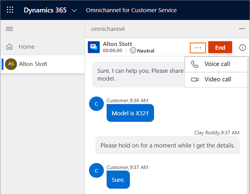
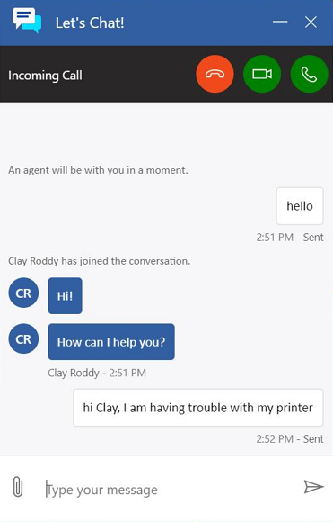

# Call options and visual engagement in live chat

[!INCLUDE[cc-use-with-omnichannel](../../../includes/cc-use-with-omnichannel.md)]

## Call options in live chat

With calling options in a live chat conversation, you can initiate a voice or video call while you're communicating with the customer over chat.

As an agent, you exchange a lot of information when you communicate with a customer via chat. This can slow down your effort to resolve the customer's issue. The customer might prefer to show you the problem and explain the issue by using a physical product. In these scenarios, you might want to initiate a voice or video call during the chat conversation to resolve the issue quickly. The calling options in the communication panel help you to easily make these calls.

### Advantages of voice and video call in live chat

With calling options in live chat, you can:

- Resolve customer issues quickly.
- Reduce your average handling time (AHT) and improve your productivity.
- Improve customer satisfaction.
- Develop a positive relationship with customers.

## Prerequisite

Latest version of Microsoft Edge and Google Chrome desktop browsers.

### Initiate voice and video call

When you're chatting with the customer, you can initiate the voice or video call. In the communication panel, beside the **End** button, select the ellipsis button . The **Voice Call** and **Video Call** options are displayed. (Depending on your system configuration, you might see **Voice Call** and **Video Call**, or just **Voice call**.)

> [!div class=mx-imgBorder]
> 

When you initiate a voice call, you can view the flyout call control, which includes the following buttons.

|Button | Name | Description |
|----------------------|-------------------------|-----------------------------|
|| Turn on video / Turn off video |  Use this button to turn on or off the video while in a call with the customer.|
|| Mute / Unmute | Use this button to mute or unmute the call while in a call with the customer. |
|| End call | Use this button to end the call. |

> [!div class=mx-imgBorder]
> 

> [!Note]
> If your organization is in the Government Community Cloud (GCC) region, the audio and video calls will be transmitted via a North American data center. 

### Capacity of the agent

When you initiate a voice or video call, your capacity is consumed, and you can't take any conversation requests until you hang up. However, your supervisor can still assign conversations to you.

### Site permissions

As an agent, you need to enable camera and microphone access in the browser to make a video and audio call, respectively.

## Customer experience

When a customer on the portal receives a call, they can accept the voice call with audio, accept the voice call with video, or reject the call.

> [!div class=mx-imgBorder]
> 

After accepting the call, the customers can view and use the following options.

|Button | Name |
|----------------------|-------------------------|
|| Turn on video / Turn off video | 
|| Mute / Unmute | 
|| End call | 

After accepting the call, the customer can turn on or off the video, mute or unmute the conversation, and end the call.

> [!div class=mx-imgBorder]
> 

### Site permissions

Customers need to provide the camera and microphone access in the browser.

## Use co-browse and screen share in live chat

The co-browsing and screen sharing features help you quickly and easily understand the customer's issue while communicating with the customer via chat channel. These visual engagement channels allow agents to interact with customers within their browsers for a concrete and effective support experience. This integration capability allows agents to initiate a third-party co-browse or screen sharing session from the chat conversation. 

> [!Important]
> Third-party providers of co-browse or screen share capabilities may have separate pricing and licensing requirements. Before enabling and using these features through third-party applications, ensure you understand the terms of using these applications. 

## See also

[Add a chat widget](../../administrator/add-chat-widget.md)